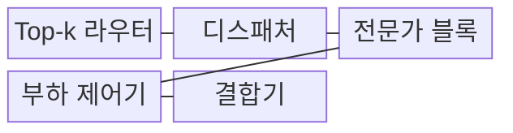
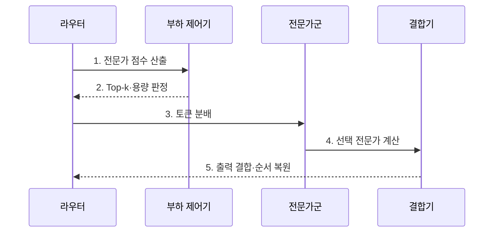

---
sidebar:
  order: 58
  label: "058. Mixture of Experts (전문가 혼합)"
  badge:
    text: "기출 · 70%"
    variant: note
title: "Mixture of Experts (전문가 혼합)"
date: "2026-07-31T08:41:30+09:00"
tags:
  - "notes-latest_tech"
weight: 58
extra:
  question_no: "058"
  source_status: "기출"
  source_history: "138회"
  priority: 70
  priority_note: "전문가 선택으로 연산 효율을 높이는 구조"
---

## 미리 알고가기

- **전문가 혼합(Mixture of Experts, MoE)**: 다수 전문가 중 입력에 적합한 일부만 활성화하는 희소 모델 구조
- **순방향 신경망(Feed-Forward Network, FFN)**: 토큰별 비선형 변환을 수행하는 Transformer 블록
- **상위 k개 선택(Top-k Routing)**: 라우터 점수가 높은 k개 전문가를 선택하는 방식이며, k는 활성화할 전문가 수
- **전체 상호 통신(All-to-All Communication)**: 각 장치가 다른 모든 장치와 토큰을 교환하는 통신

## Ⅰ. 개요

- 정의/개념: 라우터가 토큰별 일부 전문가를 선택하는 **조건부 계산 신경망 구조**
- 배경/필요성: 밀집 모델의 모든 매개변수 활성화로 **연산량·전력 비용** 급증

### 쉽게 이해하기 (학습용)
- 라우터가 토큰마다 몇 명의 전문가만 고르고 특정 전문가에게 업무가 몰리지 않게 관리합니다.

## Ⅱ. 특징

- **라우터의 Top-k 점수**에 따른 활성 전문가·결합 가중치 결정
- **부하 균형 손실·초과 토큰 정책** 기반 전문가 용량 쏠림 통제
- 희소 활성화에도 필요한 **전체 가중치 저장·장치 간 통신**

### 쉽게 이해하기 (학습용)
- 일부 전문가만 계산해도 전체 가중치 저장과 장치 간 토큰 이동이 필요해 통신이 병목이 될 수 있습니다.

## Ⅲ. 구조 및 구성요소

| 구성요소 | 책임 |
|:---|:---|
| Top-k 라우터 | 전문가별 점수·결합 가중치 계산 |
| 디스패처 | 선택 전문가로 토큰 전송 |
| 전문가 블록 | 독립적인 **FFN 변환** 수행 |
| 부하 제어기 | 용량·쏠림·초과 토큰 통제 |
| 결합기 | 출력 가중 결합과 순서 복원 |

### 쉽게 이해하기 (학습용)

- 라우터가 전문가를 고르고 디스패처가 토큰을 보내며 결합기가 출력을 원래 순서로 모읍니다.

## Ⅳ. 흐름도

**동작 원리**

1. **전문가 점수 산출**: 토큰별 **라우팅 확률** 계산
2. **Top-k·용량 판정**: 활성 전문가와 **초과 정책** 결정
3. **토큰 분배**: All-to-All 기반 **전문가 전송**
4. **선택 전문가 계산**: 활성화된 **FFN만 연산**
5. **출력 결합·순서 복원**: 라우팅 가중합과 **토큰 재배열**
### 쉽게 이해하기 (학습용)

- 라우터 점수와 용량으로 전문가를 고르고 계산 결과를 가중 결합합니다.

## Ⅴ. 종류 및 비교

| 토큰 활성화 구조 | 밀집 FFN | Top-1 MoE | Top-k MoE |
|:---|:---|:---|:---|
| 적용 기준 | 단순 실행·작은 모델 | 최소 활성 연산 우선 | 복수 전문가 결합 필요 |
| 핵심 특징 | 모든 토큰이 같은 FFN | 토큰당 전문가 1개 | 토큰당 전문가 k개 |
| 한계 | 활성 연산량 증가 | 쏠림·용량 초과 | 통신·결합 비용 증가 |

### 쉽게 이해하기 (학습용)

- 밀집·Top-1·Top-k 방식은 활성 연산량과 전문가 결합 범위가 다릅니다.

## Ⅵ. 실무 고려사항 및 대책

| 고려사항 | 대책 | 효과 |
|:---|:---|:---|
| 라우팅 쏠림 | **부하 균형 손실**·토큰 수 감시 | 전문가 활용 균등화 |
| 용량 초과 | 용량 계수·**초과 토큰 정책** 설정 | 토큰 손실·지연 통제 |
| 통신 병목 | 전문가 배치·**All-to-All** 최적화 | 장치 대기 감소 |
| 전문가 붕괴 | 라우팅 분포·**전문가 품질** 추적 | 기능 편중 조기 탐지 |

### 쉽게 이해하기 (학습용)
- 전문가별 토큰 수와 장치 간 통신 시간을 따로 측정해 라우팅 쏠림과 병목을 찾습니다.

## Ⅶ. 결론
- 희소 활성 이득이 부하·통신 비용보다 크면 **MoE**, 작으면 **밀집 FFN** 선택

### 쉽게 이해하기 (학습용)
- 전문가 수만 늘리지 않고 토큰 배분과 통신 비용을 함께 최적화해야 실제 연산 효율이 높아집니다.
