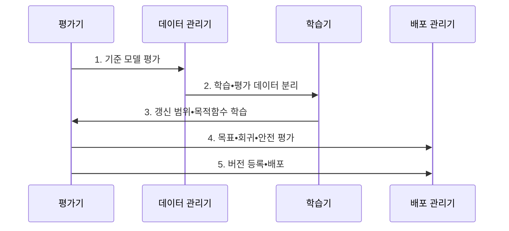

---
sidebar:
  order: 59
  label: "059. Fine-Tuning (파인튜닝)"
  badge:
    text: "기출 • 70%"
    variant: note
title: "Fine-Tuning (파인튜닝)"
date: "2026-08-04T13:52:05+09:00"
tags:
  - "notes-latest_tech"
weight: 59
extra:
  question_no: "059"
  source_status: "기출"
  source_history: "131회, 132회, 135회"
  priority: 70
  priority_note: "모델 적응 방식 비교가 반복 출제축"
---

## Ⅰ. 개요

핵심 용어

- **파인튜닝(Fine-Tuning)**: 사전학습 모델의 가중치를 목적 데이터로 추가 학습하여 특정 작업•도메인에 적응시키는 방법이다.
- **사전학습 모델**: 대규모 일반 데이터에서 범용 표현과 능력을 먼저 학습한 기반 모델이다.

- 정의/개념: **파인튜닝** 은 사전학습 모델을 목적 데이터로 학습해 작업•도메인에 적응시키는 방법
- 배경/필요성: 프롬프트만으로는 **반복 행동•출력 형식** 의 일관성 확보 불가

#### 한줄 요약
- 사전학습 모델에 회사의 답변 형식과 업무 사례를 추가로 훈련합니다.

## Ⅱ. 특징

핵심 용어

- **지도 파인튜닝(Supervised Fine-Tuning, SFT)**: 입력•정답 쌍으로 목표 출력 행동을 학습하는 방식이다.
- **매개변수 효율적 파인튜닝(Parameter-Efficient Fine-Tuning, PEFT)**: 전체 기반 모델을 고정하고 일부 추가•선택 매개변수만 갱신하는 기술군이다.
- **파멸적 망각**: 새 학습으로 기존의 범용 능력이 저하되는 현상이다.
- **전체 파인튜닝(Full Fine-Tuning, Full FT)**: 기반 모델의 전체 매개변수를 갱신하는 방식이다.

- **SFT 데이터 분포•품질** 과 목적함수에 따른 행동•일반화 범위 결정
- **Full FT•PEFT•프롬프트 튜닝** 별 갱신 대상•자원•적응 폭 차이
- **기존 능력 회귀•과적합** 과 안전성 변화의 기준 모델 대비 평가

#### 한줄 요약
- 학습 데이터가 행동을 바꾸며 갱신 범위에 따라 비용과 기존 능력의 변화 폭이 달라집니다.

## Ⅲ. 구조 및 구성요소

핵심 용어

- **갱신 매개변수**: 학습 과정에서 실제로 값을 변경할 전체 가중치•어댑터•소프트 프롬프트의 범위다.
- **목적함수**: 목표 토큰 손실과 정규화 항을 결합하여 가중치 갱신 방향을 정하는 기준이다.
- **버전 자산**: 모델•토크나이저•데이터•학습 설정•평가 결과를 추적 가능하게 연결한 묶음이다.

| 구성요소 | 책임 |
|:---|:---|
| 기반 모델 저장소 | **가중치•토크나이저 기준** 보관 |
| 데이터 관리기 | **학습•평가 데이터** 분리 |
| 학습기 | 갱신 범위와 **목적함수** 적용 |
| 평가기 | **성능•회귀•안전성** 검증 |
| 버전 저장소 | **모델•데이터•설정** 연결 |

#### 한줄 요약

- 기반 모델•학습 데이터•갱신 범위•목적함수와 결과 버전을 함께 관리합니다.

## Ⅳ. 흐름도

핵심 용어

- **평가 격리**: 학습 데이터와 평가 데이터를 분리하여 데이터 누출 없이 일반화 성능을 측정하는 원칙이다.
- **기준 모델 평가**: 학습 전 목표 과업과 기존 능력의 성능을 기록하여 변경 후 결과와 비교하는 절차다.

**동작 원리**

1. **기준 모델 평가**: 목표 과업•기존 능력의 **기준치 기록**
2. **학습•평가 데이터 분리**: 중복•오염 제거와 **평가 격리**
3. **갱신 범위•목적함수 학습**: 선택 매개변수의 **손실 최적화**
4. **목표•회귀•안전 평가**: 적응 이득과 **기존 능력 변화** 비교
5. **버전 등록•배포**: 모델•데이터•설정의 **추적 가능한 연결**
#### 한줄 요약

- 학습 전후의 목표 작업 성능과 기존 능력의 회귀를 함께 비교합니다.

## Ⅴ. 종류 및 비교

핵심 용어

- **전체 파인튜닝**: 모델 전체 매개변수를 갱신하여 적응 폭은 크지만 메모리•저장•망각 부담이 크다.
- **어댑터 기반 PEFT**: 기반 가중치를 동결하고 작은 작업별 모듈만 갱신한다.
- **프롬프트 튜닝**: 모델 가중치 대신 입력에 붙는 학습 가능한 가상 토큰만 갱신한다.

Full FT와 PEFT는 기반 모델에서 갱신하는 매개변수 범위가 다르다.

| 파인튜닝 갱신 범위 | 전체 파인튜닝 | 어댑터 기반 PEFT | 프롬프트 튜닝 |
|:---|:---|:---|:---|
| 적용 기준 | **모델 전반 적응 필요** | **작업별 경량 모듈 필요** | **가상 토큰 적응 충분** |
| 핵심 특징 | **전체 매개변수 갱신** | **기반 동결•어댑터 갱신** | **소프트 프롬프트 갱신** |
| 한계 | **메모리•저장•망각 부담** | **구조•적재 관리 필요** | **문맥 사용•표현력 제한** |

#### 한줄 요약

- 전체•어댑터•프롬프트 튜닝은 갱신하는 매개변수의 범위와 운영 비용이 다릅니다.

## Ⅵ. 실무 고려사항 및 대책

핵심 용어

- **과적합**: 학습 데이터에는 잘 맞지만 새로운 운영 입력에서 성능이 낮아지는 현상이다.
- **기존 능력 회귀셋**: 파인튜닝 뒤 범용 능력과 안전성이 유지되는지 확인하는 고정 평가 모음이다.
- **데이터 혼합**: 새 과업 데이터와 기존 능력 보존용 데이터를 함께 학습하여 망각을 줄이는 방식이다.

| 문제 | 대책 | 효과 |
|:---|:---|:---|
| **과적합** | 검증 분리•**조기 종료•정규화** | 목표 분포 **일반화** |
| **파멸적 망각** | 기존 능력 회귀셋•**데이터 혼합** | 범용 능력 **보존** |

#### 한줄 요약
- 상담 업무 성능뿐 아니라 기존 범용 능력도 확인하고 회귀가 크면 이전 버전으로 복구합니다.

## Ⅶ. 결론

핵심 용어

- **전체 파인튜닝 선택 기준**: 모델 전반의 행동을 크게 바꿀 필요가 있고 충분한 학습•저장 자원이 있을 때 선택한다.
- **매개변수 효율적 파인튜닝•프롬프트 튜닝 선택 기준**: 기반 모델을 공유하면서 작업별 자원과 배포 자산을 줄여야 할 때 선택한다.

- 전반 적응은 **Full FT**, 자원•갱신 제약은 **PEFT•프롬프트 튜닝** 선택

#### 한줄 요약
- 목표 행동을 학습한 뒤 기존 능력과 안전성이 유지되는지 비교해야 배포할 수 있습니다.
