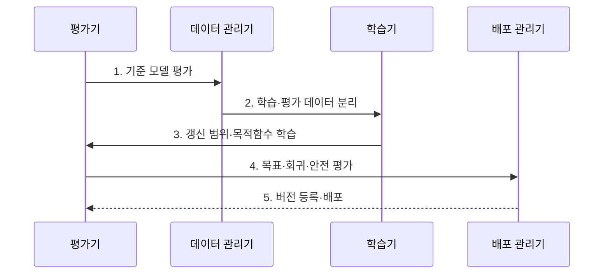

---
sidebar:
  order: 59
  label: "059. Fine-Tuning (파인튜닝)"
  badge:
    text: "기출 · 70%"
    variant: note
title: "Fine-Tuning (파인튜닝)"
date: "2026-07-31T11:59:04+09:00"
tags:
  - "notes-latest_tech"
weight: 59
extra:
  question_no: "059"
  source_status: "기출"
  source_history: "131회, 132회, 135회"
  priority: 70
  priority_note: "모델 적응 방식 비교가 반복 출제축"
---

## 미리 알고가기

- **파인튜닝 (Fine-Tuning)**: 목적 데이터로 모델 가중치를 조정함
- **파멸적 망각 (Catastrophic Forgetting)**: 새 학습으로 기존 능력이 저하되는 현상임
- **지도 미세조정(Supervised Fine-Tuning, SFT)**: 입력·정답 쌍으로 목표 출력 행동을 학습하는 방식
- **매개변수 효율 미세조정(Parameter-Efficient Fine-Tuning, PEFT)**: 전체 모델을 고정하고 일부 매개변수만 갱신하는 기술군

## Ⅰ. 개요

- 정의/개념: **파인튜닝**은 사전학습 모델을 목적 데이터로 학습해 작업·도메인에 적응시키는 방법
- 배경/필요성: 프롬프트만으로는 **반복 행동·출력 형식**의 일관성 확보 불가

### 쉽게 이해하기 (학습용)
- 사전학습 모델에 회사의 답변 형식과 업무 사례를 추가로 훈련합니다.

## Ⅱ. 특징

- **데이터 분포·품질**과 목적함수에 따른 행동·일반화 범위 결정
- **전체 FT·PEFT**와 프롬프트 튜닝별 갱신 대상·자원·적응 폭 차이
- **기존 능력 회귀·과적합**과 안전성 변화의 기준 모델 대비 평가
- 입력·정답 쌍의 **SFT**를 통한 목표 출력 행동 학습

### 쉽게 이해하기 (학습용)
- 학습 데이터가 행동을 바꾸며 갱신 범위에 따라 비용과 기존 능력의 변화 폭이 달라집니다.

## Ⅲ. 구조 및 구성요소

| 구성요소 | 책임 |
|:---|:---|
| 기반 모델 | **사전학습 가중치·토크나이저** 기준 |
| 학습 데이터 | **목표 출력·민감 데이터** 구분 |
| 갱신 매개변수 | **전체·어댑터·프롬프트 범위** 지정 |
| 목적함수 | **목표 토큰 손실·정규화** 설정 |
| 버전·평가기 | **성능·회귀·배포 자산** 관리 |

### 쉽게 이해하기 (학습용)

- 기반 모델·학습 데이터·갱신 범위·목적함수와 결과 버전을 함께 관리합니다.

## Ⅳ. 흐름도

**동작 원리**

1. **기준 모델 평가**: 목표 과업·기존 능력의 **기준치 기록**
2. **학습·평가 데이터 분리**: 중복·오염 제거와 **평가 격리**
3. **갱신 범위·목적함수 학습**: 선택 매개변수의 **손실 최적화**
4. **목표·회귀·안전 평가**: 적응 이득과 **기존 능력 변화** 비교
5. **버전 등록·배포**: 모델·데이터·설정의 **추적 가능한 연결**
### 쉽게 이해하기 (학습용)

- 학습 전후의 목표 작업 성능과 기존 능력의 회귀를 함께 비교합니다.

## Ⅴ. 종류 및 비교

| 파인튜닝 갱신 범위 | 전체 파인튜닝 | 어댑터 기반 PEFT | 프롬프트 튜닝 |
|:---|:---|:---|:---|
| 적용 기준 | **모델 전반 적응 필요** | **작업별 경량 모듈 필요** | **가상 토큰 적응 충분** |
| 핵심 특징 | **전체 매개변수 갱신** | **기반 동결·어댑터 갱신** | **소프트 프롬프트 갱신** |
| 한계 | **메모리·저장·망각 부담** | **구조·적재 관리 필요** | **문맥 사용·표현력 제한** |

### 쉽게 이해하기 (학습용)

- 전체·어댑터·프롬프트 튜닝은 갱신하는 매개변수의 범위와 운영 비용이 다릅니다.

## Ⅵ. 실무 고려사항 및 대책

| 고려사항 | 대책 | 효과 |
|:---|:---|:---|
| **과적합** | 검증 분리·**조기 종료·정규화** | 목표 분포 **일반화** |
| **파멸적 망각** | 기존 능력 회귀셋·**데이터 혼합** | 범용 능력 **보존** |

### 쉽게 이해하기 (학습용)
- 상담 업무 성능뿐 아니라 기존 범용 능력도 확인하고 회귀가 크면 이전 버전으로 복구합니다.

## Ⅶ. 결론
- 전반 적응은 **전체 FT**, 자원·갱신 제약은 **PEFT·프롬프트 튜닝** 선택

### 쉽게 이해하기 (학습용)
- 목표 행동을 학습한 뒤 기존 능력과 안전성이 유지되는지 비교해야 배포할 수 있습니다.
