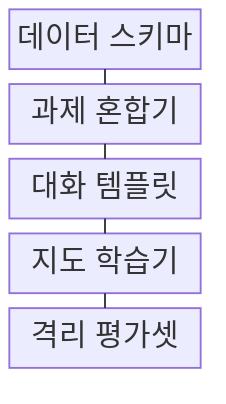
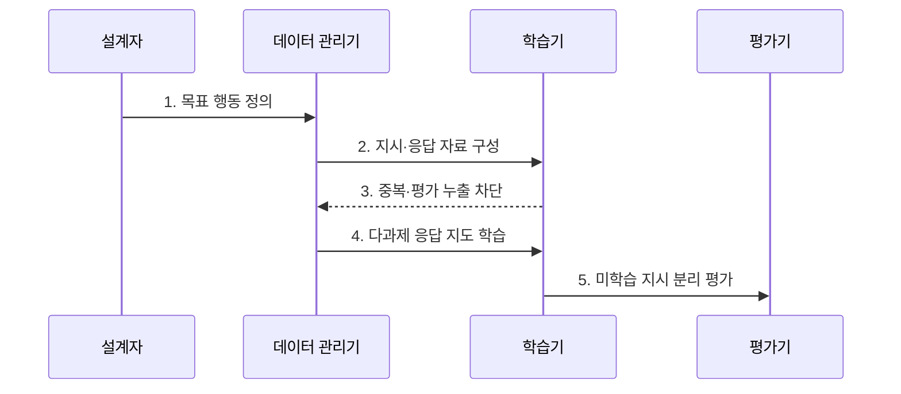

---
sidebar:
  order: 60
  label: "060. Instruction Tuning (지시 튜닝)"
  badge:
    text: "기출 · 50%"
    variant: note
title: "Instruction Tuning (지시 튜닝)"
date: "2026-07-27T23:59:59+09:00"
tags:
  - "notes-latest_tech"
weight: 60
extra:
  question_no: "060"
  source_status: "기출"
  source_history: "135회"
  priority: 50
  priority_note: "지시 이행 학습이 대화 모델의 기반"
---

## 미리 알고가기

- **지시 튜닝(Instruction Tuning)**: 다양한 과제의 지시문·입력·응답으로 지시 이행을 지도 학습
- **미학습 과제(Held-out Task)**: 학습에서 제외하고 새 지시 일반화를 평가하는 과제
- **합성 데이터(Synthetic Data)**: 모델이 생성하고 품질 검증을 거친 학습용 표본
- **정렬(Alignment)**: 모델 행동을 인간의 의도·선호·안전 기준에 맞추는 과정

## Ⅰ. 개요

- 정의/개념: 여러 과제의 지시문·입력·모범 응답으로 **지시 이행 능력을 지도 학습**
- 배경/필요성: 다음 토큰 예측만으로 불안정한 **새 지시·출력 형식** 준수 개선 필요

### 쉽게 이해하기 (학습용)
- 다양한 과업의 지시와 모범 응답으로 질문 의도와 답안 형식을 따르도록 훈련합니다.

## Ⅱ. 특징

- **다양한 과제·지시 표현 혼합**으로 미학습 지시에 대한 일반화를 높인다.
- **역할·지시·입력·응답·종료 템플릿**으로 학습 경계를 일관되게 한다.
- 지시 이행은 **사실성·안전성·인간 선호 정렬을 자동 보장하지 않는다.**

### 쉽게 이해하기 (학습용)
- 여러 문제 형식을 연습하면 지시 준수는 좋아지지만 답의 사실성과 안전성은 별도로 검증해야 합니다.

## Ⅲ. 구조 및 구성요소

| 구성요소 | 책임 |
|:---|:---|
| **데이터 스키마** | 지시·입력·**모범 응답** 관리 |
| **과제 혼합기** | 과제별 **표본 비율·난도** 조절 |
| **대화 템플릿** | 역할·지시·입력·**종료 경계** 정의 |
| **지도 학습기** | 응답 토큰 **손실 최적화** |
| **격리 평가셋** | 미학습 지시·**사실·안전** 측정 |

### 쉽게 이해하기 (학습용)

- 지시·입력·응답 형식을 통일하고 과업 비율을 조정하며 평가 자료를 격리합니다.

## Ⅳ. 흐름도

### 동작 원리

1. **목표 행동 정의**: 지시 준수·출력 형식의 **성공 기준** 설정
2. **지시·응답 자료 구성**: 과제별 입력과 **모범 응답** 연결
3. **중복·평가 누출 차단**: 근접 표본 제거와 **평가셋 격리**
4. **다과제 응답 지도 학습**: 응답 토큰 손실로 **매개변수 갱신**
5. **미학습 지시 분리 평가**: 일반화·사실성·**안전성** 독립 측정
### 쉽게 이해하기 (학습용)

- 학습·평가 자료의 중복을 제거하고 미학습 과업으로 일반화를 검증합니다.

## Ⅴ. 종류 및 비교

| 언어 모델 학습 목적 | 사전학습 | 지시 튜닝 | 선호·안전 정렬 |
|:---|:---|:---|:---|
| 적용 기준 | 범용 언어 능력 학습 | 새 지시 이행 학습 | 인간 선호·안전 행동 조정 |
| 핵심 특징 | 대규모 다음 토큰 예측 | 다과제 모범 응답 지도학습 | 선호 비교·안전 신호 학습 |
| 한계 | 지시 이행 불안정 | 사실성·안전 미보장 | 편향·과도한 거절 가능 |

> 요약: 학습 목적에 따라 사전학습·튜닝·정렬을 구분함
### 쉽게 이해하기 (학습용)

- 사전학습·지시 튜닝·선호 정렬은 학습 신호와 바꾸려는 행동이 다릅니다.

## Ⅵ. 실무 고려사항 및 대책

| 고려사항 | 대책 | 효과 |
|:---|:---|:---|
| 과제 분포 편중 | 과제군별 표본 비율·**난도 층화** | 소수 과제 일반화 보존 |
| 템플릿 오염 | 역할·**종료 토큰** 일관성 검증 | 입출력 경계 혼동 감소 |
| 평가 누출 | 중복·근접 표본 제거·**평가 격리** | 일반화 평가 신뢰 |
| 사실·안전 오판 | 사실성·안전·**선호 별도 평가** | 지시 준수와 정렬 분리 |

### 쉽게 이해하기 (학습용)
- 민감정보를 제거한 지시 데이터로 학습하고 평가 문항과 겹치는 표본은 사전에 제외합니다.

## Ⅶ. 결론
- **과제 다양성·평가 격리**로 지시 일반화를 확보하고 **사실성·안전성** 검증 후 배포

### 쉽게 이해하기 (학습용)
- 지시 수행 능력이 높아져도 사실성과 안전성이 함께 좋아졌다고 가정해서는 안 됩니다.
