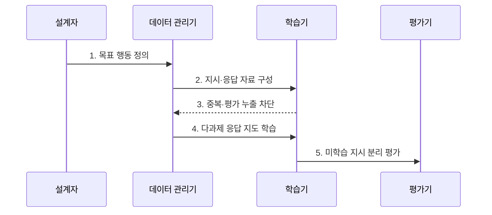

---
sidebar:
  order: 60
  label: "060. Instruction Tuning (지시 튜닝)"
  badge:
    text: "기출 · 50%"
    variant: note
title: "Instruction Tuning (지시 튜닝)"
date: "2026-08-02T09:31:00+09:00"
tags:
  - "notes-latest_tech"
weight: 60
extra:
  question_no: "060"
  source_status: "기출"
  source_history: "135회"
  priority: 50
  priority_note: "지시 이행 학습이 대화 모델의 기반"
---

## Ⅰ. 개요

핵심 용어

- **지시 튜닝(Instruction Tuning)**: 다양한 과제의 지시문·입력·모범 응답으로 모델의 지시 이행을 지도 학습하는 방법이다.
- **지시 이행**: 요청의 목표·조건·출력 형식을 해석하여 그에 맞는 응답을 생성하는 능력이다.

- 정의/개념: **지시 튜닝(Instruction Tuning)** 은 다과제 지시문·입력·모범 응답으로 지시 이행을 지도 학습하는 방법
- 배경/필요성: 다음 토큰 예측만으로는 **새 지시·출력 형식** 의 안정적 준수 불가

#### 한줄 요약
- 다양한 과업의 지시와 모범 응답으로 질문 의도와 답안 형식을 따르도록 훈련합니다.

## Ⅱ. 특징

핵심 용어

- **다과제 혼합**: 서로 다른 과제와 지시 표현을 함께 학습하여 새로운 지시로 일반화하는 방식이다.
- **대화 템플릿**: 역할·지시·입력·응답·종료 경계를 일관된 토큰 형식으로 정의한 서식이다.
- **정렬(Alignment)**: 모델 행동을 인간의 의도·선호·안전 기준에 맞추는 과정이다.

- **다양한 과제·지시 표현 혼합** 을 통한 미학습 지시 일반화
- **대화 템플릿** 을 통한 역할·지시·입력·응답 경계 일관성
- 지시 이행과 **사실성·안전성** 검증의 분리
- 지시 이행과 **인간 선호 정렬** 학습의 분리

#### 한줄 요약
- 여러 문제 형식을 연습하면 지시 준수는 좋아지지만 답의 사실성과 안전성은 별도로 검증해야 합니다.

## Ⅲ. 구조 및 구성요소

핵심 용어

- **과제 혼합기**: 과제별 표본 비율과 난도를 조정하여 특정 과제의 편중을 줄인다.
- **응답 토큰 손실**: 모범 응답과 모델 출력 토큰의 차이를 줄이도록 매개변수를 갱신하는 학습 기준이다.
- **격리 평가셋**: 학습 자료와 분리하여 미학습 지시·사실성·안전성을 측정하는 평가 모음이다.

| 구성요소 | 책임 |
|:---|:---|
| 데이터 스키마 | **지시·입력·모범 응답** 관리 |
| 과제 혼합기 | **과제별 표본 비율·난도** 조절 |
| 대화 템플릿 | **역할·지시·입력·종료 경계** 정의 |
| 지도 학습기 | **응답 토큰 손실** 최적화 |
| 격리 평가셋 | **미학습 지시·사실·안전** 측정 |

#### 한줄 요약

- 지시·입력·응답 형식을 통일하고 과업 비율을 조정하며 평가 자료를 격리합니다.

## Ⅳ. 흐름도

핵심 용어

- **평가 누출**: 평가 문항이나 유사 표본이 학습 데이터에 포함되어 일반화 성능이 과대 측정되는 문제다.
- **미학습 과제(Held-out Task)**: 학습에서 제외하고 새로운 지시에 대한 일반화 성능을 평가하는 과제다.

**동작 원리**

1. **목표 행동 정의**: 지시 준수·출력 형식의 **성공 기준** 설정
2. **지시·응답 자료 구성**: 과제별 입력과 **모범 응답** 연결
3. **중복·평가 누출 차단**: 근접 표본 제거와 **평가셋 격리**
4. **다과제 응답 지도 학습**: 응답 토큰 손실로 **매개변수 갱신**
5. **미학습 지시 분리 평가**: 일반화·사실성·**안전성** 독립 측정
#### 한줄 요약

- 학습·평가 자료의 중복을 제거하고 미학습 과업으로 일반화를 검증합니다.

## Ⅴ. 종류 및 비교

핵심 용어

- **사전학습**: 대규모 다음 토큰 예측으로 범용 언어 표현과 지식을 학습한다.
- **지시 튜닝**: 다과제 모범 응답으로 새로운 지시를 따르는 행동을 학습한다.
- **선호·안전 정렬**: 비교 선호와 안전 신호로 인간이 원하는 행동과 거절 기준을 조정한다.

| 언어 모델 학습 목적 | 사전학습 | 지시 튜닝 | 선호·안전 정렬 |
|:---|:---|:---|:---|
| 적용 기준 | **범용 언어 능력 학습** | **새 지시 이행 학습** | **인간 선호·안전 행동 조정** |
| 핵심 특징 | **대규모 다음 토큰 예측** | **다과제 모범 응답 지도학습** | **선호 비교·안전 신호 학습** |
| 한계 | **지시 이행 불안정** | **사실성·안전 미보장** | **편향·과도한 거절 가능** |

#### 한줄 요약

- 사전학습·지시 튜닝·선호 정렬은 학습 신호와 바꾸려는 행동이 다릅니다.

## Ⅵ. 실무 고려사항 및 대책

핵심 용어

- **과제 분포 편중**: 일부 과제의 표본이 지나치게 많아 다른 지시의 일반화 성능이 낮아지는 문제다.
- **템플릿 오염**: 역할·종료 토큰이 일관되지 않아 모델이 입력과 응답 경계를 혼동하는 문제다.
- **분리 평가**: 지시 준수·사실성·안전성·선호를 서로 다른 지표로 측정하는 원칙이다.

| 문제 | 대책 | 효과 |
|:---|:---|:---|
| **과제 분포 편중** | 과제군별 표본 비율·**난도 층화** | 소수 과제의 **일반화 보존** |
| **템플릿 오염** | 역할·**종료 토큰** 일관성 검증 | 입출력 경계의 **혼동 감소** |
| **평가 누출** | 중복·근접 표본 제거·**평가 격리** | 일반화 평가의 **신뢰 확보** |
| **사실·안전 오판** | 사실성·안전·**선호 별도 평가** | 지시 준수와 **정렬 분리** |

#### 한줄 요약
- 민감정보를 제거한 지시 데이터로 학습하고 평가 문항과 겹치는 표본은 사전에 제외합니다.

## Ⅶ. 결론

핵심 용어

- **지시 튜닝 적용 범위**: 새 지시와 출력 형식을 안정적으로 따르는 능력을 학습하는 데 사용한다.
- **선호·안전 정렬 적용 범위**: 사실성과 안전 행동을 별도 평가한 뒤 인간 의도에 맞게 조정하는 데 사용한다.

- 지시 준수는 **지시 튜닝**, 사실·안전 행동은 **선호·안전 정렬** 적용

#### 한줄 요약
- 지시 수행 능력이 높아져도 사실성과 안전성이 함께 좋아졌다고 가정해서는 안 됩니다.
