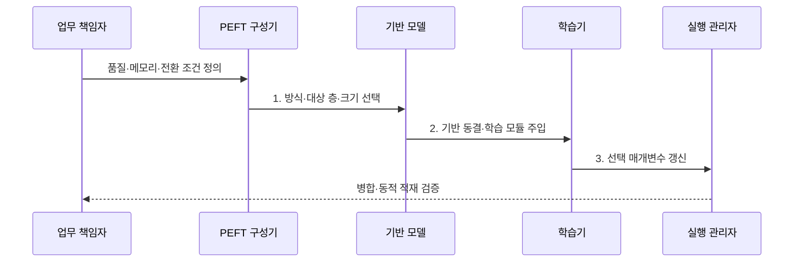

---
sidebar:
  order: 61
  label: "061. PEFT (매개변수 효율적 미세조정)"
  badge:
    text: "기출 · 70%"
    variant: note
title: "PEFT (매개변수 효율적 미세조정)"
date: "2026-07-31T08:34:26+09:00"
tags:
  - "notes-latest_tech"
weight: 61
extra:
  question_no: "061"
  source_status: "기출"
  source_history: "135회"
  priority: 70
  priority_note: "효율적 미세조정 비교가 반복 출제축"
---

## 미리 알고가기

- **매개변수 효율적 미세조정(Parameter-Efficient Fine-Tuning, PEFT)**: 큰 기반 모델은 그대로 두고 작은 학습 부품만 교체하여 업무별 모델을 만드는 기술군
- **동결(Freeze)**: 기반 모델의 가중치를 역전파 갱신 대상에서 제외하는 설정
- **어댑터(Adapter)**: 모델 층 사이에 삽입하여 업무별 표현을 학습하는 소형 신경망 모듈
- **프롬프트 튜닝(Prompt Tuning)**: 입력 앞의 학습 가능한 가상 토큰만 갱신하는 PEFT 방식
- **저랭크 적응(Low-Rank Adaptation, LoRA)**: 가중치 변화량을 두 작은 저랭크 행렬의 곱으로 학습하는 PEFT 방식
- **가중치 병합(Weight Merge)**: 학습한 변화량을 기반 가중치에 더하여 별도 어댑터 연산을 없애는 배포 방식

## Ⅰ. 개요

- 정의/개념: **PEFT**는 기반 모델을 동결하고 소수 추가·선택 매개변수만 갱신하는 미세조정 기술군
- 배경/필요성: 전체 미세조정은 가중치·그래디언트·학습 상태와 **업무별 모델 복제 비용** 유발

### 쉽게 이해하기 (학습용)
- 공용 본체는 잠그고 업무마다 작은 교체 부품만 학습해 별도로 보관함

## Ⅱ. 특징

- 기반 가중치 동결과 **소수 매개변수 선택 갱신**
- 주입 위치·구조에 따른 **학습 용량·추론 경로 차이**
- 공용 기반 모델과 업무별 모듈의 **저장·전환 분리**

### 쉽게 이해하기 (학습용)
- 작은 부품만 학습해 저장량은 줄지만 부품의 위치와 실행 방식에 따라 품질과 속도가 달라짐

## Ⅲ. 구조 및 구성요소

| 구성요소 | 책임 |
|:---|:---|
| **동결 기반 모델** | 공통 표현 제공·원본 가중치 보존 |
| **주입 구성** | PEFT 유형·대상 층·크기 지정 |
| **학습 모듈** | 업무별 변화량 저장 |
| **실행 관리자** | 기반 모델과 모듈 병합·적재·전환 |

### 쉽게 이해하기 (학습용)
- 하나의 공용 본체에 업무별 작은 모듈을 연결하고 실행할 모듈만 골라 적재함

## Ⅳ. 흐름도

**동작 원리**

1. **방식·대상 층·크기 선택**: 모델 구조와 실행 조건에 맞는 **PEFT 구성** 결정
2. **기반 동결·학습 모듈 주입**: 원본 갱신을 막고 선택 위치에 **업무별 경로** 연결
3. **선택 매개변수 갱신**: 역전파 대상을 제한해 **경량 모듈 가중치** 학습

### 쉽게 이해하기 (학습용)
- 필요한 업무 조건을 정하고 작은 부품만 학습한 뒤 합치거나 교체할 때의 비용을 확인함

## Ⅴ. 종류 및 비교

| 비교 기준 | Adapter | Prompt Tuning | LoRA |
|:---|:---|:---|:---|
| **적용 기준** | 중간 **표현 변환** 필요 | **입력층 조정**으로 충분 | 선형층 **변화량 적응** |
| 핵심 특징 | 층 사이 **소형 모듈 삽입** | 입력의 **가상 토큰 학습** | 병렬 **저랭크 행렬 학습** |
| **한계** | 추가 **순차 연산** | 문맥 길이·**표현력 제약** | 대상 층·**랭크 선택** 필요 |

### 쉽게 이해하기 (학습용)
- 중간층 부품, 입력 가상 토큰, 가중치 수정분 중 어디를 학습할지 고르는 차이임

## Ⅵ. 실무 고려사항 및 대책

| 고려사항 | 대책 | 효과 |
|:---|:---|:---|
| PEFT 유형별 **학습 용량 부족** | 동일 데이터로 Adapter·Prompt·LoRA 품질 비교 | 과업에 맞는 **주입 방식 선택** |
| 다중 업무 모듈의 **적재·전환 지연** | 모듈 크기·캐시·동시 전환 부하 시험 | 공용 기반 모델의 **전환 효율 확보** |
| 가중치 병합 후 **원본 복구 곤란** | 원본·모듈 분리 보관과 병합 전후 회귀 시험 | 배포 품질과 **가역성 확보** |

### 쉽게 이해하기 (학습용)
- 작은 모듈도 과업 능력이 부족하거나 자주 바꾸면 느려질 수 있어 학습과 전환을 함께 비교함

## Ⅶ. 결론

- 과업 표현력·학습 자원·모듈 전환 방식을 기준으로 **PEFT 유형과 병합 정책** 결정

### 쉽게 이해하기 (학습용)
- 학습량만 줄이지 말고 과업 품질과 실제 교체 비용에 맞는 방식을 선택함
