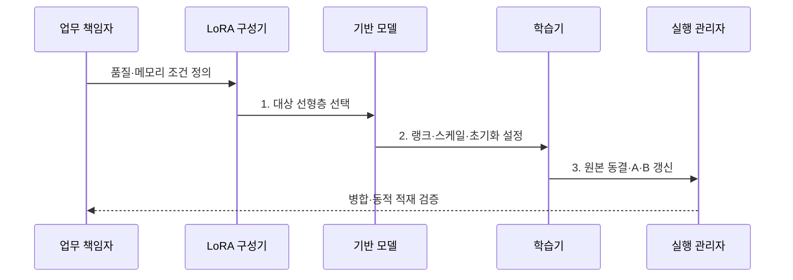

---
sidebar:
  order: 62
  label: "062. LoRA (저랭크 적응)"
  badge:
    text: "기출 · 80%"
    variant: note
title: "LoRA (저랭크 적응)"
date: "2026-08-02T09:31:00+09:00"
tags:
  - "notes-latest_tech"
weight: 62
extra:
  question_no: "062"
  source_status: "기출"
  source_history: "131회, 132회, 135회"
  priority: 80
  priority_note: "저랭크 적응이 경량 튜닝의 대표 기법"
---

## Ⅰ. 개요

핵심 용어

- **저랭크 적응(Low-Rank Adaptation, LoRA)**: 기반 가중치를 동결하고 두 작은 행렬이 만드는 변화량만 학습하는 PEFT 기법이다.
- **저랭크 행렬**: 큰 행렬의 변화를 더 작은 중간 차원을 가진 두 행렬의 곱으로 표현한 행렬이다.

- 정의/개념: **LoRA**는 동결 가중치에 더할 저랭크 변화량 $BA$만 학습하는 PEFT 기법
- 배경/필요성: 전체 가중치 갱신은 학습 상태 메모리와 **과업별 모델 복제 비용** 유발

### 쉽게 이해하기 (학습용)
- 큰 원본 행렬은 잠그고 두 작은 행렬을 곱한 수정분만 원본 출력에 더함

## Ⅱ. 특징

핵심 용어

- **동결 가중치($W_0$)**: 학습 중 값을 유지하는 기반 선형 변환 행렬이다.
- **랭크($r$)**: 두 작은 행렬 사이의 중간 차원으로 변화량의 표현 용량을 정한다.
- **스케일 계수($\alpha$)**: LoRA 변화량이 원본 출력에 반영되는 크기를 조절한다.

> 랭크가 4에서 64로 16배 증가해도 LoRA 학습량은 선형 증가하며 전체 4096×4096 가중치보다 작고, 해당 차원 가정의 이론값이지 특정 모델 실측값은 아니다.

- $W_0$ 동결과 $A·B$ 선택 갱신에 따른 **학습 상태 축소**
- $r$과 $\alpha/r$에 의한 **적응 용량·반영 크기 조절**
- 대상 선형층과 병합 여부에 따른 **품질·추론 경로 결정**

### 쉽게 이해하기 (학습용)
- 수정분의 폭과 세기, 삽입 위치를 조절해 작은 학습량으로 원하는 변화를 만듦

## Ⅲ. 구조 및 구성요소

핵심 용어

- **LoRA 변화량($BA$)**: 학습 행렬 $B$와 $A$의 곱으로 만든 가중치 수정분이다.
- **대상 모듈**: LoRA 경로를 주입할 어텐션이나 FFN의 선형층 범위다.
- **어댑터 파일**: 학습한 A·B 행렬과 구성을 기반 모델과 분리해 저장한 자산이다.

| 구성요소 | 책임 |
|:---|:---|
| **동결 경로 W₀** | 기반 선형 변환·원본 능력 보존 |
| **저랭크 행렬 A,B** | BA로 가중치 변화량 생성 |
| **랭크·스케일** | r 용량과 α/r 반영 크기 조절 |
| **대상 모듈** | LoRA 주입 선형층 범위 지정 |
| **어댑터 파일** | 학습 행렬·구성 분리 저장·병합 |

### 쉽게 이해하기 (학습용)
- 입력이 원본 경로와 작은 수정 경로를 함께 지나고 두 결과가 출력에서 합쳐짐

## Ⅳ. 흐름도

핵심 용어

- **초기화**: 학습 시작 시 LoRA 변화량이 원본 출력을 바꾸지 않도록 A·B 값을 설정하는 과정이다.
- **변화량 학습**: 원본 가중치는 보존하고 A·B에만 그래디언트를 적용하는 과정이다.

**동작 원리**

1. **대상 선형층 선택**: 변화가 필요한 투영 계층에 **LoRA 경로** 지정
2. **랭크·스케일·초기화 설정**: 표현 용량과 초기 출력 변화의 **학습 조건** 구성
3. **원본 동결·A·B 갱신**: $W_0$를 보존하고 $A,B$만 역전파로 **변화량 학습**

### 쉽게 이해하기 (학습용)
- 수정할 층과 행렬 크기를 정해 작은 행렬만 학습하고 실행할 때 합칠지 따로 둘지 결정함

## Ⅴ. 종류 및 비교

핵심 용어

- **전체 미세조정**: 원본 가중치 전체를 갱신하여 적응 폭은 크지만 학습·저장 비용도 크다.
- **Adapter**: 모델 층 사이에 직렬 소형 모듈을 삽입하여 중간 표현을 조정한다.
- **LoRA**: 선형층과 병렬인 저랭크 변화량 경로만 학습한다.

| 비교 기준 | 전체 미세조정 | Adapter | LoRA |
|:---|:---|:---|:---|
| **적용 기준** | **전체 적응** 필요 | 추가 **층 연산** 허용 | 선형층 **변화량 적응** |
| 핵심 특징 | 원본 가중치 **전체 갱신** | 직렬 **소형 모듈 삽입** | 병렬 **저랭크 변화량** |
| **한계** | **학습·저장 비용** | 순차 **추론 연산** | 랭크·**대상 층 선택** 필요 |

### 쉽게 이해하기 (학습용)
- 원본 전체, 새 중간층, 작은 수정 행렬 중 무엇을 학습하는지가 다름

## Ⅵ. 실무 고려사항 및 대책

핵심 용어

- **표현 용량 부족**: 랭크가 너무 낮아 필요한 과업 변화량을 충분히 나타내지 못하는 문제다.
- **주입 제거 시험**: Q·K·V·O 등 특정 LoRA 경로를 제외한 뒤 품질 변화를 측정해 유효 위치를 찾는 평가다.
- **병합 동등성**: LoRA를 원본에 합친 출력과 분리 실행 출력이 허용 오차 안에서 같은 성질이다.

| 문제 | 대책 | 효과 |
|:---|:---|:---|
| 낮은 $r$의 **표현 용량 부족** | 랭크별 과업 품질·학습 메모리 비교 | 최소 유효 **랭크 선택** |
| 대상 층 누락의 **과업 적응 실패** | **Q·K·V·O 투영**별 주입 제거 시험 | 유효 **주입 위치 식별** |
| 병합 전후의 **출력 불일치** | 동일 정밀도에서 병합 수치·품질 회귀 시험 | 배포 경로의 **동등성 확보** |

### 쉽게 이해하기 (학습용)
- 작은 행렬이 너무 좁거나 잘못된 층에 붙으면 배우지 못하므로 크기와 위치를 함께 시험함

## Ⅶ. 결론

핵심 용어

- **랭크 선택**: 과업 품질을 충족하는 최소 표현 용량과 학습 메모리를 비교해 결정한다.
- **병합 방식**: 고정 배포는 원본에 합치고 다중 업무 전환은 어댑터를 분리 적재하도록 정한다.

- 과업 변화량·학습 메모리·배포 경로를 기준으로 **LoRA 랭크·대상 층·병합 방식** 결정

### 쉽게 이해하기 (학습용)
- 수정분을 표현할 만큼의 행렬 폭과 효과가 큰 층, 실행에 맞는 병합 방식을 선택함
