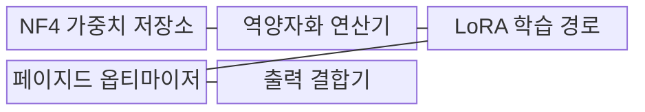
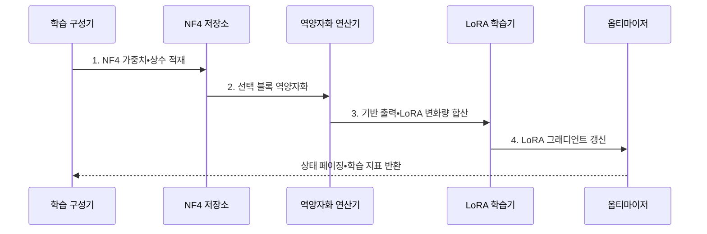

---
sidebar:
  order: 63
  label: "063. QLoRA (양자화 저랭크 적응)"
  badge:
    text: "기출 • 60%"
    variant: note
title: "QLoRA (양자화 저랭크 적응)"
date: "2026-08-04T15:13:00+09:00"
tags:
  - "notes-latest_tech"
weight: 63
extra:
  question_no: "063"
  source_status: "기출"
  source_history: "135회"
  priority: 60
  priority_note: "양자화 결합 튜닝의 비용 절감이 핵심"
---

## Ⅰ. 개요

핵심 용어

- **양자화 저랭크 적응(Quantized Low-Rank Adaptation, QLoRA)**: 4비트 기반 모델을 압축 상태로 동결하고 계산 시 역양자화하여 저랭크 적응 경로만 학습하는 기법이다.
- **저랭크 적응(Low-Rank Adaptation, LoRA)**: 기반 가중치를 고정하고 두 작은 행렬이 만드는 변화량만 학습하는 방식이다.

- 정의/개념: **양자화 저랭크 적응(Quantized Low-Rank Adaptation, QLoRA)** 은 4비트 동결 기반 모델을 역양자화하고 **저랭크 적응(Low-Rank Adaptation, LoRA)** 경로만 갱신하는 미세조정 기법
- 배경/필요성: 고정밀 기반 가중치 적재로 **제한된 GPU 메모리** 에서 대형 모델 학습 곤란

#### 한줄 요약
- 큰 원본은 4비트로 접어 보관하고 계산 순간에만 펼쳐 작은 LoRA 수정분을 학습함

## Ⅱ. 특징

핵심 용어

- **4비트 정규 부동소수점(NormalFloat 4-bit, NF4)**: 정규분포 형태의 사전학습 가중치를 표현하도록 설계된 4비트 자료형이다.
- **이중 양자화**: 가중치 블록의 양자화 상수도 다시 양자화하여 저장량을 줄이는 기법이다.
- **페이지드 옵티마이저**: 메모리 부족 시 옵티마이저 상태를 CPU와 GPU 사이에서 이동하여 순간 사용량을 완화한다.

- **4비트 정규 부동소수점(NormalFloat 4-bit, NF4)•이중 양자화** 에 따른 동결 가중치 저장량 축소
- 계산 자료형 **역양자화•저랭크 적응(Low-Rank Adaptation, LoRA)** 을 결합한 혼합 정밀도 학습
- **페이지드 옵티마이저** 를 활용한 순간 메모리 급증 완화

페이지드 옵티마이저는 **중앙처리장치(Central Processing Unit, CPU)** 와 **그래픽 처리장치(Graphics Processing Unit, GPU)** 사이에서 상태를 이동한다.

#### 한줄 요약
- 가중치와 양자화 상수는 작게 보관하고 계산 때 필요한 블록만 복원함

## Ⅲ. 구조 및 구성요소

핵심 용어

- **블록 양자화**: 가중치를 여러 블록으로 나누고 블록마다 양자화 상수를 적용하는 방식이다.
- **NF4 가중치 저장소**: 정규분포 가중치를 4비트 코드와 양자화 상수로 압축 저장한다.
- **역양자화**: 압축 가중치를 행렬 연산에 사용할 계산 자료형으로 복원하는 연산이다.
- **LoRA 학습 경로**: 동결된 기반 가중치에 더할 저랭크 변화량만 학습하는 경로이다.
- **페이지드 옵티마이저(Paged Optimizer)**: 옵티마이저 상태를 통합 메모리로 이동시켜 순간 그래픽 처리장치 메모리 사용량을 완화한다.
- **출력 결합기**: 복원한 기반 출력과 학습 중인 LoRA 변화량을 합산한다.

구조는 **4비트 정규 부동소수점(NormalFloat 4-bit, NF4) 저장소**, 역양자화 연산기, **저랭크 적응(Low-Rank Adaptation, LoRA) 학습 경로**, 페이지드 옵티마이저로 구성된다.

| 구성요소 | 책임 |
|:---|:---|
| **NF4 가중치 저장소** | 4비트 가중치•양자화 상수 보관 |
| **역양자화 연산기** | 선택 블록을 계산 자료형으로 복원 |
| **LoRA 학습 경로** | 저랭크 변화량 그래디언트 갱신 |
| **페이지드 옵티마이저** | 상태의 CPU•GPU 계층 이동 |
| **출력 결합기** | 기반 출력과 LoRA 변화량 합산 |

#### 한줄 요약
- 4비트 저장소에서 가중치를 꺼내 계산용으로 복원하고 학습 중인 LoRA 결과와 합침

## Ⅳ. 흐름도

핵심 용어

- **혼합 정밀도 학습**: 기반 가중치는 저비트로 저장하고 계산과 학습 매개변수는 더 높은 정밀도로 처리하는 방식이다.
- **상태 페이징**: GPU 메모리 피크를 낮추도록 옵티마이저 상태를 CPU와 GPU 사이에서 이동하는 과정이다.

**동작 원리**

1. **4비트 정규 부동소수점(NormalFloat 4-bit, NF4) 가중치•상수 적재**: 기반 모델을 압축 상태로 고정해 **그래픽 처리장치(Graphics Processing Unit, GPU) 저장량** 절감
2. **선택 블록 역양자화**: 현재 연산에 필요한 가중치만 **계산 정밀도** 로 복원
3. **기반 출력•저랭크 적응(Low-Rank Adaptation, LoRA) 변화량 합산**: 고정 기반 경로와 학습 경로의 **통합 출력** 생성
4. **저랭크 적응 그래디언트 갱신**: 역전파 대상을 저랭크 행렬로 제한해 **학습 상태** 축소

#### 한줄 요약
- 압축 원본을 필요한 만큼 펼쳐 수정분과 계산하고 작은 수정분만 업데이트함

## Ⅴ. 종류 및 비교

핵심 용어

- **전체 미세조정**: 전체 가중치와 학습 상태를 고정밀로 갱신한다.
- **LoRA 적용**: 고정밀 기반 모델과 저랭크 변화량 학습
- **QLoRA 적용**: 4비트 기반 모델 복원과 저랭크 변화량 학습

**저랭크 적응(Low-Rank Adaptation, LoRA)** 과 **양자화 저랭크 적응(Quantized Low-Rank Adaptation, QLoRA)** 은 기반 가중치의 저장 정밀도가 다르다.

| 비교 기준 | 전체 미세조정 | LoRA | QLoRA |
|:---|:---|:---|:---|
| **적용 기준** | **학습 자원** 충분 | 원본 **적재 메모리** 충분 | 원본 **메모리 병목** |
| 핵심 특징 | 전체 가중치 **갱신** | 고정밀 원본•**LoRA 갱신** | 4비트 원본•**LoRA 갱신** |
| **한계** | **학습 상태 메모리** | 원본 **적재 비용** | 양자화 오차•**커널•페이징** |

#### 한줄 요약
- 원본 전체를 학습할지, 원본을 그대로 둘지, 4비트로 줄여 둘지가 다름

## Ⅵ. 실무 고려사항 및 대책

핵심 용어

- **양자화 손실**: 4비트 정규 부동소수점 근사와 역양자화 때문에 저랭크 적응 대비 과업 품질이 낮아지는 문제다.
- **커널 호환성**: 목표 그래픽 처리장치와 소프트웨어가 4비트 정규 부동소수점 저장•역양자화 연산을 지원하는 성질이다.
- **이동 병목**: 상태 페이징의 중앙처리장치•그래픽 처리장치 전송 시간이 학습 속도를 제한하는 문제다.

| 문제 | 대책 | 효과 |
|:---|:---|:---|
| **4비트 정규 부동소수점(NormalFloat 4-bit, NF4) 역양자화** 의 과업 품질 저하 | 동일 데이터의 **저랭크 적응(Low-Rank Adaptation, LoRA)•양자화 저랭크 적응(Quantized Low-Rank Adaptation, QLoRA) 회귀 비교** | 양자화 손실 **판정** |
| 미지원 커널의 **학습 지연•실패** | 장치별 4비트 정규 부동소수점•역양자화 커널 호환 시험 | 실행 가능 환경 **확정** |
| 상태 페이징의 **중앙처리장치(Central Processing Unit, CPU)•그래픽 처리장치(Graphics Processing Unit, GPU) 이동 병목** | 피크 메모리와 전송 대역폭 동시 측정 | 메모리 절감의 **지연 대가 통제** |

#### 한줄 요약
- 압축 오차와 복원 커널, CPU로 상태를 옮기는 시간을 각각 확인함

## Ⅶ. 결론

핵심 용어

- **저랭크 적응 선택 기준**: 고정밀 원본을 적재할 메모리가 충분하고 양자화 오차를 피해야 할 때 사용한다.
- **양자화 저랭크 적응 선택 기준**: 그래픽 처리장치 메모리가 병목이고 4비트 정규 부동소수점 품질•커널•전송 비용이 허용 범위일 때 사용한다.

- **GPU 메모리•양자화 품질•커널 지원** 기준으로 **LoRA•QLoRA** 선택

#### 한줄 요약
- 메모리 절감이 품질 손실과 데이터 이동 시간을 감당할 만큼 큰지 비교함
