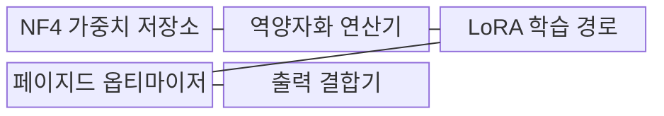
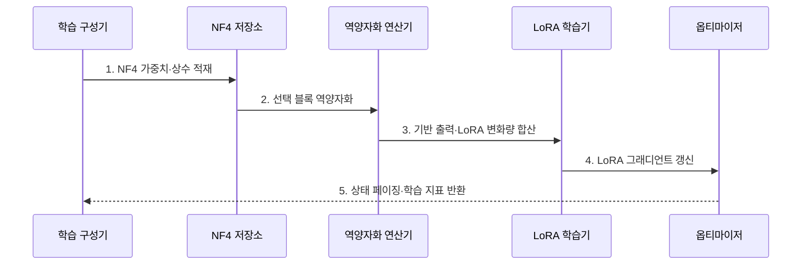

---
sidebar:
  order: 63
  label: "063. QLoRA (양자화 저랭크 적응)"
  badge:
    text: "기출 · 60%"
    variant: note
title: "QLoRA (양자화 저랭크 적응)"
date: "2026-07-30T11:04:43+09:00"
tags:
  - "notes-latest_tech"
weight: 63
extra:
  question_no: "063"
  source_status: "기출"
  source_history: "135회"
  priority: 60
  priority_note: "양자화 결합 튜닝의 비용 절감이 핵심"
---

## 미리 알고가기

- **양자화 저랭크 적응(Quantized Low-Rank Adaptation, QLoRA)**: 4비트 기반 모델은 압축 상태로 고정하고 계산할 때만 복원하여 LoRA 경로를 학습하는 기법
- **저랭크 적응(Low-Rank Adaptation, LoRA)**: 기반 가중치를 고정하고 두 작은 행렬이 만드는 변화량만 학습하는 방식
- **4비트 정규 부동소수점(NormalFloat 4-bit, NF4)**: 정규분포 형태의 사전학습 가중치를 표현하도록 설계된 4비트 자료형
- **블록 양자화(Block Quantization)**: 가중치를 여러 블록으로 나누고 블록마다 양자화 상수를 적용하는 방식
- **이중 양자화(Double Quantization)**: 가중치 블록의 양자화 상수도 다시 양자화하여 저장량을 줄이는 기법
- **역양자화(Dequantization)**: 압축된 가중치를 행렬 연산에 사용할 계산 자료형으로 복원하는 연산
- **페이지드 옵티마이저(Paged Optimizer)**: 메모리 부족 시 옵티마이저 상태를 CPU와 GPU 사이에서 이동하여 순간 사용량을 완화하는 방식
- **중앙·그래픽 처리장치(Central·Graphics Processing Unit, CPU·GPU)**: 옵티마이저 상태를 보관하는 호스트 장치와 모델 연산을 수행하는 가속 장치

## Ⅰ. 개요

- 정의/개념: **QLoRA**는 4비트 동결 기반 모델을 역양자화하고 LoRA 경로만 갱신하는 미세조정 기법
- 배경/필요성: LoRA도 고정밀 기반 가중치 적재로 **제한된 GPU 메모리**에서 대형 모델 학습 곤란

### 쉽게 이해하기 (학습용)
- 큰 원본은 4비트로 접어 보관하고 계산 순간에만 펼쳐 작은 LoRA 수정분을 학습함

## Ⅱ. 특징

- NF4·블록·이중 양자화에 따른 **동결 가중치 저장량 축소**
- 계산 자료형 역양자화와 LoRA를 결합한 **혼합 정밀도 학습**
- 페이지드 옵티마이저를 활용한 **순간 메모리 급증 완화**

### 쉽게 이해하기 (학습용)
- 가중치와 양자화 상수는 작게 보관하고 계산 때 필요한 블록만 복원함

## Ⅲ. 구조 및 구성요소

| 구성요소 | 책임 |
|:---|:---|
| NF4 가중치 저장소 | 4비트 가중치·양자화 상수 보관 |
| 역양자화 연산기 | 선택 블록을 계산 자료형으로 복원 |
| LoRA 학습 경로 | 저랭크 변화량 그래디언트 갱신 |
| 페이지드 옵티마이저 | 상태의 CPU·GPU 계층 이동 |
| 출력 결합기 | 기반 출력과 LoRA 변화량 합산 |

### 쉽게 이해하기 (학습용)
- 4비트 저장소에서 가중치를 꺼내 계산용으로 복원하고 학습 중인 LoRA 결과와 합침

## Ⅳ. 흐름도

**동작 원리**

1. **NF4 가중치·상수 적재**: 기반 모델을 압축 상태로 고정해 **GPU 저장량** 절감
2. **선택 블록 역양자화**: 현재 연산에 필요한 가중치만 **계산 정밀도**로 복원
3. **기반 출력·LoRA 변화량 합산**: 고정 기반 경로와 학습 경로의 **통합 출력** 생성
4. **LoRA 그래디언트 갱신**: 역전파 대상을 저랭크 행렬로 제한해 **학습 상태** 축소
5. **상태 페이징·학습 지표 반환**: 메모리 압박 시 상태를 이동하고 **품질·지연** 기록

### 쉽게 이해하기 (학습용)
- 압축 원본을 필요한 만큼 펼쳐 수정분과 계산하고 작은 수정분만 업데이트함

## Ⅴ. 종류 및 비교

| 비교 기준 | 전체 미세조정 | LoRA | QLoRA |
|:---|:---|:---|:---|
| 적용 기준 | 학습 자원 충분 | 원본 적재 메모리 충분 | 원본 메모리 병목 |
| 핵심 특징 | 전체 가중치 **갱신** | 고정밀 원본·**LoRA 갱신** | 4비트 원본·**LoRA 갱신** |
| 한계 | 학습 상태 메모리 | 원본 적재 비용 | 양자화 오차·커널·페이징 |

### 쉽게 이해하기 (학습용)
- 원본 전체를 학습할지, 원본을 그대로 둘지, 4비트로 줄여 둘지가 다름

## Ⅵ. 실무 고려사항 및 대책

| 고려사항 | 대책 | 효과 |
|:---|:---|:---|
| NF4 역양자화의 **과업 품질 저하** | 동일 데이터의 LoRA·QLoRA 회귀 비교 | 양자화 손실 **판정** |
| 미지원 커널의 **학습 지연·실패** | 장치별 NF4·역양자화 커널 호환 시험 | 실행 가능 환경 **확정** |
| 상태 페이징의 **CPU·GPU 이동 병목** | 피크 메모리와 전송 대역폭 동시 측정 | 메모리 절감의 **지연 대가 통제** |

### 쉽게 이해하기 (학습용)
- 압축 오차와 복원 커널, CPU로 상태를 옮기는 시간을 각각 확인함

## Ⅶ. 결론

- GPU 메모리·양자화 품질·커널 지원을 기준으로 **LoRA와 QLoRA 학습 경로** 선택

### 쉽게 이해하기 (학습용)
- 메모리 절감이 품질 손실과 데이터 이동 시간을 감당할 만큼 큰지 비교함
