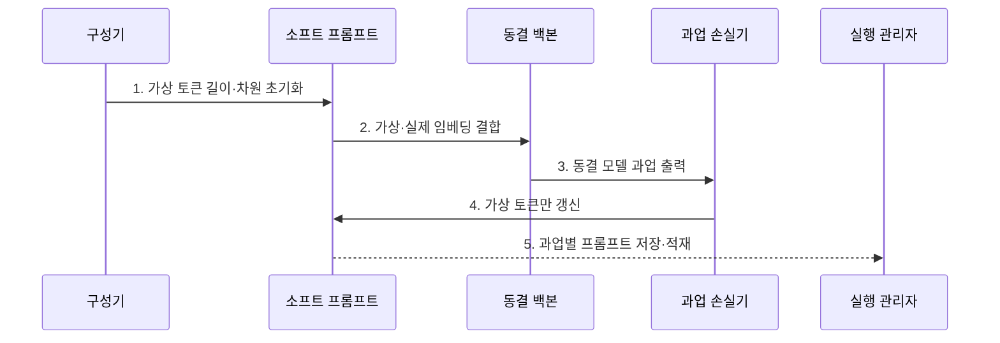

---
sidebar:
  order: 64
  label: "064. Prompt Tuning (프롬프트 튜닝)"
  badge:
    text: "기출 · 50%"
    variant: note
title: "Prompt Tuning (프롬프트 튜닝)"
date: "2026-07-30T11:04:43+09:00"
tags:
  - "notes-latest_tech"
weight: 64
extra:
  question_no: "064"
  source_status: "기출"
  source_history: "135회"
  priority: 50
  priority_note: "가상 토큰 학습은 PEFT 비교 항목"
---

## 미리 알고가기

- **프롬프트 튜닝(Prompt Tuning)**: 동결 모델의 입력 앞에 학습 가능한 가상 토큰을 붙여 과업별 행동을 조정하는 PEFT 방식
- **소프트 프롬프트(Soft Prompt)**: 사람이 읽는 문장이 아니라 역전파로 값이 갱신되는 연속 임베딩 벡터
- **하드 프롬프트(Hard Prompt)**: 사람이 읽고 직접 작성·수정하는 자연어 지시문
- **접두어 튜닝(Prefix Tuning)**: 입력층뿐 아니라 모델 각 층의 키·값 앞에 학습 가능한 접두어 벡터를 붙이는 방식
- **매개변수 효율적 미세조정(Parameter-Efficient Fine-Tuning, PEFT)**: 기반 모델을 동결하고 소수 추가·선택 매개변수만 학습하는 기술군
- **문맥 윈도우(Context Window)**: 모델이 한 번의 추론에서 참조할 수 있는 입력·출력 토큰의 최대 범위

## Ⅰ. 개요

- 정의/개념: **프롬프트 튜닝**은 동결 모델의 입력 앞에 붙는 과업별 가상 토큰 벡터만 학습하는 PEFT 기법
- 배경/필요성: 전체·어댑터 미세조정은 과업별 가중치와 **추가 모델 구성요소 관리** 필요

### 쉽게 이해하기 (학습용)
- 공용 모델 앞에 업무마다 다른 보이지 않는 표지판을 붙이고 표지판 값만 학습함

## Ⅱ. 특징

- 실제 입력 앞에 결합되는 **학습 가능 연속 임베딩**
- 기반 모델 동결과 **가상 토큰 선택 갱신**
- 프롬프트 길이에 따른 **표현 용량·문맥 비용 절충**

### 쉽게 이해하기 (학습용)
- 가상 표지판이 길면 더 많은 과업 정보를 담지만 실제 문장을 넣을 자리를 더 차지함

## Ⅲ. 구조 및 구성요소

| 구성요소 | 책임 |
|:---|:---|
| 소프트 프롬프트 | 과업별 **연속 임베딩 저장** |
| 프롬프트 초기화기 | 가상 토큰 길이·차원의 **초기값 구성** |
| 임베딩 결합기 | 가상·실제 토큰의 **입력 시퀀스 연결** |
| 동결 백본 | 고정 가중치 기반 **과업 출력 생성** |
| 과업 손실기 | 소프트 프롬프트의 **그래디언트 산출** |

### 쉽게 이해하기 (학습용)
- 가상 토큰과 실제 토큰을 한 줄로 이어 모델에 넣고 가상 토큰 쪽만 수정함

## Ⅳ. 흐름도

### 동작 원리

1. **가상 토큰 길이·차원 초기화**: 모델 임베딩 차원과 과업에 맞는 **학습 벡터** 생성
2. **가상·실제 임베딩 결합**: 소프트 프롬프트를 입력 앞에 붙여 **통합 시퀀스** 구성
3. **동결 모델 과업 출력**: 기반 가중치를 유지한 채 결합 입력의 **예측 결과** 생성
4. **가상 토큰만 갱신**: 과업 손실의 그래디언트를 소프트 프롬프트에만 **역전파**
5. **과업별 프롬프트 저장·적재**: 작은 벡터 자산을 분리해 **업무별 실행 경로** 전환

### 쉽게 이해하기 (학습용)
- 가상 표지판을 실제 문장 앞에 놓고 결과가 좋아지도록 표지판만 반복 수정함

## Ⅴ. 종류 및 비교

| 비교 기준 | 하드 프롬프트 | Prompt Tuning | Prefix Tuning |
|:---|:---|:---|:---|
| 적용 기준 | 즉시 작성·해석 필요 | 입력층 조정으로 충분 | 계층별 문맥 제어 필요 |
| 핵심 특징 | **자연어 지시문** 직접 작성 | 입력층 **가상 토큰 학습** | 계층별 **키·값 접두어 학습** |
| 한계 | 작성자·표현 편차 | 문맥 점유·해석 곤란 | 계층별 캐시 메모리 증가 |

### 쉽게 이해하기 (학습용)
- 사람이 쓰는 문장, 입력 앞의 가상 토큰, 모든 층의 가상 접두어 중 조정 위치가 다름

## Ⅵ. 실무 고려사항 및 대책

| 고려사항 | 대책 | 효과 |
|:---|:---|:---|
| 짧은 가상 토큰의 **과업 표현 부족** | 프롬프트 길이별 품질·문맥 점유 비교 | 최소 유효 **토큰 길이 선택** |
| 긴 가상 토큰의 **입력 문맥 축소** | 출력 예약 후 프롬프트·실제 입력 예산 분리 | 문맥 윈도우 **초과 방지** |
| 기반 모델 교체의 **프롬프트 호환 실패** | 모델별 프롬프트 재학습·회귀 시험 | 과업 품질 **복원** |

### 쉽게 이해하기 (학습용)
- 표지판이 너무 짧으면 뜻이 부족하고 너무 길면 실제 문장 자리가 줄어 모델마다 다시 맞춰야 함

## Ⅶ. 결론

- 과업 복잡도·문맥 예산·기반 모델 호환성을 기준으로 **프롬프트 길이와 적응 방식** 결정

### 쉽게 이해하기 (학습용)
- 과업 정보를 담으면서 실제 입력을 가리지 않는 가상 토큰 길이와 위치를 선택함
