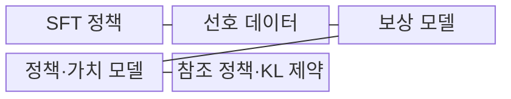
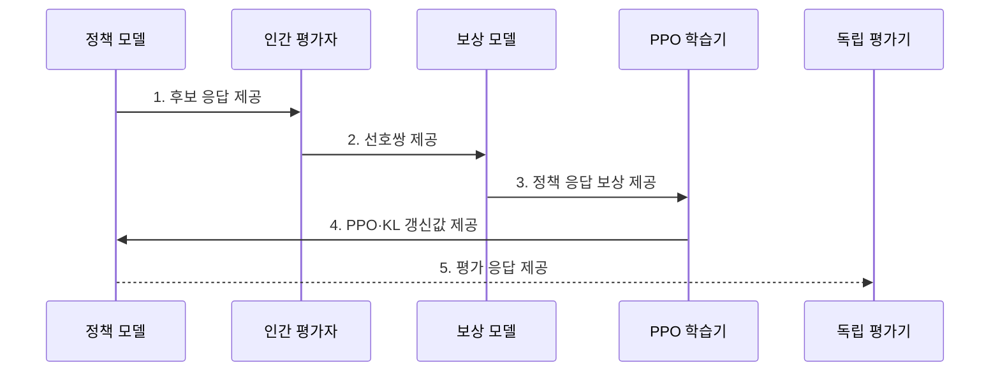

---
sidebar:
  order: 65
  label: "065. RLHF (인간 피드백 강화학습)"
  badge:
    text: "기출 · 70%"
    variant: note
title: "RLHF (인간 피드백 강화학습)"
date: "2026-07-31T08:36:02+09:00"
tags:
  - "notes-latest_tech"
weight: 65
extra:
  question_no: "065"
  source_status: "기출"
  source_history: "137회"
  priority: 70
  priority_note: "인간 선호 정렬이 생성형 AI 핵심"
---

## 미리 알고가기

- **인간 피드백 강화학습(Reinforcement Learning from Human Feedback, RLHF)**: 사람이 더 낫다고 고른 응답을 보상 신호로 바꾸어 언어 모델의 생성 정책을 조정하는 학습 방식
- **선호 데이터(Preference Data)**: 같은 입력에 대한 여러 응답의 우열을 사람이 비교하여 기록한 학습 자료
- **보상 모델(Reward Model, RM)**: 응답을 입력받아 인간이 선호할 정도를 하나의 보상 점수로 예측하는 모델
- **근접 정책 최적화(Proximal Policy Optimization, PPO)**: 한 번의 정책 갱신 폭을 제한하면서 보상을 높이는 강화학습 알고리즘
- **지도 미세조정(Supervised Fine-Tuning, SFT)**: 모범 응답을 따라 생성하도록 초기 정책을 학습하는 단계
- **쿨백-라이블러 발산(Kullback-Leibler Divergence, KL)**: 기준 정책과 현재 정책의 확률분포 차이를 측정하여 과도한 이탈을 제한하는 비대칭 척도
- **보상 해킹(Reward Hacking)**: 실제 인간 의도보다 보상 모델의 허점을 이용하는 응답으로 높은 점수를 얻는 현상
- **직접 선호 최적화(Direct Preference Optimization, DPO)**: 별도 보상 모델과 온라인 강화학습 없이 선호 응답 쌍으로 정책을 직접 조정하는 방식

> **키워드:** RLHF (인간 피드백 강화학습)

## Ⅰ. 개요

- 정의/개념: **RLHF**는 인간 선호 보상 모델로 언어 모델의 생성 정책을 강화학습하는 정렬 방식
- 배경/필요성: SFT의 모범 답안 모방만으로는 유용성·안전성 같은 **상대 선호 기준 반영**에 한계

### 쉽게 이해하기 (학습용)
- 여러 답 중 사람이 고른 답을 채점 기준으로 배우고 모델이 그 점수를 높이도록 연습함

## Ⅱ. 특징

- 인간 선호쌍 기반 **응답 순위 보상 모델 학습**
- PPO 보상 최대화와 KL 제약의 **정책 성능·이탈 절충**
- 보상 모델과 생성 정책을 분리한 **간접 선호 최적화**

### 쉽게 이해하기 (학습용)
- 사람의 선택을 배운 채점기가 점수를 주고 모델은 원래 말투에서 너무 멀어지지 않게 점수를 높임

## Ⅲ. 구조 및 구성요소

| 구성요소 | 책임 |
|:---|:---|
| **SFT 정책** | 모범 응답 기반 초기 정책 제공 |
| **선호 데이터** | 후보 응답 간 인간 비교 순위 저장 |
| **보상 모델** | 응답별 인간 선호 점수 예측 |
| **정책·가치 모델** | 응답 생성·기대 보상 추정 |
| **참조 정책·KL 제약** | 과도한 정책 이탈 제한 |

### 쉽게 이해하기 (학습용)
- 사람의 선택표로 채점기를 만들고 생성 모델이 기준 모델에서 크게 벗어나지 않으며 점수를 높이게 함

## Ⅳ. 흐름도

**동작 원리**

1. **후보 응답 제공**: 같은 입력의 여러 답으로 **비교 표본** 구성
2. **선호쌍 제공**: 선택·비선택 응답의 **우선순위 데이터** 전달
3. **정책 응답 보상 제공**: 현재 생성 결과에 **학습 보상 점수** 부여
4. **PPO·KL 갱신값 제공**: 보상을 높이되 참조 정책과의 **분포 이탈** 제한
5. **평가 응답 제공**: 보상 점수 밖의 유용성·안전성 **실패 행동** 검증

### 쉽게 이해하기 (학습용)
- 사람의 비교표로 채점기를 만들고 모델을 훈련한 뒤 다른 사람이 실제 답을 다시 확인함

## Ⅴ. 종류 및 비교

| 비교 기준 | SFT | RLHF | DPO |
|:---|:---|:---|:---|
| **적용 기준** | **지시 추종** 학습 | 보상 기반 **정책 탐색** | 고정 **선호쌍** 직접 학습 |
| 핵심 특징 | 모범 응답 **모방** | RM·PPO·KL **정책 최적화** | 선호쌍 **직접 정책 최적화** |
| **한계** | 시연 **품질·범위 의존** | 복잡성·**보상 해킹**·불안정 | 데이터 밖 **정책 탐색 제한** |

### 쉽게 이해하기 (학습용)
- 모범 답을 따라 하거나, 채점기 점수를 높이거나, 선호 답을 직접 더 자주 만들도록 배우는 차이임

## Ⅵ. 실무 고려사항 및 대책

| 고려사항 | 대책 | 효과 |
|:---|:---|:---|
| 평가자 구성 편향의 **보상 모델 왜곡** | 집단별 선호 일치도·갈등 표본 분석 | 선호 기준의 **대표성 확보** |
| 높은 RM 점수의 **보상 해킹** | 독립 인간 평가와 적대적 프롬프트 시험 | 실제 유용성 **검증** |
| 낮은 KL 제약의 **정책 붕괴** | KL 계수별 보상·언어 품질 공동 평가 | 정책 이탈 **통제** |

### 쉽게 이해하기 (학습용)
- 채점자가 치우치거나 모델이 채점 요령만 익히지 않도록 다른 사람이 답과 원래 말하기 능력을 다시 확인함

## Ⅶ. 결론

- 선호 대표성·보상 해킹·정책 이탈을 기준으로 **RLHF 보상 모델과 KL 제약** 조정

### 쉽게 이해하기 (학습용)
- 채점표의 대표성과 허점을 확인하면서 모델이 원래 능력을 잃지 않는 제약 강도를 선택함
