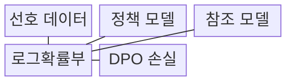
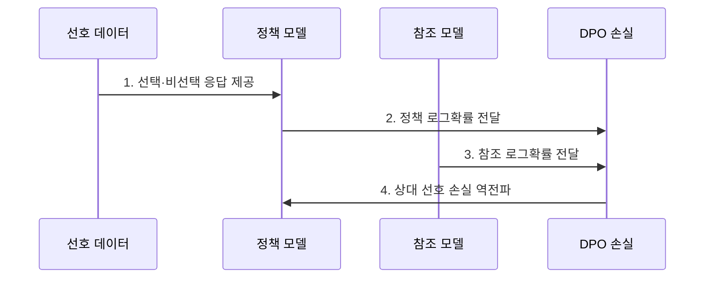

---
sidebar:
  order: 66
  label: "066. DPO (직접 선호 최적화)"
  badge:
    text: "미출 · 70%"
    variant: note
title: "DPO (직접 선호 최적화)"
date: "2026-08-02T09:31:00+09:00"
tags:
  - "notes-latest_tech"
weight: 66
extra:
  question_no: "066"
  source_status: "미출"
  source_history: ""
  priority: 70
  priority_note: "강화학습 없는 선호 최적화가 최신 쟁점"
---

## Ⅰ. 개요

핵심 용어

- **직접 선호 최적화(DPO)**: 별도 보상 모델과 온라인 강화학습 없이 선호·비선호 응답쌍으로 정책을 직접 훈련하는 정렬 기법이다.
- **선호 응답쌍**: 같은 질문에 대한 선택 응답과 비선택 응답을 한 쌍으로 기록한 학습 신호다.

- 정의/개념: **선호 응답쌍·참조 모델**로 정책을 직접 최적화하는 정렬 기법
- 배경/필요성: RLHF는 **보상 모델·온라인 강화학습**으로 훈련 복잡도 증가

### 쉽게 이해하기 (학습용)

- 좋은 답과 나쁜 답의 쌍을 이용해 좋은 답의 생성 가능성을 높입니다.

## Ⅱ. 특징

핵심 용어

- **참조 모델**: 정책 모델이 정렬 중 기존 품질을 잃지 않도록 기준 확률을 제공하는 동결 모델이다.
- **상대 로그확률**: 정책과 참조 모델이 선호·비선호 응답에 부여한 로그확률 차이를 비교한 값이다.
- **베타 계수($\beta$)**: 선호 적합과 참조 모델 보존 사이의 강도를 조절하는 하이퍼파라미터다.

- 별도 보상 모델 없는 **선호 응답쌍 직접 학습**
- 정책·참조 모델의 **상대 로그확률** 기반 선호 판정
- **베타 계수** 기반 선호 적합·참조 정책 보존 절충

### 쉽게 이해하기 (학습용)

- 준비된 답안쌍만 학습하므로 간단하지만 데이터 밖 오류는 발견하기 어렵습니다.

## Ⅲ. 구조 및 구성요소

핵심 용어

- **정책 모델**: 선호 응답 가능도를 높이고 비선호 응답 가능도를 낮추도록 갱신되는 모델이다.
- **로그확률부**: 정책·참조 모델의 응답 토큰 로그확률과 차이를 계산한다.
- **DPO 손실**: 상대 확률 차이가 선호 순서와 일치하도록 정책을 최적화하는 손실이다.

| 구성요소 | 책임 |
|:---|:---|
| **선호 데이터** | 선호·비선호 응답쌍 제공 |
| **정책 모델** | 선호 응답 가능도를 높이도록 갱신 |
| **참조 모델** | 동결 모델의 기준 확률 제공 |
| **로그확률부** | 정책·참조 확률 차이 계산 |
| **DPO 손실** | 상대 확률을 선호 순서에 맞게 최적화 |

### 쉽게 이해하기 (학습용)

- 정책과 동결한 참조 모델의 응답 가능도를 비교해 선호 응답의 확률을 높입니다.

## Ⅳ. 흐름도

핵심 용어

- **선택 응답**: 비교 평가에서 더 낫다고 판단되어 확률을 높일 학습 대상이다.
- **비선택 응답**: 비교 평가에서 덜 선호되어 선택 응답보다 확률을 낮출 대상이다.

**동작 원리**

1. **선택·비선택 응답 제공**: 동일 질문의 선호 순서 학습 신호 구성
2. **정책 로그확률 전달**: 갱신 대상 모델의 응답별 가능도 산출
3. **참조 로그확률 전달**: 동결 정책 대비 응답별 편차 기준 제공
4. **상대 선호 손실 역전파**: 베타 계수로 선호 적합과 정책 이탈 조절

### 쉽게 이해하기 (학습용)

- 답안쌍을 정제해 상대 확률을 학습하고 보지 못한 질문의 생성 결과도 확인합니다.

## Ⅴ. 종류 및 비교

핵심 용어

- **DPO**: 고정 선호쌍의 상대 로그확률을 직접 최적화한다.
- **지도 미세조정**: 모범 응답의 정답 토큰 가능도를 높여 지시 행동을 학습한다.
- **RLHF**: 별도 보상 모델을 학습하고 온라인 강화학습으로 보상을 최적화한다.

| 정렬 방식 | 직접 선호 최적화 | 지도 미세조정 | 인간 피드백 강화학습 |
|:---|:---|:---|:---|
| **적용 기준** | 고정 **선호쌍** 기반 단순 정렬 | 모범 응답 기반 **지시 학습** | 온라인 **탐색·반복 개선** |
| **핵심 특징** | **상대 로그확률** 직접 최적화 | 정답 토큰 **가능도 최대화** | **보상 모델** 기반 정책 갱신 |
| **한계** | 선호 데이터의 **범위·편향** 의존 | 응답 **품질·다양성** 의존 | **보상 해킹·학습 불안정** |

### 쉽게 이해하기 (학습용)

- DPO는 별도 채점 모델 없이 두 답 중 선호된 답을 더 자주 만들도록 학습합니다.

## Ⅵ. 실무 고려사항 및 대책

핵심 용어

- **길이 편향**: 응답의 실제 품질보다 길고 자세한 형식이 선호 신호로 학습되는 문제다.
- **정책 이탈**: 선호 데이터에 과도하게 맞추면서 참조 모델의 기존 언어 능력과 품질에서 멀어지는 현상이다.
- **과소 적합**: 제약이 지나치게 강해 정책이 선호 차이를 충분히 학습하지 못하는 현상이다.

| 문제 | 대책 | 효과 |
|:---|:---|:---|
| 길이 단서로 **선호쌍 편향** 학습 | 길이·출처 균형화와 **분할 평가** | 실제 품질 기반 **선호 신호** 확보 |
| 과도한 베타로 **정책 이탈·과소 적합** | **베타 계수**별 선호·품질 회귀 시험 | 선호 적합·**참조 정책 보존** 절충 |

### 쉽게 이해하기 (학습용)

- 응답 길이 같은 쉬운 단서를 외우지 않는지 살피고 새 질문의 품질을 확인해야 합니다.

## Ⅶ. 결론

핵심 용어

- **DPO 선택 기준**: 대표성 있는 고정 선호쌍이 충분하고 온라인 정책 탐색이 필요하지 않을 때 사용한다.
- **독립 생성 평가**: 학습 선호쌍 밖의 새로운 질문에서도 품질·안전성을 유지하는지 확인하는 평가다.

- 고정 선호쌍이 충분하면 **DPO**를 선택하고 범위 밖 생성은 **독립 평가**로 검증

### 쉽게 이해하기 (학습용)

- 답안쌍에 없던 상황도 잘 처리하는지 별도 생성 평가로 검증해야 합니다.
