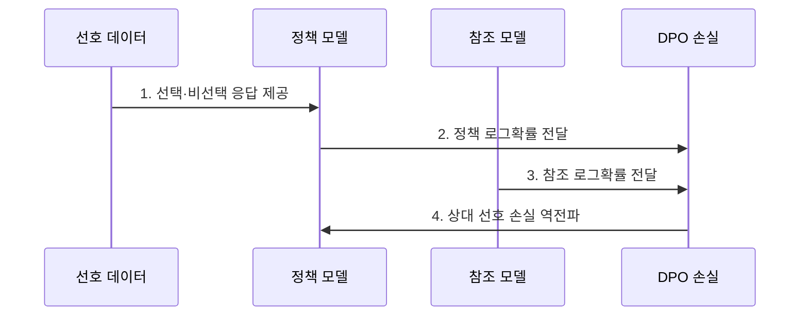

---
sidebar:
  order: 66
  label: "066. DPO (직접 선호 최적화)"
  badge:
    text: "미출 · 70%"
    variant: note
title: "DPO (직접 선호 최적화)"
date: "2026-07-25T23:15:00+09:00"
tags:
  - "notes-latest_tech"
weight: 66
extra:
  question_no: "066"
  source_status: "미출"
  source_history: ""
  priority: 70
  priority_note: "강화학습 없는 선호 최적화가 최신 쟁점"
---

## 미리 알고가기

- **직접 선호 최적화 (Direct Preference Optimization, DPO)**: 강화학습 단계를 우회해 선호·비선호 데이터쌍으로 모델을 훈련하는 정렬 기법
- **참조 모델 (Reference Model)**: 정책 모델이 정렬 과정에서 품질을 잃지 않도록 기준이 되는 동결 백본
- **베타 계수 (Beta, β)**: 참조 모델과의 로그 확률 거리 비율을 조절하는 하이퍼파라미터
- **브래들리-테리 모델 (Bradley-Terry Model)**: 응답 선호 확률을 선호 점수 차이의 로지스틱 함수로 정의하는 확률 모델

## Ⅰ. 개요

- 정의/개념: **선호 응답쌍·참조 모델**로 정책을 직접 최적화하는 정렬 기법
- 배경/필요성: RLHF의 **보상 모델·강화학습** 복잡성을 줄이는 오프라인 선호 학습 필요

### 쉽게 이해하기 (학습용)

- 좋은 답과 나쁜 답의 쌍을 이용해 좋은 답의 생성 가능성을 높입니다.

## Ⅱ. 특징

- 별도 보상 모델 없는 **선호 응답쌍 직접 학습**
- 정책·참조 모델의 **상대 로그확률** 기반 선호 판정
- **베타 계수** 기반 선호 적합·참조 정책 보존 절충

### 쉽게 이해하기 (학습용)

- 준비된 답안쌍만 학습하므로 간단하지만 데이터 밖 오류는 발견하기 어렵습니다.

## Ⅲ. 구조 및 구성요소

| 구성요소 | 책임 |
|:---|:---|
| 선호 데이터 | 선호·비선호 응답쌍 제공 |
| 정책 모델 | 선호 응답 가능도를 높이도록 갱신 |
| 참조 모델 | 동결 모델의 기준 확률 제공 |
| 로그확률부 | 정책·참조 확률 차이 계산 |
| DPO 손실 | 상대 확률을 선호 순서에 맞게 최적화 |

### 쉽게 이해하기 (학습용)

- 정책과 동결한 참조 모델의 응답 가능도를 비교해 선호 응답의 확률을 높입니다.

## Ⅳ. 흐름도

**동작 원리**

1. **선택·비선택 응답 제공**: 동일 질문의 선호 순서 학습 신호 구성
2. **정책 로그확률 전달**: 갱신 대상 모델의 응답별 가능도 산출
3. **참조 로그확률 전달**: 동결 정책 대비 응답별 편차 기준 제공
4. **상대 선호 손실 역전파**: 베타 계수로 선호 적합과 정책 이탈 조절

### 쉽게 이해하기 (학습용)

- 답안쌍을 정제해 상대 확률을 학습하고 보지 못한 질문의 생성 결과도 확인합니다.

## Ⅴ. 종류 및 비교

| 정렬 방식 | 직접 선호 최적화 | 지도 미세조정 | 인간 피드백 강화학습 |
|:---|:---|:---|:---|
| **적용 기준** | 고정 선호쌍 기반 단순 정렬 | 모범 응답 기반 지시 학습 | 온라인 탐색·반복 개선 |
| **핵심 특징** | 상대 로그확률 직접 최적화 | 정답 토큰 가능도 최대화 | 보상 모델 기반 정책 갱신 |
| **한계** | 선호 데이터 범위·편향 의존 | 응답 품질·다양성 의존 | 보상 해킹·학습 불안정 |

### 쉽게 이해하기 (학습용)

- DPO는 별도 채점 모델 없이 두 답 중 선호된 답을 더 자주 만들도록 학습합니다.

## Ⅵ. 실무 고려사항 및 대책

| 고려사항 | 대책 | 효과 |
|:---|:---|:---|
| 길이 단서로 **선호쌍 편향** 학습 | 길이·출처 균형화와 **분할 평가** | 실제 품질 기반 **선호 신호** 확보 |
| 과도한 베타로 **정책 이탈·과소 적합** | **베타 계수**별 선호·품질 회귀 시험 | 선호 적합·**참조 정책 보존** 절충 |

### 쉽게 이해하기 (학습용)

- 응답 길이 같은 쉬운 단서를 외우지 않는지 살피고 새 질문의 품질을 확인해야 합니다.

## Ⅶ. 결론

- **선호쌍 대표성·베타 계수**로 DPO의 정책 이탈과 선호 적합을 조절하는 정렬

### 쉽게 이해하기 (학습용)

- 답안쌍에 없던 상황도 잘 처리하는지 별도 생성 평가로 검증해야 합니다.
