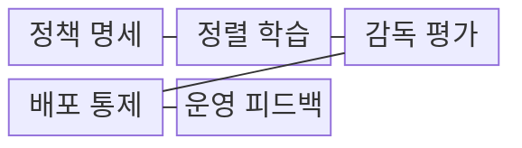
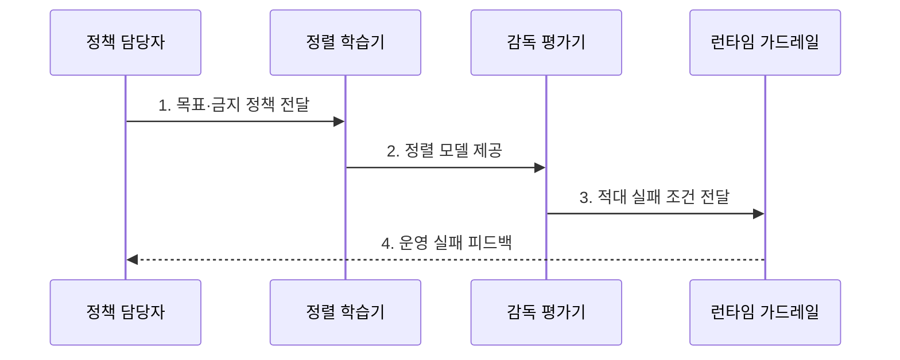

---
sidebar:
  order: 67
  label: "067. AI Alignment (AI 정렬)"
  badge:
    text: "기출 · 70%"
    variant: note
title: "AI Alignment (AI 정렬)"
date: "2026-07-31T08:36:52+09:00"
tags:
  - "notes-latest_tech"
weight: 67
extra:
  question_no: "067"
  source_status: "기출"
  source_history: "137회, 138회"
  priority: 70
  priority_note: "목표·가치 정렬과 안전 통제가 핵심"
---

## 미리 알고가기

- **인공지능 정렬(Artificial Intelligence Alignment, AI Alignment, 에이아이 얼라인먼트)**: 모델의 목표·행동을 인간 의도와 정책에 맞추는 과정
- **유용·정직·무해(Helpful, Honest, Harmless, HHH, 에이치 에이치 에이치)**: 세 단어의 같은 머리글자를 묶은 정렬 평가축
- **적대적 평가 (Red Teaming)**: 우회 입력으로 안전 실패를 탐색함
- **런타임 가드레일 (Runtime Guardrail)**: 입출력과 권한을 실행 중 통제함

## Ⅰ. 개요

- 정의/개념: 인간 의도·정책에 맞게 모델 목표·행동을 조정하는 **안전 최적화 과정**
- 배경/필요성: 성능 최적화만으로 **인간 의도·가치 준수**와 유해 행동 통제 불가

### 쉽게 이해하기 (학습용)

- 내비게이션에 목적지를 정확히 지정하듯 모델의 목표와 한계를 먼저 정합니다.

## Ⅱ. 특징

- 정책과 인간 의도의 목표 불일치를 줄이는 **명세·의도 정합**
- 모델의 응답·행동 성향을 조정하는 **정렬 학습**
- 학습 밖 실패를 제한하는 **적대적 평가·런타임 통제**

### 쉽게 이해하기 (학습용)

- 규칙을 잘 써도 모델이 평가의 허점을 이용할 수 있어 실제 행동을 따로 살핍니다.

## Ⅲ. 구조 및 구성요소

| 구성요소 | 책임 |
|:---|:---|
| **정책 명세** | 허용 행동과 우선순위 정의 |
| **정렬 학습** | 성향 반영 신호 조절 |
| **감독 평가** | 정상·적대 실패 측정 |
| **배포 통제** | 입출력·권한 실행 통제 |
| **운영 피드백** | 정책과 평가 갱신 |

### 쉽게 이해하기 (학습용)

- 목표·학습·평가·가드레일이 모델 행동을 함께 통제합니다.

## Ⅳ. 흐름도

**동작 원리**

1. **목표·금지 정책 전달**: **HHH** 행동 우선순위 명세
2. **정렬 모델 제공**: 선호·원칙 신호 기반 응답 성향 조정
3. **적대 실패 조건 전달**: 우회 입력의 과잉 거절·유해 행동 식별
4. **운영 실패 피드백**: 가드레일 결과의 정책·학습 평가 환류

### 쉽게 이해하기 (학습용)

- 목표를 학습·평가·통제하고 발견한 실패를 다시 반영합니다.

## Ⅴ. 종류 및 비교

| 정렬 계층 | 목표 명세 정렬 | 학습된 정책 정렬 | 배포 시점 통제 |
|:---|:---|:---|:---|
| **적용 기준** | 정책 **목적 정의** | 행동 **성향 학습** | 실행 **권한 제한** |
| **핵심 특징** | 목적·금지·**우선순위 명세** | 선호·원칙 기반 **행동 학습** | 권한·**입출력 제한** |
| **한계** | 대리 목표·**명세 누락** | 평가 밖 **행동 실패** | 우회 입력·**과잉 거절** |

### 쉽게 이해하기 (학습용)

- 목표 명세·정책 학습·배포 통제는 책임 지점이 다릅니다.

## Ⅵ. 실무 고려사항 및 대책

| 고려사항 | 대책 | 효과 |
|:---|:---|:---|
| 대리 지표 최적화로 **목표 불일치** | 정책 명세와 **적대 평가** 공동 설계 | 의도 밖 행동 탐지 |
| 강한 안전 정렬로 **과잉 거절** | 유용·무해 분리 평가와 임계값 조정 | 정상 요청 **유용성 보존** |

### 쉽게 이해하기 (학습용)

- 금지 답변뿐 아니라 정상 요청의 유용성을 평가하고 위험한 실행에는 승인을 둡니다.

## Ⅶ. 결론

- 목표 불일치는 **정렬 학습**, 실행 위험은 **런타임 가드레일**로 통제

### 쉽게 이해하기 (학습용)

- 규칙과 실제 행동이 어긋나는 사례를 찾아 학습·평가·통제를 함께 고쳐야 합니다.
