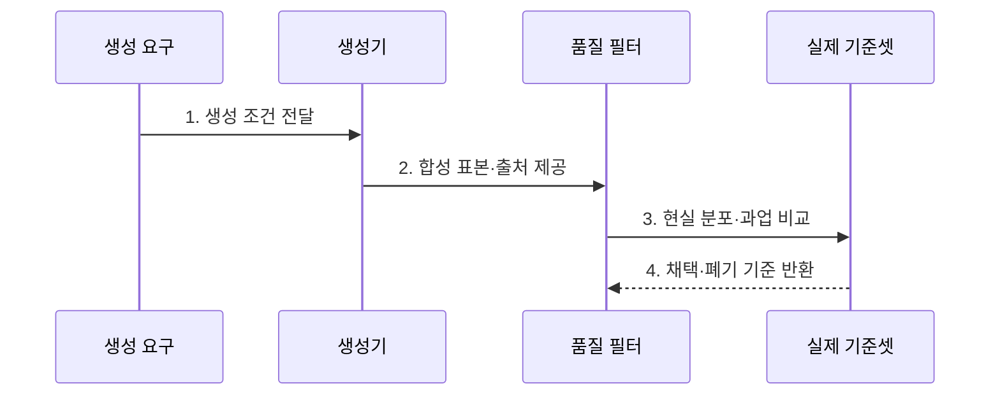

---
sidebar:
  order: 68
  label: "068. Synthetic Data (합성 데이터)"
  badge:
    text: "미출 · 70%"
    variant: note
title: "Synthetic Data (합성 데이터)"
date: "2026-07-25T23:17:00+09:00"
tags:
  - "notes-latest_tech"
weight: 68
extra:
  question_no: "068"
  source_status: "미출"
  source_history: ""
  priority: 70
  priority_note: "데이터 부족·보호 대응이 최신 활용축"
---

## 미리 알고가기

- **합성 데이터 (Synthetic Data)**: 실제 관측 대신 생성 모델이나 시뮬레이터로 만든 학습·평가 데이터
- **모조 데이터 (Dummy Data)**: 스키마 규칙만 모사하여 채운 단순 테스트 데이터
- **자가 훈련 성능 붕괴 (MAD, Model Autophagy Disorder)**: 모델이 합성 데이터만 학습해 다양성을 잃고 지능이 붕괴하는 현상
- **실제 고정 기준셋 (Anchor Set)**: 합성 데이터 왜곡을 모니터링하기 위해 보존하는 순수 실제 데이터 기준선

## Ⅰ. 개요

- 정의/개념: 모델·규칙·시뮬레이터로 생성한 데이터
- 배경/필요성: 실제 데이터의 **희귀 상황 부족·민감정보 제약** 보완 필요

### 쉽게 이해하기 (학습용)

- 실제 상황을 모의로 연습하되 현실 데이터와 일치하는지 확인합니다.

## Ⅱ. 특징

- **조건 제어 생성**으로 실제 수집이 어려운 상황을 보강한다.
- **자동 라벨·계보 추적**으로 생성 조건과 정답을 연결한다.
- 생성기의 **분포 편향·원천 정보 재현** 위험

### 쉽게 이해하기 (학습용)

- 원하는 조건의 장면을 만들 수 있지만 현실의 누락과 민감 정보도 복제할 수 있습니다.

## Ⅲ. 구조 및 구성요소

| 구성요소 | 책임 |
|:---|:---|
| 생성 요구 | 분포·클래스·금지 속성 정의 |
| 생성기 | 표본과 라벨 산출 |
| 품질 필터 | 형식·사실 오류 검출 |
| 출처 기록 | 생성 이력과 표본 연결 |
| 실제 기준셋 | 분포·성능 비교 기준 제공 |

### 쉽게 이해하기 (학습용)

- 생성 조건에 맞춘 표본을 품질 필터와 실제 기준셋으로 검사합니다.

## Ⅳ. 흐름도

**동작 원리**

1. **생성 조건 전달**: 희귀 클래스·금지 속성·목표 분포 명세
2. **합성 표본·출처 제공**: 생성 시드·모델·라벨의 추적 정보 결합
3. **현실 분포·과업 비교**: 실제 기준셋 대비 분포 이격·성능 측정
4. **채택·폐기 기준 반환**: 허용 범위 표본만 학습 데이터로 편입

### 쉽게 이해하기 (학습용)

- 생성 표본은 품질 검사와 현실 표본 대조를 통과해야 학습에 사용합니다.

## Ⅴ. 종류 및 비교

| 데이터 생성 방식 | 합성 데이터 | 실제 원천 데이터 | 증강 데이터 |
|:---|:---|:---|:---|
| **적용 기준** | 희귀 조건·표본 보강 | 현실 기준·평가 데이터 | 라벨 보존 변환 |
| **핵심 특징** | 모델·규칙·시뮬레이터 생성 | 현실 관측·기록 | 원본 표본 변환 |
| **한계** | 생성기 편향·분포 이격 | 수집 편향·민감정보 | 라벨 의미 훼손 |

### 쉽게 이해하기 (학습용)

- 실제·증강·합성 데이터는 생성 근거가 달라 검증할 오류도 다릅니다.

## Ⅵ. 실무 고려사항 및 대책

| 고려사항 | 대책 | 효과 |
|:---|:---|:---|
| 생성기 편향으로 **현실 분포 이격** | 실제 기준셋 기반 분포·과업 검증 | 합성 표본 **현실성 확보** |
| 합성 반복 학습으로 **다양성 붕괴** | 실제 데이터 혼합·합성 비율 제한 | **자가 훈련 성능 붕괴** 억제 |

### 쉽게 이해하기 (학습용)

- 위험 상황을 안전하게 생성하되 실제 운영 자료를 기준으로 왜곡을 걸러냅니다.

## Ⅶ. 결론

- **현실 분포 이격·다양성 붕괴**를 기준으로 실제·합성 데이터 혼합 비율을 결정

### 쉽게 이해하기 (학습용)

- 현실성 검증과 개인정보 검사를 통과한 합성 표본만 학습에 사용해야 합니다.
