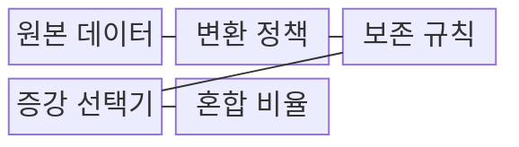
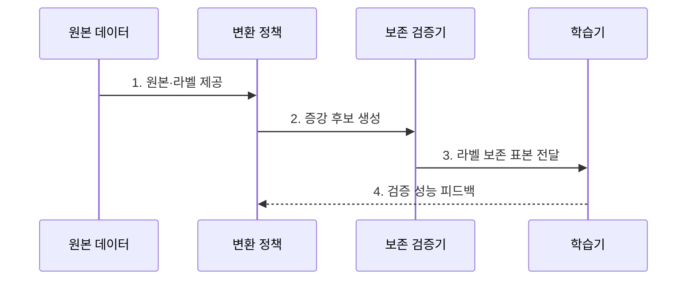

---
sidebar:
  order: 69
  label: "069. Data Augmentation (데이터 증강)"
  badge:
    text: "기출 · 50%"
    variant: note
title: "Data Augmentation (데이터 증강)"
date: "2026-07-31T08:37:36+09:00"
tags:
  - "notes-latest_tech"
weight: 69
extra:
  question_no: "069"
  source_status: "기출"
  source_history: "135회"
  priority: 50
  priority_note: "학습 데이터 다양화의 기본 기법"
---

## 미리 알고가기

- **데이터 증강(Data Augmentation, 데이터 어그멘테이션)**: 원본의 라벨 의미를 보존하며 변형 표본을 생성하는 기법
- **역번역 (Back-Translation)**: 문장을 외국어로 번역 후 다시 번역하여 표현을 변경함
- **동의어 치환 (Synonym Replacement)**: 의미를 유지하며 일부 단어를 동의어로 변경함
- **라벨 오염 (Label Corruption)**: 변환이 원본 정답 의미를 훼손하는 현상

## Ⅰ. 개요

- 정의/개념: 원본 라벨을 보존한 변형 표본으로 학습셋을 넓히는 **데이터 일반화 기법**
- 배경/필요성: 제한된 원본만으로는 **환경 변형** 대응력이 낮고 과적합 증가

### 쉽게 이해하기 (학습용)

- 같은 대상을 여러 각도나 표현으로 바꿔도 정답을 찾도록 학습합니다.

## Ⅱ. 특징

- 원본 정답 의미를 유지하는 **라벨 보존 변환**
- 이미지·텍스트·음성별 **변환 종류·강도**
- 증강 표본의 유효성을 가리는 **성능·라벨 오염 검증**

### 쉽게 이해하기 (학습용)

- 매체별 변환이 정답 의미를 바꾸면 잘못된 학습 신호가 됩니다.

## Ⅲ. 구조 및 구성요소

| 구성요소 | 책임 |
|:---|:---|
| **원본 데이터** | 증강 기준과 라벨 보존 |
| **변환 정책** | 도메인별 종류와 강도 정의 |
| **보존 규칙** | 유지할 개체·의도 조건 명시 |
| **증강 선택기** | 라벨 검사 통과 표본 공급 |
| **혼합 비율** | 검증 결과에 따른 공급 비중 |

### 쉽게 이해하기 (학습용)

- 원본 라벨을 보존한 증강 후보만 학습에 사용합니다.

## Ⅳ. 흐름도

**동작 원리**

1. **원본·라벨 제공**: 변환 뒤 유지할 개체·의도·사건 정의
2. **증강 후보 생성**: 도메인별 변환 종류·강도의 확률 적용
3. **라벨 보존 표본 전달**: 의미 훼손·분포 이탈 후보 제외
4. **검증 성능 피드백**: 미증강 검증셋 성능 기반 정책·비율 조정

### 쉽게 이해하기 (학습용)

- 라벨 보존 변환만 생성하고 실제 검증셋으로 효과를 평가합니다.

## Ⅴ. 종류 및 비교

| 판단 기준 | 이미지 증강 | 텍스트 증강 | 음성·시계열 증강 |
|:---|:---|:---|:---|
| **적용 기준** | **촬영 변화** 대응 | **의도·관계** 유지 | **사건 정체** 유지 |
| **핵심 특징** | **회전·밝기·가림** | **역번역·동의어 치환** | **이동·잡음·속도** 변경 |
| **한계** | 방향·위치의 **라벨 변경** | 개체·**의미 변경** | 신호·**사건 훼손** |

### 쉽게 이해하기 (학습용)

- 이미지·텍스트·음성은 라벨을 보존하는 변환이 다릅니다.

## Ⅵ. 실무 고려사항 및 대책

| 고려사항 | 대책 | 효과 |
|:---|:---|:---|
| 과도한 변환으로 **라벨 오염** 발생 | 도메인별 **라벨 보존 규칙** 적용 | 증강 표본의 정답 의미 유지 |
| 증강 분포 평가로 **성능 과대평가** | 독립 **미증강 검증셋** 사용 | 실제 환경 일반화 검증 |

### 쉽게 이해하기 (학습용)

- 조명과 표현은 바꾸되 결함 모양이나 문의 의도가 달라진 자료는 제외합니다.

## Ⅶ. 결론

- **라벨 보존·미증강 성능**을 기준으로 변환 정책과 혼합 비율을 결정

### 쉽게 이해하기 (학습용)

- 정답을 바꾸는 변형은 제외하고 실제 검증 데이터로 성과를 확인해야 합니다.
