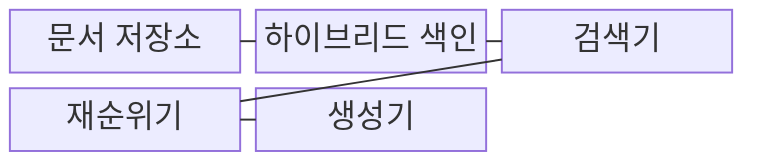
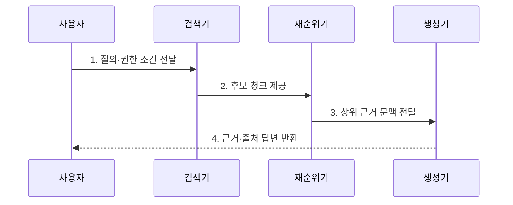

---
sidebar:
  order: 70
  label: "070. RAG (검색 증강 생성)"
  badge:
    text: "기출 · 80%"
    variant: note
title: "RAG (검색 증강 생성)"
date: "2026-07-27T23:59:59+09:00"
tags:
  - "notes-latest_tech"
weight: 70
extra:
  question_no: "070"
  source_status: "기출"
  source_history: "135회, 137회, 138회"
  priority: 80
  priority_note: "검색 근거 결합이 생성형 AI 핵심 출제축"
---

## 미리 알고가기

- **검색 증강 생성(Retrieval-Augmented Generation, RAG)**: 외부 지식에서 검색한 근거를 모델 문맥에 결합해 답변하는 기법
- **리트리버 (Retriever)**: 질의와 관련된 문서 조각을 검색함
- **문서 분할 (Chunking)**: 원문을 의미 단위로 분할함
- **하이브리드 검색 (Hybrid Search)**: 의미 기반 검색과 키워드 검색을 결합함
- **생성 모델 (Generative Model)**: 검색 근거를 바탕으로 답변을 작성함

## Ⅰ. 개요

- 정의/개념: 외부 문서를 검색해 근거 문맥으로 답변 생성
- 배경/필요성: 모델 내부 지식의 **최신성·전문성·출처 제시** 한계 보완 필요

### 쉽게 이해하기 (학습용)

- 질문과 관련된 자료를 먼저 찾아 펼쳐 놓고 답하는 오픈북 방식입니다.

## Ⅱ. 특징

- **문서 색인 갱신**으로 모델 재학습 없이 근거를 변경한다.
- **검색·생성 책임 분리**로 관련 근거를 찾고 근거 기반 답을 작성한다.
- **검색 관련성·근거 충실성 분리 평가**로 단계별 품질을 판정한다.

### 쉽게 이해하기 (학습용)

- 지식은 문서 교체로 갱신하지만 검색 성공과 근거 충실성은 따로 확인합니다.

## Ⅲ. 구조 및 구성요소

| 구성요소 | 책임 |
|:---|:---|
| 문서 저장소 | 원문·버전·권한 관리 |
| 하이브리드 색인 | 벡터·키워드 색인 관리 |
| 검색기 | 질의·권한 조건 후보 조회 |
| 재순위기 | 후보의 질의 적합도 재평가 |
| 생성기 | 선별 근거로 답변·출처 생성 |

### 쉽게 이해하기 (학습용)

- 문서의 권한과 버전을 색인하고 검색한 근거와 출처로 답변합니다.

## Ⅳ. 흐름도

**동작 원리**

1. **질의·권한 조건 전달**: 질문 의미와 접근 가능한 문서 범위 결합
2. **후보 청크 제공**: 벡터·키워드 색인의 관련 문서 조각 검색
3. **상위 근거 문맥 전달**: 재순위 점수 기반 생성 근거 선별
4. **근거·출처 답변 반환**: 제공 문맥에 충실한 응답과 출처 생성

### 쉽게 이해하기 (학습용)

- 청크를 검색·선별한 뒤 근거와 출처를 붙여 답변합니다.

## Ⅴ. 종류 및 비교

| 지식 반영 방식 | 검색 증강 생성 | 프롬프트 전용 생성 | 미세조정 |
|:---|:---|:---|:---|
| **적용 기준** | 최신 근거·출처 필요 | 모델 내부 지식으로 충분 | 행동·출력 패턴 내재화 |
| **핵심 특징** | 외부 지식 문맥 제공 | 입력 지시로 직접 생성 | 가중치에 행동 패턴 학습 |
| **한계** | 검색 실패·근거 불충실 | 최신성·출처 관리 부족 | 지식 변경 시 재학습 |

### 쉽게 이해하기 (학습용)

- 프롬프트·미세조정·RAG는 지식을 반영하는 방식이 다릅니다.

## Ⅵ. 실무 고려사항 및 대책

| 고려사항 | 대책 | 효과 |
|:---|:---|:---|
| 청크 분할·검색 실패로 **근거 누락** | 하이브리드 검색·재순위 평가 | **검색 관련성** 향상 |
| 검색 문맥 밖 생성으로 **근거 불충실** | 인용 검증·근거 없음 응답 정책 | **답변 충실성** 확보 |
| 권한 없는 청크 검색으로 **정보 노출** | 색인·검색 단계의 권한 필터 | 사용자별 **근거 접근 통제** |

### 쉽게 이해하기 (학습용)

- 사용자가 볼 수 있는 최신 규정만 찾고 검색 실패와 생성 오류를 분리합니다.

## Ⅶ. 결론

- **검색 관련성·근거 충실성·문서 권한**으로 RAG의 검색·생성 계층을 분리 통제

### 쉽게 이해하기 (학습용)

- 올바른 자료를 안전하게 찾았는지와 근거대로 답했는지를 각각 검증해야 합니다.
