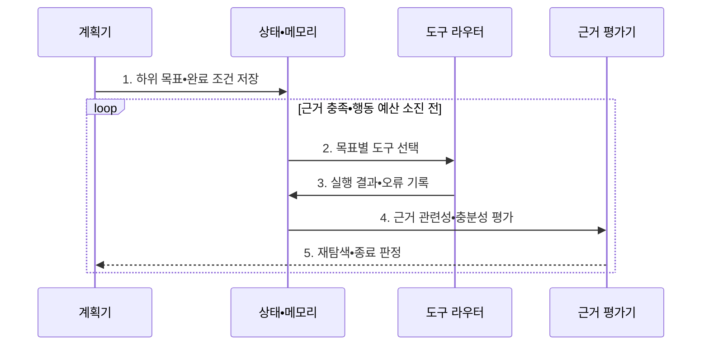

---
sidebar:
  order: 71
  label: "071. Agentic RAG (에이전틱 RAG)"
  badge:
    text: "미출 • 80%"
    variant: note
title: "Agentic RAG (에이전틱 RAG)"
date: "2026-08-04T13:59:58+09:00"
tags:
  - "notes-latest_tech"
weight: 71
extra:
  question_no: "071"
  source_status: "미출"
  source_history: ""
  priority: 80
  priority_note: "자율 검색•검증 결합이 최신 출제축"
---

## Ⅰ. 개요

핵심 용어

- **에이전틱 검색 증강 생성(Agentic Retrieval-Augmented Generation, Agentic RAG)**: 에이전트가 목표를 분해하고 도구 호출과 근거 평가를 반복해 답변을 만드는 RAG 방식이다.

- 정의/개념: 계획•도구 호출•근거 평가를 반복하는 **에이전틱 검색 증강 생성(Agentic Retrieval-Augmented Generation, Agentic RAG) 방식**
- 배경/필요성: 단일 RAG의 **복합 질의 분해•실패 복구 한계**

#### 한줄 요약

- 할 일을 나누고 적절한 도구로 확인하며 근거가 부족하면 다시 검색합니다.

## Ⅱ. 특징

핵심 용어

- **반추**: 수집한 근거가 목표를 충족하는지 평가하고 다음 행동을 조정하는 단계이다.
- **종료 조건**: 근거 충족도와 비용 한도 등을 기준으로 반복 탐색을 끝내는 규칙이다.

- 실행 구조: **계획기의 하위 목표 분해•상태 기반 실행**
- 재검색•전략 수정 기준: **근거 평가•반추**
- 결합 항목: **도구 라우팅•반복 종료 조건**

#### 한줄 요약

- 에이전트는 조사 기록으로 다음 행동을 정하므로 반복과 권한 오용을 통제해야 합니다.

## Ⅲ. 구조 및 구성요소

핵심 용어

- **도구 라우터(Tool Router)**: 목표와 입력 스키마에 맞는 외부 도구를 선택해 호출하는 구성요소이다.
- **근거 평가기**: 수집한 자료의 관련성•충분성•모순 여부를 판정하는 구성요소이다.
- **정책 통제기**: 권한과 비용, 반복 횟수 및 중단 규칙을 실행 과정에 강제한다.

| 구성요소 | 책임 |
|:---|:---|
| **계획기** | 목표•완료 조건•작업 순서 제안 |
| **상태•메모리** | 결과•출처•오류•남은 목표 저장 |
| **도구 라우터** | 권한•스키마 기반 도구 호출 |
| **근거 평가기** | 관련성•충분성•모순 검사 |
| **정책 통제기** | 단계•비용•권한•중단 규칙 강제 |

#### 한줄 요약

- 계획•상태•도구•근거 평가와 안전 정책이 함께 반복 탐색을 통제합니다.

## Ⅳ. 흐름도

핵심 용어

- **하위 목표**: 복합 질의를 검증 가능한 단위 작업으로 분해한 목표이다.
- **상태 메모리**: 도구 실행 결과와 오류, 출처 및 남은 목표를 다음 판단에 전달하는 기록이다.

**동작 원리**

1. **하위 목표•완료 조건 저장**: **복합 질의의 검증 가능 단위 분해**
2. **목표별 도구 선택**: 스키마•권한에 맞는 **도구 라우팅**
3. **실행 결과•오류 기록**: **상태 메모리•남은 목표 갱신**
4. **근거 관련성•충분성 평가**: 출처 일치와 **증거 공백** 판정
5. **재탐색•종료 판정**: 근거 충족•예산 소진에 따른 **반복 제어**

#### 한줄 요약

- 조사 범위와 안전선을 정하고 근거가 충분하거나 한계에 닿으면 멈춥니다.

## Ⅴ. 종류 및 비교

핵심 용어

- **고정 검색 증강 생성(Fixed Retrieval-Augmented Generation, 고정 RAG)**: 미리 정한 단일 검색•생성 절차를 한 번 수행하는 방식이다.
- **워크플로 검색 증강 생성(Workflow Retrieval-Augmented Generation, 워크플로 RAG)**: 사전에 정의한 조건과 분기에 따라 여러 검색 단계를 수행하는 방식이다.
- **에이전틱 검색 증강 생성(Agentic Retrieval-Augmented Generation, 에이전틱 RAG)**: 상태와 근거 평가를 바탕으로 다음 검색 행동을 동적으로 결정하는 방식이다.

RAG 실행 방식은 고정형•워크플로형•에이전틱형으로 구분한다.

| RAG 방식 | 고정 RAG | 워크플로 RAG | Agentic RAG |
|:---|:---|:---|:---|
| **적용 기준** | 질문•데이터가 **일정한 상황** | 절차•예외 분기가 **명확한 업무** | 복합 목표의 **반복 탐색** |
| **핵심 특징** | **검색•생성** 1회 수행 | 사전 정의된 **분기 실행** | 상태•평가 기반 **행동 결정** |
| **한계** | 검색 실패의 **복구 곤란** | 미정의 상황의 **분기 누락** | 반복 루프•**도구 비용 증가** |

#### 한줄 요약

- 고정형•워크플로형•에이전틱형은 다음 검색 단계를 정하는 방식이 다릅니다.

## Ⅵ. 실무 고려사항 및 대책

핵심 용어

- **무한 탐색 루프**: 근거 부족 판정이 반복되어 검색과 도구 호출이 끝나지 않는 문제이다.
- **도구 오선택**: 목표나 입력 스키마와 맞지 않는 도구를 호출해 오류와 비용을 늘리는 문제이다.
- **근거 모순**: 서로 다른 출처가 같은 사실에 대해 양립하기 어려운 내용을 제시하는 상태이다.

| 문제 | 대책 | 효과 |
|:---|:---|:---|
| 근거 부족으로 **반복 탐색** | **최대 단계•비용•완료 조건** 설정 | **무한 탐색 루프** 차단 |
| 부적합한 **도구 오선택** | 목표•스키마 기반 **도구 라우팅** | 호출 **실패•오용 감소** |
| 근거 간 **모순 발생** | 출처•시점 기반 **근거 평가** | **상충 근거** 식별 |

#### 한줄 요약

- 반복 행동과 누적 비용을 감시하고 중요한 시스템 호출에는 사람 승인을 둡니다.

## Ⅶ. 결론

핵심 용어

- **근거 임계값**: 답변을 확정하기 위해 근거가 충족해야 하는 최소 품질 기준이다.
- **행동 예산**: 에이전트가 한 요청에서 사용할 수 있는 도구 호출 횟수와 비용의 상한이다.

- 복합 질의 선택 기준: **근거 임계값•행동 예산 판정 가능성**, 적용 방식: **에이전틱 검색 증강 생성(Agentic Retrieval-Augmented Generation, Agentic RAG)**

#### 한줄 요약

- 탐색 범위와 실행 권한 및 중단 조건을 명확한 정책으로 제한해야 합니다.
