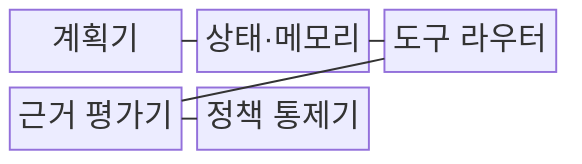
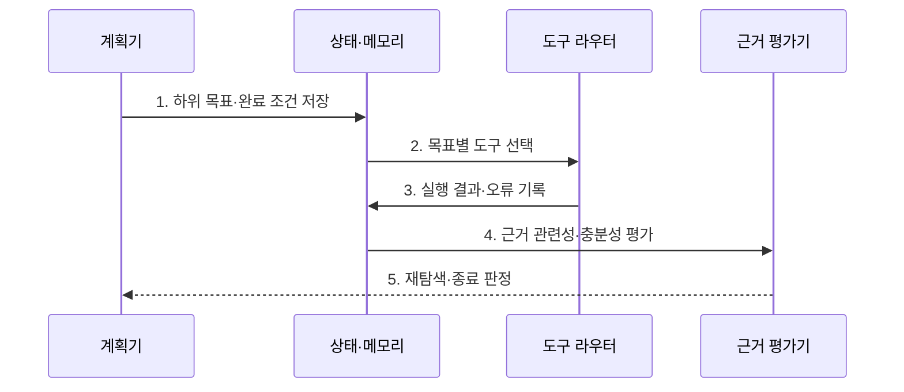

---
sidebar:
  order: 71
  label: "071. Agentic RAG (에이전틱 RAG)"
  badge:
    text: "미출 · 80%"
    variant: note
title: "Agentic RAG (에이전틱 RAG)"
date: "2026-07-31T08:38:40+09:00"
tags:
  - "notes-latest_tech"
weight: 71
extra:
  question_no: "071"
  source_status: "미출"
  source_history: ""
  priority: 80
  priority_note: "자율 검색·검증 결합이 최신 출제축"
---

## 미리 알고가기

- **에이전틱 RAG (Agentic RAG)**: 에이전트가 도구를 스스로 고르고 여러 번 검증해 답을 만드는 RAG
- **반추 (Reflection)**: 정보의 신뢰도와 추가 검색 필요성을 스스로 평가하는 성찰 단계
- **도구 라우팅 (Tool Routing)**: 질의 문맥에 맞춰 적합한 외부 API 도구를 식별해 호출하는 기법
- **무한 탐색 루프 (Infinite Loop)**: 에이전트 성찰 오작동으로 무의미한 검색을 반복하는 자원 낭비 결함

## Ⅰ. 개요

- 정의/개념: 계획·도구 호출·근거 평가를 반복하는 **자율 검색 증강 생성 방식**
- 배경/필요성: 단일 검색 RAG의 **복합 질의 분해·실패 복구** 한계

### 쉽게 이해하기 (학습용)

- 할 일을 나누고 적절한 도구로 확인하며 근거가 부족하면 다시 검색합니다.

## Ⅱ. 특징

- 계획기의 **하위 목표 분해**와 상태 기반 실행
- **근거 평가·반추**에 따른 재검색·전략 수정
- 도구 라우팅과 **반복 종료 조건**의 결합

### 쉽게 이해하기 (학습용)

- 에이전트는 조사 기록으로 다음 행동을 정하므로 반복과 권한 오용을 통제해야 합니다.

## Ⅲ. 구조 및 구성요소

| 구성요소 | 책임 |
|:---|:---|
| **계획기** | 목표·완료 조건·작업 순서 제안 |
| **상태·메모리** | 결과·출처·오류·남은 목표 저장 |
| **도구 라우터** | 권한·스키마 기반 도구 호출 |
| **근거 평가기** | 관련성·충분성·모순 검사 |
| **정책 통제기** | 단계·비용·권한·중단 규칙 강제 |

### 쉽게 이해하기 (학습용)

- 계획·상태·도구·근거 평가와 안전 정책이 함께 반복 탐색을 통제합니다.

## Ⅳ. 흐름도

**동작 원리**

1. **하위 목표·완료 조건 저장**: 복합 질의를 **검증 가능 단위**로 분해
2. **목표별 도구 선택**: 스키마·권한에 맞는 **도구 라우팅**
3. **실행 결과·오류 기록**: 해결 상태와 **남은 목표** 갱신
4. **근거 관련성·충분성 평가**: 출처 일치와 **증거 공백** 판정
5. **재탐색·종료 판정**: 근거 충족·예산 소진에 따른 **반복 제어**

### 쉽게 이해하기 (학습용)

- 조사 범위와 안전선을 정하고 근거가 충분하거나 한계에 닿으면 멈춥니다.

## Ⅴ. 종류 및 비교

| RAG 방식 | 고정 RAG | 워크플로 RAG | Agentic RAG |
|:---|:---|:---|:---|
| **적용 기준** | 질문·데이터가 **일정한 상황** | 절차·예외 분기가 **명확한 업무** | 복합 목표의 **반복 탐색** |
| **핵심 특징** | **검색·생성** 1회 수행 | 사전 정의된 **분기 실행** | 상태·평가 기반 **행동 결정** |
| **한계** | 검색 실패의 **복구 곤란** | 미정의 상황의 **분기 누락** | 반복 루프·**도구 비용 증가** |

### 쉽게 이해하기 (학습용)

- 고정형·워크플로형·에이전틱형은 다음 검색 단계를 정하는 방식이 다릅니다.

## Ⅵ. 실무 고려사항 및 대책

| 고려사항 | 대책 | 효과 |
|:---|:---|:---|
| 근거 부족으로 **반복 탐색** | **최대 단계·비용·완료 조건** 설정 | **무한 탐색 루프** 차단 |
| 부적합한 **도구 선택** | 목표·스키마 기반 **도구 라우팅** | 호출 **실패·오용 감소** |
| 근거 간 **모순 발생** | 출처·시점 기반 **근거 평가** | **상충 근거** 식별 |

### 쉽게 이해하기 (학습용)

- 반복 행동과 누적 비용을 감시하고 중요한 시스템 호출에는 사람 승인을 둡니다.

## Ⅶ. 결론

- **근거 품질·종료 조건**을 판정할 수 있는 복합 질의에 **Agentic RAG** 선택

### 쉽게 이해하기 (학습용)

- 탐색 범위와 실행 권한 및 중단 조건을 명확한 정책으로 제한해야 합니다.
