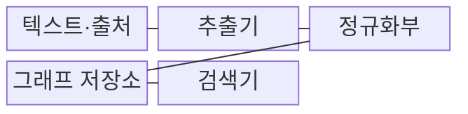
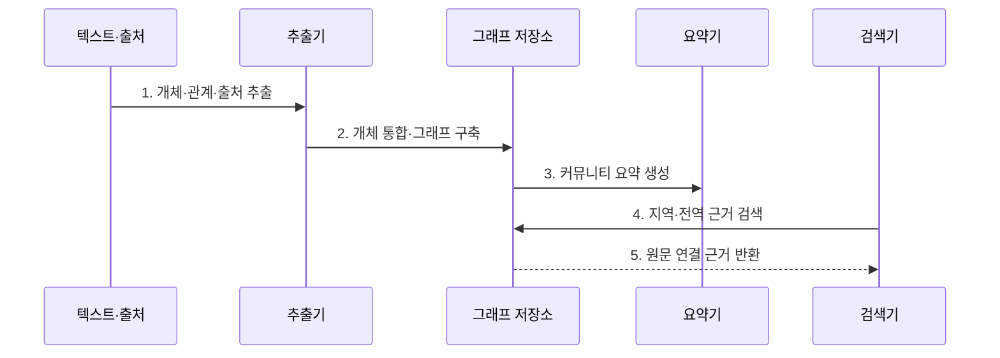

---
sidebar:
  order: 72
  label: "072. Graph RAG (지식그래프 융합형 RAG)"
  badge:
    text: "기출 · 70%"
    variant: note
title: "Graph RAG (지식그래프 융합형 RAG)"
date: "2026-07-27T23:59:59+09:00"
tags:
  - "notes-latest_tech"
weight: 72
extra:
  question_no: "072"
  source_status: "기출"
  source_history: "138회"
  priority: 70
  priority_note: "그래프 근거 탐색이 RAG 확장 핵심"
---

## 미리 알고가기

- **RAG(Retrieval-Augmented Generation, 래그)**: 검색 근거를 모델 문맥에 넣어 답변을 생성하는 방식
- **GraphRAG(그래프 래그)**: 개체·관계·커뮤니티 요약을 구조화해 검색 근거로 사용하는 RAG 방식
- **다중 홉 질의 (Multi-Hop Query)**: 여러 관계를 차례로 따라가는 질문
- **개체명 통합 (Entity Resolution)**: 별칭을 같은 개체 식별자로 연결

## Ⅰ. 개요

- 정의/개념: 개체·관계 그래프와 요약을 검색 근거로 활용
- 배경/필요성: 청크 검색의 **다중 관계·전체 주제 탐색** 한계

### 쉽게 이해하기 (학습용)

- 개체와 사건을 점과 선으로 연결해 주변 관계나 전체 주제 요약을 찾습니다.

## Ⅱ. 특징

- **개체·관계·출처 그래프**로 원문 사실과 근거를 연결한다.
- **지역·전역 검색**으로 개체 주변 관계와 집단 요약을 구분해 찾는다.
- **개체 통합·관계 추출·갱신 품질**로 그래프 오류와 비용을 관리한다.

### 쉽게 이해하기 (학습용)

- 관계 지도는 탐색을 돕지만 잘못 추출한 개체나 관계가 오류를 전파할 수 있습니다.

## Ⅲ. 구조 및 구성요소

| 구성요소 | 책임 |
|:---|:---|
| 텍스트·출처 | 원문 단위와 문서 위치 보존 |
| 추출기 | 개체·관계와 원문 근거 추출 |
| 정규화부 | 별칭 통합·동명이인 분리 |
| 그래프 저장소 | 관계·근거·커뮤니티 버전 관리 |
| 검색기 | 개체 이웃·전체 요약 경로 선택 |

### 쉽게 이해하기 (학습용)

- 개체 관계와 커뮤니티 요약을 질문 범위에 맞춰 검색합니다.

## Ⅳ. 흐름도

**동작 원리**

1. **개체·관계·출처 추출**: 원문에서 **그래프 후보** 생성
2. **개체 통합·그래프 구축**: 별칭·동명이인을 구분한 **관계 연결**
3. **커뮤니티 요약 생성**: 집단별 **전역 주제** 압축
4. **지역·전역 근거 검색**: 질의 범위에 따른 **탐색 경로** 선택
5. **원문 연결 근거 반환**: 관계·요약의 **출처 대조** 가능성 확보

### 쉽게 이해하기 (학습용)

- 관계 그래프를 만들고 지역·전역 검색 결과를 원문과 대조합니다.

## Ⅴ. 종류 및 비교

| RAG 방식 | GraphRAG | 벡터 RAG | 하이브리드 RAG |
|:---|:---|:---|:---|
| 적용 기준 | 관계·전역 질의 | 독립 사실 질의 | 원문·관계 병행 |
| 핵심 특징 | 관계·커뮤니티 요약 | 의미 유사 청크 검색 | 청크·그래프 문맥 결합 |
| 한계 | 추출 오류·구축 비용 | 다중 관계 누락 | 병합 충돌·근거 불일치 |

### 쉽게 이해하기 (학습용)

- 벡터·그래프·하이브리드 RAG는 검색 근거 단위가 다릅니다.

## Ⅵ. 실무 고려사항 및 대책

| 고려사항 | 대책 | 효과 |
|:---|:---|:---|
| 별칭·동명이인 혼합 | **개체명 통합**과 식별자 분리 | 잘못된 관계 연결 감소 |
| 관계 추출 오류 | 관계마다 **원문 출처** 연결 | 그래프 근거 검증 |
| 삭제 관계 잔존 | 원문 변경과 **그래프·요약 갱신** 연계 | 최신 관계 유지 |

### 쉽게 이해하기 (학습용)

- 그래프를 갱신할 때 삭제된 관계도 반영하고 모든 연결을 원문과 대조합니다.

## Ⅶ. 결론

- **관계 정확도·전역 질의 비중**을 기준으로 **GraphRAG** 적용 범위 결정

### 쉽게 이해하기 (학습용)

- 정확한 그래프와 최신 원문의 연결을 유지해야 신뢰할 수 있는 답을 만듭니다.
