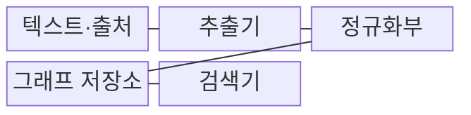
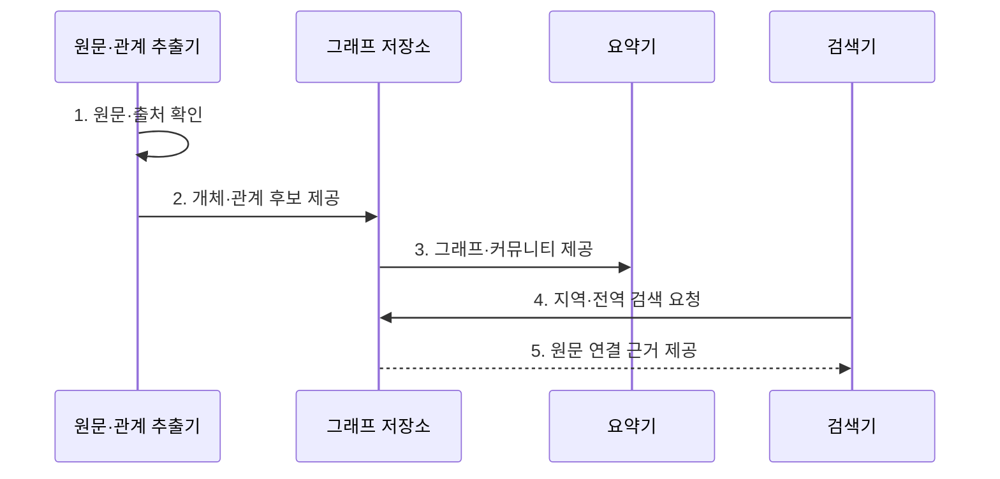

---
sidebar:
  order: 72
  label: "072. Graph RAG (지식그래프 융합형 RAG)"
  badge:
    text: "기출 · 70%"
    variant: note
title: "Graph RAG (지식그래프 융합형 RAG)"
date: "2026-07-31T11:58:18+09:00"
tags:
  - "notes-latest_tech"
weight: 72
extra:
  question_no: "072"
  source_status: "기출"
  source_history: "138회"
  priority: 70
  priority_note: "그래프 근거 탐색이 RAG 확장 핵심"
---

## Ⅰ. 개요

핵심 용어

- **그래프 검색 증강 생성(Graph Retrieval-Augmented Generation, GraphRAG)**: 문서에서 추출한 개체·관계와 커뮤니티 요약을 검색 근거로 사용하는 RAG 방식이다.
- **다중 홉 질의**: 답을 찾기 위해 여러 개체의 관계를 차례로 따라가야 하는 질의이다.

- 정의/개념: 개체·관계·커뮤니티 요약을 구조화해 검색하는 **그래프 검색 증강 생성(Graph Retrieval-Augmented Generation, GraphRAG) 방식**
- 배경/필요성: 일반 검색 증강 생성(Retrieval-Augmented Generation, RAG)의 청크 검색만으로는 **다중 홉 질의·전체 주제 탐색 한계**

#### 한줄 요약

- 개체와 사건을 점과 선으로 연결해 주변 관계나 전체 주제 요약을 찾습니다.

## Ⅱ. 특징

핵심 용어

- **지식 그래프**: 개체를 노드로, 개체 사이의 관계를 간선으로 표현한 지식 구조이다.
- **커뮤니티 요약**: 밀접하게 연결된 개체 집단의 주요 주제와 관계를 압축한 근거이다.

- 원문 사실과 근거를 연결하는 **지식 그래프의 개체·관계·출처 구조**
- 탐색 근거: **주변 관계·커뮤니티 요약**, 탐색 방식: **지역·전역 검색**
- 개체 통합·관계 추출·갱신 오류 누적에 따른 **정확도 저하·비용 증가**

#### 한줄 요약

- 관계 지도는 탐색을 돕지만 잘못 추출한 개체나 관계가 오류를 전파할 수 있습니다.

## Ⅲ. 구조 및 구성요소

핵심 용어

- **개체명 통합**: 표기가 다른 별칭을 동일한 개체 식별자로 연결하는 과정이다.
- **관계 추출**: 원문에서 개체 사이의 의미 관계와 그 근거 문장을 식별하는 과정이다.

정규화 단계: **개체명 통합·관계 추출**, 결과: 원문 속 별칭과 관계를 그래프 식별자와 간선으로 연결

| 구성요소 | 책임 |
|:---|:---|
| **텍스트·출처** | 원문 단위와 문서 위치 보존 |
| **추출기** | 개체·관계와 원문 근거 추출 |
| **정규화부** | 별칭 통합·동명이인 분리 |
| **그래프 저장소** | 관계·근거·커뮤니티 버전 관리 |
| **검색기** | 개체 이웃·전체 요약 경로 선택 |

#### 한줄 요약

- 개체 관계와 커뮤니티 요약을 질문 범위에 맞춰 검색합니다.

## Ⅳ. 흐름도

핵심 용어

- **지역 검색**: 특정 개체 주변의 이웃과 관계를 따라 세부 근거를 찾는 방식이다.
- **전역 검색**: 그래프 커뮤니티 요약을 사용해 전체 주제와 경향을 찾는 방식이다.

**동작 원리**

1. **원문·출처 확인**: 개체·관계의 **그래프 후보** 추출
2. **개체·관계 후보 제공**: 별칭·동명이인을 구분한 **관계 연결**
3. **그래프·커뮤니티 제공**: 집단별 **전역 주제** 요약
4. **지역·전역 검색 요청**: 질의 범위에 따른 **탐색 경로** 선택
5. **원문 연결 근거 제공**: 관계·요약의 **출처 대조** 지원

#### 한줄 요약

- 관계 그래프를 만들고 지역·전역 검색 결과를 원문과 대조합니다.

## Ⅴ. 종류 및 비교

핵심 용어

- **벡터 검색 증강 생성(Vector Retrieval-Augmented Generation, 벡터 RAG)**: 질의와 문서 조각의 임베딩 유사도를 기준으로 근거를 검색하는 방식이다.
- **하이브리드 검색 증강 생성(Hybrid Retrieval-Augmented Generation, 하이브리드 RAG)**: 벡터·어휘·그래프 검색 신호를 함께 사용해 근거 후보를 구성하는 방식이다.

검색 증강 생성(Retrieval-Augmented Generation, RAG)은 근거 단위에 따라 그래프형, 벡터형, 하이브리드형으로 구분한다.

| RAG 방식 | GraphRAG | 벡터 RAG | 하이브리드 RAG |
|:---|:---|:---|:---|
| **적용 기준** | **다중 홉·전역 질의** | **독립 사실 질의** | **원문·관계** 병행 |
| **핵심 특징** | 관계·**커뮤니티 요약** | 의미 유사 **청크 검색** | 청크·**그래프 문맥** 결합 |
| **한계** | 추출 오류·**구축 비용** | 다중 **관계 누락** | 병합 충돌·**근거 불일치** |

#### 한줄 요약

- 벡터·그래프·하이브리드 검색 증강 생성은 검색 근거 단위가 다릅니다.

## Ⅵ. 실무 고려사항 및 대책

핵심 용어

- **개체 중복**: 같은 대상을 서로 다른 개체로 저장해 관계가 분산되는 문제이다.
- **관계 추출 오류**: 원문에 없는 관계를 만들거나 실제 관계를 빠뜨리는 문제이다.
- **관계 노후화**: 원문 변경 이후 그래프의 연결과 요약이 갱신되지 않는 문제이다.

| 문제 | 대책 | 효과 |
|:---|:---|:---|
| 별칭 분산에 따른 **개체 중복** | **개체명 통합·식별자 분리** | 잘못된 **관계 연결 감소** |
| **관계 추출 오류** | 관계마다 **원문 출처** 연결 | 그래프 **근거 검증** |
| 갱신 누락에 따른 **관계 노후화** | 원문 변경과 **그래프·요약 갱신 연계** | **최신 관계 유지** |

#### 한줄 요약

- 그래프를 갱신할 때 삭제된 관계도 반영하고 모든 연결을 원문과 대조합니다.

## Ⅶ. 결론

핵심 용어

- **관계 정확성**: 그래프의 간선이 원문에서 확인되는 실제 관계를 올바르게 나타내는 정도이다.
- **근거 추적성**: 검색 결과의 개체와 관계를 원문 출처까지 역으로 확인할 수 있는 성질이다.

- 적용 기준: **관계 정확성·전역 질의 비중·근거 추적성**, 적용 방식: **그래프 검색 증강 생성(Graph Retrieval-Augmented Generation, GraphRAG)**

#### 한줄 요약

- 정확한 그래프와 최신 원문의 연결을 유지해야 신뢰할 수 있는 답을 만듭니다.
