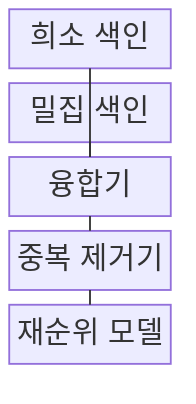
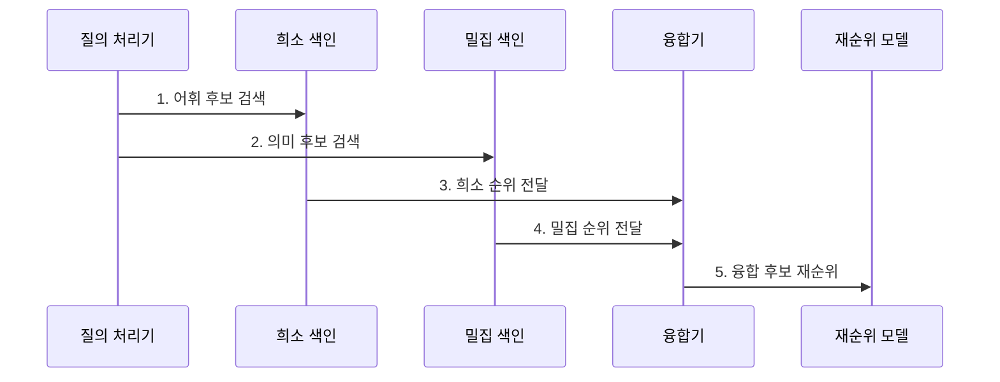

---
sidebar:
  order: 73
  label: "073. Hybrid Search (하이브리드 검색)"
  badge:
    text: "기출 · 70%"
    variant: note
title: "Hybrid Search (하이브리드 검색)"
date: "2026-07-27T23:59:59+09:00"
tags:
  - "notes-latest_tech"
weight: 73
extra:
  question_no: "073"
  source_status: "기출"
  source_history: "135회, 137회, 138회"
  priority: 70
  priority_note: "희소·밀집 결합이 검색 설계의 핵심"
---

## 미리 알고가기

- **하이브리드 검색(Hybrid Search, 하이브리드 서치)**: 서로 다른 검색 신호를 혼합한다는 뜻으로, 희소·밀집 후보를 결합
- **희소 검색 (Sparse Retrieval)**: 정확한 어휘 신호로 문서 탐색
- **밀집 검색 (Dense Retrieval)**: 벡터 의미 유사도로 문서 탐색
- **BM25(Best Matching 25, 비엠이십오)**: Okapi 계열의 버전명에서 유래한 어휘 검색 순위 함수로, 빈도·희귀도·문서 길이를 반영

## Ⅰ. 개요

- 정의/개념: 희소·밀집 검색 후보를 점수나 순위로 결합
- 배경/필요성: 단일 검색의 **의미 표현·정확 식별자 누락** 보완 필요

### 쉽게 이해하기 (학습용)

- 어휘 검색과 의미 검색이 낸 후보 목록을 합쳐 최종 순위를 정합니다.

## Ⅱ. 특징

- 희소·밀집 검색기가 독립적으로 후보와 순위를 생성한다.
- 순위 융합 또는 정규화 점수 융합으로 후보를 결합한다.
- 재순위 모델이 통합 후보의 문맥 관련성을 최종 평가한다.

### 쉽게 이해하기 (학습용)

- 두 검색의 점수 척도가 달라 한쪽 신호가 부당하게 지배하지 않도록 조정합니다.

## Ⅲ. 구조 및 구성요소

| 구성요소 | 책임 |
|:---|:---|
| 희소 색인 | 역색인으로 어휘 후보 산출 |
| 밀집 색인 | 임베딩 거리로 의미 후보 산출 |
| 융합기 | 순위·정규화 점수로 목록 결합 |
| 중복 제거기 | 동일 후보 통합 |
| 재순위 모델 | 질의 관련성으로 최종 순위 결정 |

### 쉽게 이해하기 (학습용)

- 희소·밀집 색인이 후보를 만들고 융합기가 두 순위를 합칩니다.

## Ⅳ. 흐름도

### 동작 원리

1. **어휘 후보 검색**: BM25 기반 **정확 용어** 회수
2. **의미 후보 검색**: 임베딩 기반 **의미 유사 문서** 회수
3. **희소 순위 전달**: 어휘 검색의 **독립 순위** 보존
4. **밀집 순위 전달**: 의미 검색의 **독립 순위** 보존
5. **융합 후보 재순위**: 순위 융합·중복 제거 후 **관련성 평가**

### 쉽게 이해하기 (학습용)

- 두 후보를 척도에 맞게 융합하고 질의와의 관련성으로 재순위합니다.

## Ⅴ. 종류 및 비교

| 검색 방식 | 하이브리드 검색 | 희소 검색 | 밀집 검색 |
|:---|:---|:---|:---|
| 적용 기준 | 어휘·의미 병행 | 정확 용어 중요 | 의미 유사성 중요 |
| 핵심 특징 | 순위·점수 융합 | 단어 일치·희귀도 | 벡터 의미 유사도 |
| 한계 | 가중치·정규화 왜곡 | 동의어·우회 표현 누락 | 정확 식별자 누락 |

> 요약: 하이브리드 검색은 어휘·의미 신호를 병행함

### 쉽게 이해하기 (학습용)

- 희소·밀집·하이브리드 검색은 사용하는 신호가 다릅니다.

## Ⅵ. 실무 고려사항 및 대책

| 고려사항 | 대책 | 효과 |
|:---|:---|:---|
| 점수 척도 불일치 | **순위 융합** 또는 점수 정규화 | 한 검색 신호의 지배 방지 |
| 후보 중복 | 문서 식별자 기반 **중복 제거** | 후보 다양성 보존 |
| 융합 후 관련성 저하 | 통합 후보 **재순위화** | 최종 순위 정확도 향상 |

### 쉽게 이해하기 (학습용)

- 오류 코드의 정확 일치와 자연어 질문의 의미 유사 결과를 한 목록으로 합칩니다.

## Ⅶ. 결론

- **정확 용어·의미 질의 비중**에 맞춰 융합 방식을 선택하고 **재순위 성능**으로 결정

### 쉽게 이해하기 (학습용)

- 점수를 정규화하거나 순위를 융합하고 중복 제거 뒤 관련성을 다시 평가해야 합니다.
