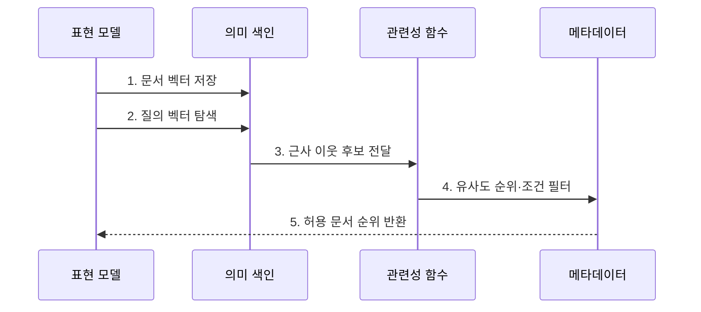

---
sidebar:
  order: 74
  label: "074. Semantic Search (의미 검색)"
  badge:
    text: "기출 · 50%"
    variant: note
title: "Semantic Search (의미 검색)"
date: "2026-07-27T23:59:59+09:00"
tags:
  - "notes-latest_tech"
weight: 74
extra:
  question_no: "074"
  source_status: "기출"
  source_history: "135회"
  priority: 50
  priority_note: "의미 기반 검색이 RAG 검색 기반"
---

## 미리 알고가기

- **의미 검색 (Semantic Search)**: 의미 유사성으로 문서 탐색
- **임베딩 (Embedding)**: 질의·문서를 벡터로 변환
- **희소 검색 (Sparse Retrieval)**: 정확한 어휘 신호로 문서 탐색
- **밀집 검색 (Dense Retrieval)**: 임베딩 거리로 의미 후보 탐색
- **RAG(Retrieval-Augmented Generation, 래그)**: 검색 결과를 생성 모델의 근거 문맥으로 사용하는 방식

## Ⅰ. 개요

- 정의/개념: 질의와 의미가 유사한 문서를 벡터로 검색
- 배경/필요성: 어휘 일치 검색의 **동의어·우회 표현 누락** 보완 필요

### 쉽게 이해하기 (학습용)

- 표현이 달라도 뜻이 비슷한 질문과 문서를 같은 벡터 공간에서 찾습니다.

## Ⅱ. 특징

- **공동 의미 벡터 공간**에 질의와 문서를 표현한다.
- **벡터 유사도·ANN 색인**으로 의미상 가까운 후보를 찾는다.
- **희소·정확 검색 보완**으로 도메인 불일치와 식별자 누락을 보정한다.

### 쉽게 이해하기 (학습용)

- 낯선 전문 분야나 제품 번호는 의미 검색이 빗나갈 수 있어 정확 검색도 필요합니다.

## Ⅲ. 구조 및 구성요소

| 구성요소 | 책임 |
|:---|:---|
| 표현 모델 | 질의·문서를 의미 벡터로 변환 |
| 의미 색인 | 문서 벡터·식별자 관계 저장 |
| 관련성 함수 | 질의·문서 의미 유사도 계산 |
| 문자열 경로 | 코드·식별자 정확 후보 보완 |
| 메타데이터 | 조건 필터로 부적합 후보 제외 |

### 쉽게 이해하기 (학습용)

- 의미 후보에 정확 문자열과 권한 조건을 함께 적용합니다.

## Ⅳ. 흐름도

**동작 원리**

1. **문서 벡터 저장**: 문서 의미를 **동일 벡터 공간**에 배치
2. **질의 벡터 탐색**: 질의 의도를 **임베딩 벡터**로 변환
3. **근사 이웃 후보 전달**: ANN으로 **탐색 범위** 축소
4. **유사도 순위·조건 필터**: 의미 거리와 **메타데이터 조건** 결합
5. **허용 문서 순위 반환**: 필터를 통과한 **관련 문서** 제공

### 쉽게 이해하기 (학습용)

- 의미 후보를 찾고 정확 문자열과 권한 조건으로 보완합니다.

## Ⅴ. 종류 및 비교

| 검색 방식 | 의미 검색 | 정확 검색 | 희소 검색 |
|:---|:---|:---|:---|
| 적용 기준 | 표현보다 의미 중요 | 식별자 표기 | 핵심 용어 출현 |
| 핵심 특징 | 임베딩 의미 유사도 | 문자열 완전·부분 일치 | 어휘 빈도·희귀도 |
| 한계 | 도메인 거리 왜곡 | 표기 변형 누락 | 동의어·의도 누락 |

### 쉽게 이해하기 (학습용)

- 문자열·희소·밀집 검색은 관련성을 판단하는 기준이 다릅니다.

## Ⅵ. 실무 고려사항 및 대책

| 고려사항 | 대책 | 효과 |
|:---|:---|:---|
| 도메인 임베딩 불일치 | 도메인 평가셋으로 **표현 모델** 선택 | 의미 거리 왜곡 감소 |
| 고유명사·코드 누락 | **정확·희소 검색** 후보 결합 | 식별자 회수 보완 |
| ANN 탐색 축소 과다 | 탐색 폭과 **회수율·지연** 실측 | 이웃 누락 통제 |

### 쉽게 이해하기 (학습용)

- 자연어 질문은 의미로 찾고 오류 코드는 정확히 일치시키며 도메인별 성능을 검증합니다.

## Ⅶ. 결론

- **도메인 의미 유사성**이 핵심인 질의에 의미 검색을 적용하고 **정확 검색**으로 식별자 보완

### 쉽게 이해하기 (학습용)

- 코드·전문용어는 정확 검색으로 보완하고 새 도메인마다 회수 성능을 확인해야 합니다.
