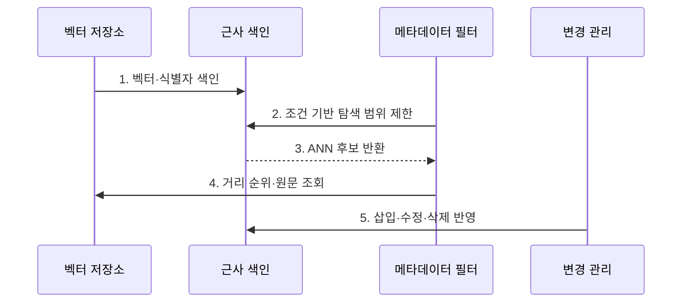

---
sidebar:
  order: 75
  label: "075. Vector Database (벡터 데이터베이스)"
  badge:
    text: "기출 · 70%"
    variant: note
title: "Vector Database (벡터 데이터베이스)"
date: "2026-07-27T23:59:59+09:00"
tags:
  - "notes-latest_tech"
weight: 75
extra:
  question_no: "075"
  source_status: "기출"
  source_history: "135회, 137회, 138회"
  priority: 70
  priority_note: "벡터 검색 구조·운영이 반복 출제축"
---

## 미리 알고가기

- **벡터 DB(Vector Database, 벡터 디비)**: 벡터·식별자·메타데이터와 유사도 검색 색인을 관리하는 저장소
- **ANN(Approximate Nearest Neighbor)**: 일부 정확도를 양보하고 탐색량을 줄이는 근사 최근접 이웃 검색
- **DB(Database, 디비)**: 데이터와 변경 상태를 지속 저장·관리하는 시스템
- **임베딩 (Embedding)**: 대상을 벡터로 변환

## Ⅰ. 개요

- 정의/개념: 벡터·메타데이터를 저장하고 근사 검색
- 배경/필요성: 벡터 전수 비교의 **검색 시간·연산량 증가** 완화 필요

### 쉽게 이해하기 (학습용)

- 비슷한 벡터를 빨리 찾는 색인과 메타데이터의 변경 상태를 함께 관리합니다.

## Ⅱ. 특징

- **벡터·원문·메타데이터·권한 결속**으로 검색 단위를 저장한다.
- **ANN 색인 절충**으로 회수율과 지연·메모리를 관리한다.
- **저장소·색인·복제본 동기화**로 삽입·수정·삭제의 일관성을 유지한다.

### 쉽게 이해하기 (학습용)

- 근사 색인은 빠르지만 가까운 항목을 놓칠 수 있고 필터와 갱신도 성능을 바꿉니다.

## Ⅲ. 구조 및 구성요소

| 구성요소 | 책임 |
|:---|:---|
| 벡터 저장소 | 벡터·원문·권한·시점 연결 |
| 근사 색인 | 벡터 후보 탐색 범위 축소 |
| 거리 함수 | 벡터 간 유사도 계산 |
| 필터부 | 메타데이터로 허용 후보 제한 |
| 변경 관리 | 저장·색인·복제본 버전 추적 |

### 쉽게 이해하기 (학습용)

- 벡터 저장·근사 색인·필터·변경 관리가 역할을 나눕니다.

## Ⅳ. 흐름도

**동작 원리**

1. **벡터·식별자 색인**: 임베딩과 **원문 참조** 연결
2. **조건 기반 탐색 범위 제한**: 메타데이터로 **허용 후보** 축소
3. **ANN 후보 반환**: 근사 색인으로 **탐색량 절감**
4. **거리 순위·원문 조회**: 거리 함수 기반 **이웃 정렬**
5. **삽입·수정·삭제 반영**: 저장소·색인·복제본의 **상태 동기화**

### 쉽게 이해하기 (학습용)

- 벡터를 색인해 후보를 찾고 수정·삭제 반영 상태를 확인합니다.

## Ⅴ. 종류 및 비교

| 저장 방식 | 전용 벡터 DB | 관계형 DB 확장 | 검색 엔진 벡터 |
|:---|:---|:---|:---|
| 적용 기준 | 대규모 독립 확장 | 업무 일관성 우선 | 혼합 검색 우선 |
| 핵심 특징 | 분산 ANN 색인 중심 | 관계 데이터·벡터 통합 | 역색인·벡터 통합 |
| 한계 | 원문·색인 동기화 부담 | 대규모 벡터 확장 제약 | 두 색인의 자원 경합 |

### 쉽게 이해하기 (학습용)

- 관계형·검색 엔진·전용 벡터 DB는 통합 범위가 다릅니다.

## Ⅵ. 실무 고려사항 및 대책

| 고려사항 | 대책 | 효과 |
|:---|:---|:---|
| ANN 이웃 누락 | 탐색 폭별 **회수율·지연** 측정 | 근사 검색 절충 결정 |
| 필터 후 후보 부족 | **사전·사후 필터** 방식 비교 | 조건 검색 회수율 보존 |
| 삭제 벡터 잔존 | 저장소·색인·복제본 **동기화** | 오래된 후보 반환 방지 |

### 쉽게 이해하기 (학습용)

- 권한 없는 문서는 제외하고 임베딩 모델을 바꾸면 새 색인을 검증한 뒤 전환합니다.

## Ⅶ. 결론

- **회수율·지연·필터 선택도**에 맞는 ANN 색인을 선택하고 **변경 동기화** 보장

### 쉽게 이해하기 (학습용)

- 검색 속도뿐 아니라 이웃 누락과 메모리 사용 및 수정·삭제 반영을 확인해야 합니다.
