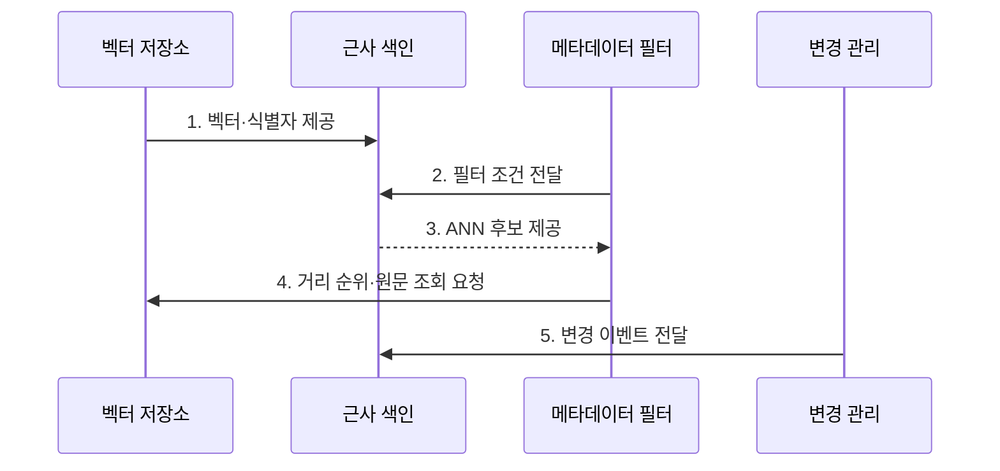

---
sidebar:
  order: 75
  label: "075. Vector Database (벡터 데이터베이스)"
  badge:
    text: "기출 · 70%"
    variant: note
title: "Vector Database (벡터 데이터베이스)"
date: "2026-08-02T11:00:00+09:00"
tags:
  - "notes-latest_tech"
weight: 75
extra:
  question_no: "075"
  source_status: "기출"
  source_history: "135회, 137회, 138회"
  priority: 70
  priority_note: "벡터 검색 구조·운영이 반복 출제축"
---

## Ⅰ. 개요

핵심 용어

- **벡터 데이터베이스(Vector Database)**는 벡터·식별자·메타데이터와 유사도 검색 색인을 함께 관리하는 검색 특화 저장소다.
- **ANN**은 일부 정확도를 양보하고 탐색량을 줄이는 근사 최근접 이웃 검색 방식이다.

- 정의/개념: 벡터·원문·메타데이터와 ANN 색인을 관리하는 **검색 특화 데이터베이스**
- 배경/필요성: 벡터 전수 비교는 데이터 증가에 따라 **검색 시간·연산량** 급증

#### 한줄 요약

- 비슷한 벡터를 빨리 찾는 색인과 메타데이터의 변경 상태를 함께 관리합니다.

## Ⅱ. 특징

핵심 용어

- **회수율(Recall)**은 관련 이웃 중 검색 결과가 실제로 찾아낸 비율이다.
- **탐색 폭**은 ANN이 후보를 찾을 때 조사하는 색인 범위로, 넓힐수록 회수율과 지연·메모리 사용이 함께 증가한다.

- 검색 단위별 벡터·원문·메타데이터·권한의 **연결 관리**
- ANN 탐색 폭 증가에 따른 **회수율 향상**
- ANN 탐색 폭 증가에 따른 **검색 지연·메모리 증가**
- 삽입·수정·삭제를 반영하는 **저장소·색인·복제본 동기화**

#### 한줄 요약

- 근사 색인은 빠르지만 가까운 항목을 놓칠 수 있고 필터와 갱신도 성능을 바꿉니다.

## Ⅲ. 구조 및 구성요소

핵심 용어

- **임베딩**은 텍스트·이미지 같은 대상을 의미나 특징을 나타내는 벡터로 변환한 표현이다.
- **거리 함수**는 코사인·내적·유클리드 거리 등으로 벡터 간 유사성을 계산한다.

| 구성요소 | 책임 |
|:---|:---|
| **벡터 저장소** | 벡터·원문·권한·시점 연결 |
| **근사 색인** | 벡터 후보 탐색 범위 축소 |
| **거리 함수** | 벡터 간 유사도 계산 |
| **필터부** | 메타데이터로 허용 후보 제한 |
| **변경 관리** | 저장·색인·복제본 버전 추적 |

#### 한줄 요약

- 벡터 저장·근사 색인·필터·변경 관리가 역할을 나눕니다.

## Ⅳ. 흐름도

핵심 용어

- **메타데이터 필터**는 권한·시점·문서 유형 같은 조건으로 검색 가능한 후보를 제한한다.
- **변경 동기화**는 삽입·수정·삭제 상태를 저장소·색인·복제본에 일관되게 반영한다.

**동작 원리**

1. **벡터·식별자 제공**: **임베딩·원문 참조** 연결
2. **필터 조건 전달**: 메타데이터로 **허용 후보** 축소
3. **ANN 후보 제공**: 근사 색인으로 **탐색량 절감**
4. **거리 순위·원문 조회 요청**: 거리 함수 기반 **이웃 정렬**
5. **변경 이벤트 전달**: 저장소·색인·복제본의 **상태 동기화**

#### 한줄 요약

- 벡터를 색인해 후보를 찾고 수정·삭제 반영 상태를 확인합니다.

## Ⅴ. 종류 및 비교

핵심 용어

- **전용 벡터 DB·관계형 DB 확장·검색 엔진 벡터**는 각각 독립 확장, 업무 데이터 일관성, 희소·밀집 혼합 검색에 강점이 있다.

| 저장 방식 | 전용 벡터 DB | 관계형 DB 확장 | 검색 엔진 벡터 |
|:---|:---|:---|:---|
| **적용 기준** | 대규모 **독립 확장** | 업무 **일관성** 우선 | **혼합 검색** 우선 |
| **핵심 특징** | 분산 **ANN 색인** 중심 | 관계 데이터·**벡터 통합** | 역색인·**벡터 통합** |
| **한계** | 원문·색인 **동기화 부담** | 대규모 **벡터 확장 제약** | 두 색인의 **자원 경합** |

#### 한줄 요약

- 관계형·검색 엔진·전용 벡터 DB는 통합 범위가 다릅니다.

## Ⅵ. 실무 고려사항 및 대책

핵심 용어

- **사전 필터**는 ANN 탐색 전에 허용 후보를 제한하고, **사후 필터**는 ANN 결과에서 조건에 맞는 항목을 제거한다.
- **색인 전환**은 새 임베딩 모델의 색인을 별도로 검증한 뒤 읽기 트래픽을 새 버전으로 바꾸는 절차다.

| 문제 | 대책 | 효과 |
|:---|:---|:---|
| ANN의 **이웃 누락** | 탐색 폭별 **회수율·지연** 측정 | 회수율 목표에 맞는 **탐색 폭 결정** |
| 필터 후 **후보 부족** | **사전·사후 필터** 방식 비교 | 조건 검색의 **회수율 보존** |
| 삭제된 **벡터 잔존** | 저장소·색인·복제본 **동기화** | 오래된 **후보 반환 방지** |

#### 한줄 요약

- 권한 없는 문서는 제외하고 임베딩 모델을 바꾸면 새 색인을 검증한 뒤 전환합니다.

## Ⅶ. 결론

핵심 용어

- **선택 기준**은 회수율·검색 지연·필터 선택도와 변경 동기화 요구사항이다.

- **회수율·지연·필터 선택도**에 맞는 ANN 색인을 선택하고 **변경 동기화** 보장

#### 한줄 요약

- 검색 속도뿐 아니라 이웃 누락과 메모리 사용 및 수정·삭제 반영을 확인해야 합니다.
