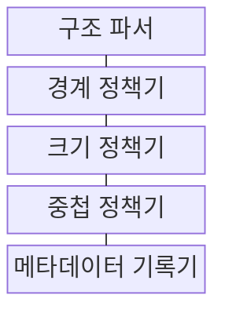
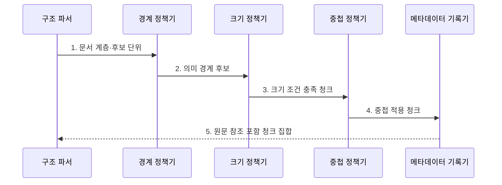

---
sidebar:
  order: 77
  label: "077. Chunking 청크 분할 (Chunking)"
  badge:
    text: "기출 · 60%"
    variant: note
title: "Chunking 청크 분할 (Chunking)"
date: "2026-07-30T11:04:43+09:00"
tags:
  - "notes-latest_tech"
weight: 77
extra:
  question_no: "077"
  source_status: "기출"
  source_history: "135회"
  priority: 60
  priority_note: "문서 분할이 검색 품질을 좌우"
---

## 미리 알고가기

- **청킹 (Chunking)**: 원문을 검색 가능한 의미 단위로 분할함
- **청크 (Chunk)**: 검색·생성에 전달되는 문서 조각임
- **중첩 (Overlap)**: 인접 청크에 경계 문맥을 반복함
- **메타데이터 (Metadata)**: 청크의 위치·계층 정보를 기록함
- **검색 증강 생성(Retrieval-Augmented Generation, RAG)**: 검색 근거를 생성 모델의 문맥으로 제공하는 방식
- **청킹과 RAG의 관계**: 문서를 검색 가능한 덩어리로 나누고, 검색된 덩어리를 생성 모델의 근거로 제공함

## Ⅰ. 개요

- 정의/개념: 원문을 의미 있는 검색 단위로 나누는 전처리
- 기존 한계: 문서 전체 검색은 문맥 한도 초과·검색 잡음 유발

### 쉽게 이해하기 (학습용)

- 질문으로 찾기 좋은 의미 단위로 문서를 나누고 출처 정보를 붙입니다.

## Ⅱ. 특징

- **경계 보존**: 문장·문단·절의 의미 구조를 유지한다
- **크기 상충**: 작은 단위는 정밀도, 큰 단위는 문맥에 유리하다
- **연결 정보**: 중첩·메타데이터로 경계와 출처를 보완한다

### 쉽게 이해하기 (학습용)

- 너무 작으면 문맥이 끊기고 너무 크면 노이즈가 늘며 중첩은 중복 비용을 만듭니다.

## Ⅲ. 구조 및 구성요소

| 구성요소 | 책임 |
|:---|:---|
| 구조 파서 | 제목·문단·표·코드의 문서 계층 추출 |
| 경계 정책기 | 의미 구조에 따른 분할 우선순위 결정 |
| 크기 정책기 | 청크의 최소·최대 토큰 범위 결정 |
| 중첩 정책기 | 인접 청크에 반복할 경계 문맥 결정 |
| 메타데이터 기록기 | 원문 위치·계층·인접 청크 참조 기록 |

### 쉽게 이해하기 (학습용)

- 파서·경계·크기·중첩·위치 정보가 청크를 구성합니다.

## Ⅳ. 흐름도

### 동작 원리

1. **문서 계층·후보 단위**: 제목·문단·표 구조를 분할 후보로 보존
2. **의미 경계 후보**: 구조 우선순위로 절단 가능한 지점 선택
3. **크기 조건 충족 청크**: 토큰 상한 안에서 인접 단위를 결합
4. **중첩 적용 청크**: 경계 문맥이 필요한 구간만 선택적으로 반복
5. **원문 참조 포함 청크 집합**: 위치·계층·인접 참조를 함께 기록

### 쉽게 이해하기 (학습용)

- 문서 구조와 크기로 나누고 중첩과 원문 위치를 붙입니다.

## Ⅴ. 종류 및 비교

| 비교 기준 | 고정 크기 | 구조 기반 | 의미 기반 |
|:---|:---|:---|:---|
| 적용 기준 | 균일 문서·빠른 처리 | 제목·문단 구조가 명확할 때 | 주제 전환 보존이 중요할 때 |
| 핵심 특징 | 토큰 수 기준 분할 | 문서 계층 기준 분할 | 의미 유사도 변화로 분할 |
| 한계 | 의미 경계 절단 | 불규칙 구조에 취약 | 계산 비용·경계 변동 |

> 요약: 분할 기준에 따른 방식 차이임

### 쉽게 이해하기 (학습용)

- 고정·구조·의미 기반 청킹은 경계를 정하는 기준과 비용이 다릅니다.

## Ⅵ. 실무 고려사항 및 대책

| 고려사항 | 대책 | 효과 |
|:---|:---|:---|
| 과소·과대 **청크 크기**로 문맥 단절 또는 검색 잡음 증가 | 질문 유형별 크기를 탐색하고 Context Recall·Precision으로 선택 | 근거 회수율과 **토큰 비용** 균형 |
| 표·조항·코드의 **의미 경계** 절단 | 문서 구조를 우선해 분할하고 필요한 경계에만 중첩 적용 | 근거 단위의 **의미 완결성** 보존 |
| 검색 조각의 **상위 문맥·출처** 소실 | 문서 ID·계층 경로·페이지·인접 청크를 메타데이터로 보존 | 근거 위치의 **추적 가능성** 확보 |

### 쉽게 이해하기 (학습용)

- 규정은 조·항·호와 원문 위치를 보존하고 매뉴얼은 설명과 예제 코드의 결합 여부를 검증합니다.

## Ⅶ. 결론

- 검색 문맥 보존을 위해 구조·길이를 검토하여 **청킹** 활용

### 쉽게 이해하기 (학습용)

- 검색 가능성과 문맥 보존 및 중복 비용을 문서 유형별로 비교해야 합니다.
