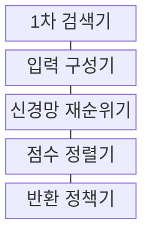
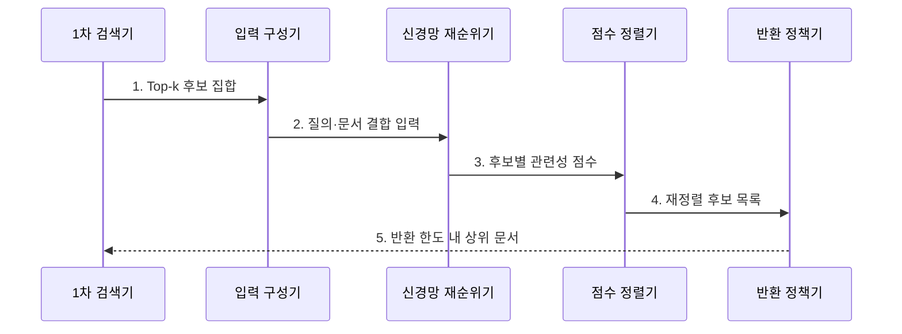

---
sidebar:
  order: 78
  label: "078. Reranker 재순위화 모델 (Neural Reranker)"
  badge:
    text: "기출 · 60%"
    variant: note
title: "Reranker 재순위화 모델 (Neural Reranker)"
date: "2026-07-30T11:04:43+09:00"
tags:
  - "notes-latest_tech"
weight: 78
extra:
  question_no: "078"
  source_status: "기출"
  source_history: "138회"
  priority: 60
  priority_note: "재순위화가 검색 정밀도 개선의 핵심"
---

## 미리 알고가기

- **신경망 재순위 모델 (Neural Reranker)**: 1차 후보의 관련성을 재점수화함
- **교차 인코더 (Cross-Encoder)**: 질의와 문서를 동시에 입력하여 점수화함
- **양방향 인코더 표현 (Bidirectional Encoder Representations from Transformers, BERT)**: 문맥 표현을 생성함
- **문맥화 후기 상호작용 모델 (Contextualized Late Interaction over BERT, ColBERT)**: 토큰 유사도를 결합함
- **상위 k개(Top-k)**: 1차 검색 결과 중 재평가할 상위 후보 수
- **재순위화 범위**: BERT·ColBERT 계열 모델로 1차 검색의 상위 k개 후보를 정밀 평가하며, k는 재평가할 후보 수

## Ⅰ. 개요

- 정의/개념: 1차 검색 후보의 관련성을 신경망으로 재점수화
- 기존 한계: 빠른 검색 점수는 질의·문서의 정밀 상호작용 부족

### 쉽게 이해하기 (학습용)

- 1차 검색이 넓게 모은 후보를 정밀하게 다시 평가해 순서를 정합니다.

## Ⅱ. 특징

- **후보 제한**: 1차 검색에 포함된 문서만 재정렬한다
- **정밀 상호작용**: 질의·문서 관계로 점수를 계산한다
- **품질·지연 상충**: 후보 수와 모델 복잡도가 비용을 높인다

### 쉽게 이해하기 (학습용)

- 재순위 모델은 누락된 후보를 되살릴 수 없고 후보가 많을수록 시간이 더 듭니다.

## Ⅲ. 구조 및 구성요소

| 구성요소 | 책임 |
|:---|:---|
| 1차 검색기 | 재평가할 Top-k 후보 집합 회수 |
| 입력 구성기 | 질의와 후보 문서를 모델 입력으로 결합 |
| 신경망 재순위기 | 질의·문서 상호작용 기반 관련성 산출 |
| 점수 정렬기 | 재산출 점수에 따라 후보 순서 조정 |
| 반환 정책기 | 지연·반환 한도에 맞는 상위 문서 선택 |

### 쉽게 이해하기 (학습용)

- 후보·학습 목적·재점수 모델이 최종 반환 순서를 결정합니다.

## Ⅳ. 흐름도

### 동작 원리

1. **Top-k 후보 집합**: 1차 검색 회수율이 재순위 가능 범위를 결정
2. **질의·문서 결합 입력**: 교차 상호작용이 가능한 입력 표현 구성
3. **후보별 관련성 점수**: 신경망이 문맥 조건을 반영해 재점수화
4. **재정렬 후보 목록**: 새 점수를 기준으로 후보 순서 변경
5. **반환 한도 내 상위 문서**: 지연 예산과 생성 문맥 한도에 맞춰 선택

### 쉽게 이해하기 (학습용)

- 1차 검색 후보만 신경망으로 재점수화해 상위 문서를 반환합니다.

## Ⅴ. 종류 및 비교

| 비교 기준 | 점별 학습 | 쌍별 학습 | 목록별 학습 |
|:---|:---|:---|:---|
| 적용 기준 | 라벨 보유 시 | 선호 관계 시 | 순위 라벨 시 |
| 핵심 특징 | 개별 관련성 점수 학습 | 두 문서의 선호 순서 학습 | 전체 후보 순위 품질 학습 |
| 한계 | 문서 간 순서 반영 부족 | 전체 목록 최적화 부족 | 학습 비용·구현 복잡 |

> 요약: 학습 단위에 따른 방식 차이임

### 쉽게 이해하기 (학습용)

- 점별·쌍별·목록별 재순위 학습은 최적화하는 순위 단위가 다릅니다.

## Ⅵ. 실무 고려사항 및 대책

| 고려사항 | 대책 | 효과 |
|:---|:---|:---|
| 정답이 Top-k 밖인 **1차 검색 누락** | 재순위 전 Recall@k를 확보하고 희소·밀집 하이브리드 검색 적용 | 재순위 대상의 **정답 포함률** 확보 |
| 후보 수·모델 크기 증가에 따른 **꼬리 지연** | 지연 예산에 맞춰 k를 제한하고 경량 모델·배치 추론 적용 | 재순위 **응답 시간·비용** 제한 |
| 쉬운 음성 표본 위주의 **순위 학습 편향** | 검색 상위의 Hard Negative를 수집하고 nDCG·MRR로 평가 | 유사 오답의 **순위 분별력** 향상 |

### 쉽게 이해하기 (학습용)

- 1차 검색의 회수율을 먼저 확보한 뒤 질문 조건과 유사 오답을 구분하는 순위를 검증합니다.

## Ⅶ. 결론

- 검색 정밀도 향상을 위해 후보 수·지연을 검토하여 **재순위** 활용

### 쉽게 이해하기 (학습용)

- 1차 검색은 회수율을, 재순위는 정밀도를 높이되 전체 지연도 함께 계산해야 합니다.
