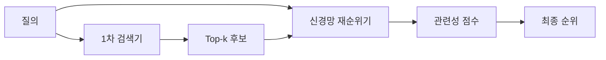

---
sidebar:
  order: 78
  label: "078. Reranker 재순위화 모델 (Neural Reranker)"
  badge:
    text: "기출 · 60%"
    variant: note
title: "Reranker 재순위화 모델 (Neural Reranker)"
date: "2026-07-27T23:59:59+09:00"
tags:
  - "notes-latest_tech"
weight: 78
extra:
  question_no: "078"
  source_status: "기출"
  source_history: "138회"
  priority: 60
  priority_note: "재순위화가 검색 정밀도 개선의 핵심"
---

## 미리 알고가기

- **신경망 재순위 모델 (Neural Reranker)**: 1차 후보의 관련성을 재점수화함
- **교차 인코더 (Cross-Encoder)**: 질의와 문서를 동시에 입력하여 점수화함
- **양방향 인코더 표현 (Bidirectional Encoder Representations from Transformers, BERT)**: 문맥 표현을 생성함
- **문맥화 후기 상호작용 모델 (Contextualized Late Interaction over BERT, ColBERT)**: 토큰 유사도를 결합함
- **상위 k개(Top-k)**: 1차 검색 결과 중 재평가할 상위 후보 수
- **약어·기호 읽기**: BERT·ColBERT는 ‘버트·콜버트’, Top-k는 ‘톱 케이’로 읽고 k는 후보 개수를 뜻함

## Ⅰ. 개요

- 정의/개념: 1차 검색 후보의 관련성을 신경망으로 재점수화
- 기존 한계: 빠른 검색 점수는 질의·문서의 정밀 상호작용 부족

### 쉽게 이해하기 (학습용)

- 1차 검색이 넓게 모은 후보를 정밀하게 다시 평가해 순서를 정합니다.

## Ⅱ. 특징

- **후보 제한**: 1차 검색에 포함된 문서만 재정렬한다
- **정밀 상호작용**: 질의·문서 관계로 점수를 계산한다
- **품질·지연 상충**: 후보 수와 모델 복잡도가 비용을 높인다

### 쉽게 이해하기 (학습용)

- 재순위 모델은 누락된 후보를 되살릴 수 없고 후보가 많을수록 시간이 더 듭니다.

## Ⅲ. 구성요소 및 구조

| 설계 요소 | 핵심 키워드 | 직관적 설명 |
|:---|:---|:---|
| 후보 집합 | 1차 검색 결과 | 재순위 대상 문서 리스트임 |
| 질의·문서 표현 | 입력 특징 | 신경망의 관련성 판정 데이터임 |
| 순위 목적 | 학습 목표 | 점수 산출 및 순위 기준 정의함 |
| 순위 모델 | 재점수화 | 후보별 관련 점수를 산출함 |
| 재순위 정책 | 반환 규모 | 평가 및 최종 반환 문서 수임 |

### 쉽게 이해하기 (학습용)

- 후보·학습 목적·재점수 모델이 최종 반환 순서를 결정합니다.

## Ⅳ. 원리 및 절차 흐름도

| 절차 | 설명 |
|:---|:---|
| Top-k후보회수 | 검색 범위 제한함 |
| 입력구성 | 모델 입력 생성함 |
| 후보채점 | 관련성 계산함 |
| 점수정렬 | 순위 재조정함 |
| 문서반환 | 한도 내 반환함 |

### 쉽게 이해하기 (학습용)

- 1차 검색 후보만 신경망으로 재점수화해 상위 문서를 반환합니다.

## Ⅴ. 재순위 학습 방식 비교

| 비교 기준 | 점별 학습 | 쌍별 학습 | 목록별 학습 |
|:---|:---|:---|:---|
| 적용 기준 | 라벨 보유 시 | 선호 관계 시 | 순위 라벨 시 |
| 핵심 특징 | 개별 관련성 점수 학습 | 두 문서의 선호 순서 학습 | 전체 후보 순위 품질 학습 |
| 한계 | 문서 간 순서 반영 부족 | 전체 목록 최적화 부족 | 학습 비용·구현 복잡 |

> 요약: 학습 단위에 따른 방식 차이임

### 쉽게 이해하기 (학습용)

- 점별·쌍별·목록별 재순위 학습은 최적화하는 순위 단위가 다릅니다.

## Ⅵ. 실무 사례

1. 규정 검색: **적용 대상·예외**로 후보 재점수화
2. 장애 검색: **증상·해결 절차** 관련성으로 재정렬

### 쉽게 이해하기 (학습용)

- 넓게 찾은 규정·매뉴얼 후보 중 질문 조건과 더 잘 맞는 문서를 위로 올립니다.

## Ⅶ. 결론

- 회수율은 **1차 검색**, 정밀도·지연은 재순위로 조정

### 쉽게 이해하기 (학습용)

- 1차 검색은 회수율을, 재순위는 정밀도를 높이되 전체 지연도 함께 계산해야 합니다.
