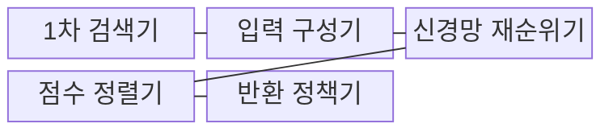
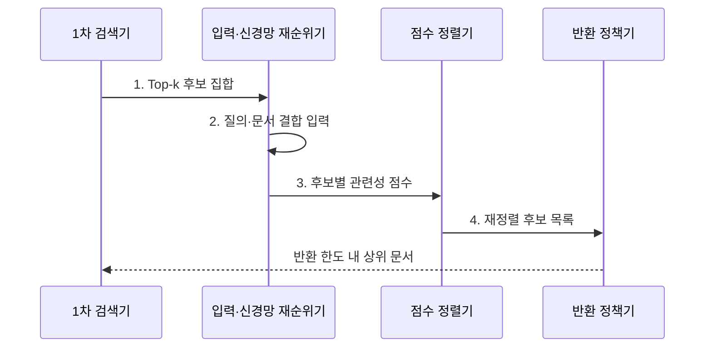

---
sidebar:
  order: 78
  label: "078. 신경망 재순위 모델 (Neural Reranker)"
  badge:
    text: "기출 · 60%"
    variant: note
title: "신경망 재순위 모델 (Neural Reranker)"
date: "2026-08-02T11:06:00+09:00"
tags:
  - "notes-latest_tech"
weight: 78
extra:
  question_no: "078"
  source_status: "기출"
  source_history: "138회"
  priority: 60
  priority_note: "재순위화가 검색 정밀도 개선의 핵심"
---

## Ⅰ. 개요

핵심 용어

- **신경망 재순위 모델(Neural Reranker)**: 1차 검색 후보의 관련성을 신경망으로 재점수화해 최종 순서를 개선한다.

- 정의/개념: **신경망 재순위 모델(Neural Reranker)** 은 1차 검색 후보의 관련성을 신경망으로 재평가하는 순위 최적화 모델
- 배경/필요성: 빠른 검색 점수는 **질의·문서 상호작용 부족**

#### 한줄 요약

- 1차 검색이 넓게 모은 후보를 정밀하게 다시 평가해 순서를 정합니다.

## Ⅱ. 특징

핵심 용어

- **교차 인코더**: 질의와 문서를 동시에 입력해 정밀하게 점수화한다.
- **BERT 기반 문맥화 후기 상호작용(Contextualized Late Interaction over BERT, ColBERT)**: 문서 토큰을 미리 인코딩하고 질의 토큰과 후기 상호작용해 지연을 줄인다.

- 1차 검색에 포함된 문서만 재정렬하는 **후보 제한**
- 질의·문서 관계로 점수를 계산하는 **정밀 상호작용**
- **트랜스포머 양방향 인코더 표현(Bidirectional Encoder Representations from Transformers, BERT) 교차 인코더** 의 정밀 평가와 후보별 추론 지연 증가
- **BERT 기반 문맥화 후기 상호작용(Contextualized Late Interaction over BERT, ColBERT)** 의 문서 토큰 사전 인코딩에 따른 재순위 지연 감소

#### 한줄 요약

- 재순위 모델은 누락된 후보를 되살릴 수 없고 후보가 많을수록 시간이 더 듭니다.

## Ⅲ. 구조 및 구성요소

핵심 용어

- **Top-k**: 1차 검색 결과 중 재평가할 상위 후보 수다.
- **반환 정책**: 응답 지연과 문맥 한도 안에서 최종 제공할 문서 수를 정한다.

| 구성요소 | 책임 |
|:---|:---|
| **1차 검색기** | 재평가할 Top-k 후보 회수 |
| **입력 구성기** | 질의·후보를 모델 입력으로 결합 |
| **신경망 재순위기** | 상호작용 기반 관련성 산출 |
| **점수 정렬기** | 재산출 점수로 후보 순서 조정 |
| **반환 정책기** | 지연·반환 한도 내 문서 선택 |

#### 한줄 요약

- 후보·학습 목적·재점수 모델이 최종 반환 순서를 결정합니다.

## Ⅳ. 흐름도

핵심 용어

- **후보 제한**: 재순위 모델이 1차 검색에서 누락된 문서를 되살릴 수 없다는 제약이다.
- **재점수화**: 질의·문서 상호작용을 반영한 새 관련성 점수로 후보 순서를 바꾸는 과정이다.

**동작 원리**

1. **Top-k 후보 집합**: 1차 검색 회수율이 재순위 가능 범위를 결정
2. **질의·문서 결합 입력**: 교차 상호작용이 가능한 입력 표현 구성
3. **후보별 관련성 점수**: 신경망이 문맥 조건을 반영해 재점수화
4. **재정렬 후보 목록**: 새 점수를 기준으로 후보 순서 변경

#### 한줄 요약

- 1차 검색 후보만 신경망으로 재점수화해 상위 문서를 반환합니다.

## Ⅴ. 종류 및 비교

핵심 용어

- **점별·쌍별·목록별 학습**: 각각 개별 관련성, 문서 간 선호, 전체 후보 순위 품질을 최적화한다.

| 비교 기준 | 점별 학습 | 쌍별 학습 | 목록별 학습 |
|:---|:---|:---|:---|
| **적용 기준** | 개별 **관련성 라벨** 보유 | 문서 간 **선호 관계** 보유 | 전체 **순위 라벨** 보유 |
| **핵심 특징** | 개별 **관련성 점수** 학습 | 두 문서의 **선호 순서** 학습 | 전체 후보의 **순위 품질** 학습 |
| **한계** | 문서 간 **순서 반영 부족** | 전체 목록 **최적화 부족** | 학습 비용·**구현 복잡성** |

#### 한줄 요약

- 점별·쌍별·목록별 재순위 학습은 최적화하는 순위 단위가 다릅니다.

## Ⅵ. 실무 고려사항 및 대책

핵심 용어

- **상위 k개 재현율(Recall at k, Recall@k)**: 관련 정답이 재순위 후보에 포함된 비율이다.
- **정규화 할인 누적 이득(Normalized Discounted Cumulative Gain, nDCG)**: 관련성과 순위 위치를 함께 반영한 지표다.
- **평균 역순위(Mean Reciprocal Rank, MRR)**: 첫 관련 정답 순위의 역수를 질의별로 평균한 지표다.

| 문제 | 대책 | 효과 |
|:---|:---|:---|
| Top-k 밖의 **1차 검색 누락** | **상위 k개 재현율(Recall at k, Recall@k)** 확보와 하이브리드 검색 적용 | 재순위의 **정답 포함률** 확보 |
| 후보·모델 증가에 따른 **꼬리 지연** | k 제한과 경량 모델·**배치 추론** 적용 | **응답 시간·비용** 제한 |
| 쉬운 부정 표본 중심의 **순위 학습 편향** | 어려운 부정 표본 수집과 **정규화 할인 누적 이득(Normalized Discounted Cumulative Gain, nDCG)·평균 역순위(Mean Reciprocal Rank, MRR)** 평가 | 유사 오답의 **순위 분별력** 향상 |

#### 한줄 요약

- 1차 검색의 회수율을 먼저 확보한 뒤 질문 조건과 유사 오답을 구분하는 순위를 검증합니다.

## Ⅶ. 결론

핵심 용어

- **지연 예산**: 1차 검색과 Top-k 후보의 모델 추론을 포함한 전체 응답 시간 한도다.

- 회수율이 확보되면 **재순위** 를 적용하고 지연 예산별 **Top-k·모델 크기** 제한

#### 한줄 요약

- 1차 검색은 회수율을, 재순위는 정밀도를 높이되 전체 지연도 함께 계산해야 합니다.
