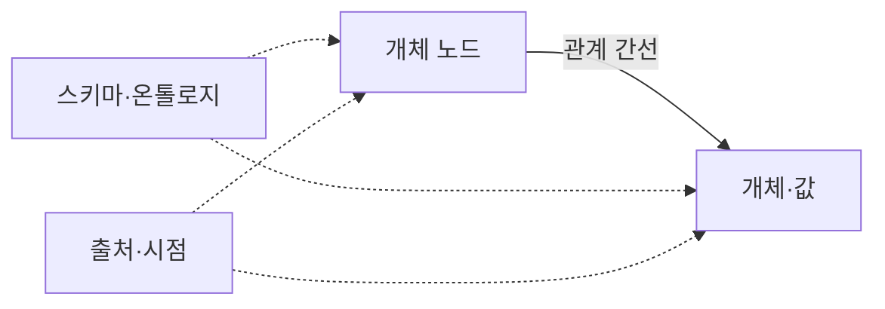
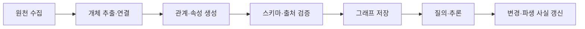

---
sidebar:
  order: 79
  label: "079. Knowledge Graph 지식그래프 (Knowledge Graph)"
  badge:
    text: "기출 · 60%"
    variant: note
title: "Knowledge Graph 지식그래프 (Knowledge Graph)"
date: "2026-07-27T23:59:59+09:00"
tags:
  - "notes-latest_tech"
weight: 79
extra:
  question_no: "079"
  source_status: "기출"
  source_history: "138회"
  priority: 60
  priority_note: "관계 기반 근거 연결이 설명형 검색 기반"
---

## 미리 알고가기

- **지식그래프 (Knowledge Graph)**: 개체와 관계를 그래프 구조로 저장함
- **개체 연결 (Entity Linking)**: 문서 언급을 식별자에 매핑함
- **스키마 (Schema)**: 허용 개체·관계를 정의함
- **온톨로지 (Ontology)**: 개념·관계의 의미 제약 체계임
- **자원 기술 프레임워크(Resource Description Framework, RDF)**: 주어·술어·목적어 트리플로 사실을 표현하는 표준
- **약어·명칭 읽기**: RDF는 ‘알디에프’, Knowledge Graph는 ‘날리지 그래프’로 읽고 RDF는 영문 머리글자, 그래프는 지식의 관계 구조를 뜻함

## Ⅰ. 개요

- 정의/개념: 식별된 개체와 사실 관계를 그래프로 표현한 지식망
- 기존 한계: 표·문서에 분산된 사실은 다단계 관계 추적이 어려움

### 쉽게 이해하기 (학습용)

- 개체에 고유 식별자를 붙이고 개체 간 관계를 선으로 연결합니다.

## Ⅱ. 특징

- **개체 식별**: 별칭·언급을 하나의 식별자로 연결한다
- **관계 표현**: 트리플·간선으로 다단계 경로를 탐색한다
- **지식 신뢰**: 스키마·출처·시점으로 사실을 검증한다

### 쉽게 이해하기 (학습용)

- 별칭을 한 개체로 묶고 관계마다 출처와 시점을 붙여 연결 경로를 추적합니다.

## Ⅲ. 구성요소 및 구조

| 설계 요소 | 핵심 키워드 | 직관적 설명 |
|:---|:---|:---|
| 개체 | 고유 노드 | 관리 대상 대상을 식별함 |
| 관계 | 간선 표현 | 대상 간 유형·방향임 |
| 속성 | 기록 정보 | 사실의 값·시점임 |
| 스키마 | 제약 정의 | 데이터 표현의 규칙임 |
| 출처 | 메타데이터 | 사실의 근거·이력임 |

### 쉽게 이해하기 (학습용)

- 개체·관계·속성·규칙·출처가 추적 가능한 지식 지도를 이룹니다.

## Ⅳ. 원리 및 절차 흐름도

| 절차 | 설명 |
|:---|:---|
| 원천수집 | 문서·DB·이벤트 확보 |
| 개체추출·연결 | 언급을 고유 식별자에 매핑 |
| 관계·속성생성 | 트리플·값·시점 생성 |
| 스키마·출처검증 | 구조·근거·중복 확인 |
| 그래프저장 | 노드·간선·메타데이터 적재 |
| 질의·추론 | 경로 탐색·파생 사실 계산 |
| 변경·파생갱신 | 원천 변경과 추론 결과 반영 |

### 쉽게 이해하기 (학습용)

- 개체를 식별하고 관계·출처·제약을 검증해 저장합니다.

## Ⅴ. 관계형 DB·지식그래프·온톨로지 비교

| 비교 기준 | 관계형 DB | 지식그래프 | 온톨로지 |
|:---|:---|:---|:---|
| 적용 기준 | 고정 구조 | 관계·출처 중요 | 의미 규칙 공유 |
| 핵심 특징 | 표·키·조인 | 개체·관계·사실 | 개념·제약·공리 |
| 한계 | 가변 관계 확장 복잡 | 개체 연결·정합성 비용 | 합의·추론 비용 |

> 요약: 모델별 표현 대상과 목적 차이임

### 쉽게 이해하기 (학습용)

- 관계형 모델·지식그래프·온톨로지는 표현 대상과 추론 범위가 다릅니다.

## Ⅵ. 실무 사례

1. 권한 분석: **사용자·역할·자원 경로** 추적
2. 장애 분석: **서비스 의존 그래프**로 전파 범위 탐색

### 쉽게 이해하기 (학습용)

- 권한 경로나 장애 전파 범위를 관계선을 따라 추적할 수 있습니다.

## Ⅶ. 결론

- 다단계 관계는 **지식그래프**, 의미 제약은 온톨로지

### 쉽게 이해하기 (학습용)

- 식별자·관계 규칙·출처를 지속해서 정합하게 유지해야 신뢰할 수 있습니다.
