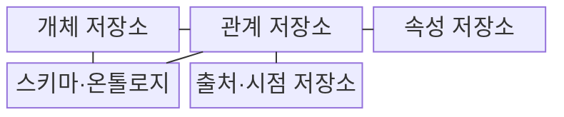
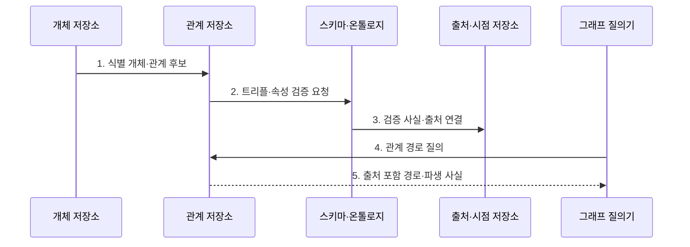

---
sidebar:
  order: 79
  label: "079. Knowledge Graph 지식그래프 (Knowledge Graph)"
  badge:
    text: "기출 · 60%"
    variant: note
title: "Knowledge Graph 지식그래프 (Knowledge Graph)"
date: "2026-07-30T11:04:43+09:00"
tags:
  - "notes-latest_tech"
weight: 79
extra:
  question_no: "079"
  source_status: "기출"
  source_history: "138회"
  priority: 60
  priority_note: "관계 기반 근거 연결이 설명형 검색 기반"
---

## 미리 알고가기

- **지식그래프 (Knowledge Graph)**: 개체와 관계를 그래프 구조로 저장함
- **개체 연결 (Entity Linking)**: 문서 언급을 식별자에 매핑함
- **스키마 (Schema)**: 허용 개체·관계를 정의함
- **온톨로지 (Ontology)**: 개념·관계의 의미 제약 체계임
- **자원 기술 프레임워크(Resource Description Framework, RDF)**: 주어·술어·목적어 트리플로 사실을 표현하는 표준
- **RDF와 지식 그래프의 관계**: RDF는 주어·술어·목적어로 관계를 표현하고, 지식 그래프는 이를 연결해 탐색·추론 가능한 지식 구조를 구성함

## Ⅰ. 개요

- 정의/개념: 식별된 개체와 사실 관계를 그래프로 표현한 지식망
- 배경/필요성: 표·문서에 분산된 사실은 다단계 관계 추적이 어려움

### 쉽게 이해하기 (학습용)

- 개체에 고유 식별자를 붙이고 개체 간 관계를 선으로 연결합니다.

## Ⅱ. 특징

- **개체 식별**: 별칭·언급을 하나의 식별자로 연결한다
- **관계 표현**: 트리플·간선으로 다단계 경로를 탐색한다
- **지식 신뢰**: 스키마·출처·시점으로 사실을 검증한다

### 쉽게 이해하기 (학습용)

- 별칭을 한 개체로 묶고 관계마다 출처와 시점을 붙여 연결 경로를 추적합니다.

## Ⅲ. 구조 및 구성요소

| 구성요소 | 책임 |
|:---|:---|
| 개체 저장소 | 실제 대상을 고유 식별자 노드로 관리 |
| 관계 저장소 | 개체 간 유형·방향을 간선으로 관리 |
| 속성 저장소 | 개체·관계의 값과 시점을 관리 |
| 스키마·온톨로지 | 허용 개체·관계와 의미 제약 정의 |
| 출처·시점 저장소 | 사실의 원천·유효 기간·이력 보관 |

### 쉽게 이해하기 (학습용)

- 개체·관계·속성·규칙·출처가 추적 가능한 지식 지도를 이룹니다.

## Ⅳ. 흐름도

1. **식별 개체·관계 후보**: 문서 언급을 고유 식별자와 연결
2. **트리플·속성 검증 요청**: 관계 방향·타입을 스키마로 판정
3. **검증 사실·출처 연결**: 간선에 원천과 유효 시점을 결합
4. **관계 경로 질의**: 다단계 간선을 따라 사실 후보 탐색
5. **출처 포함 경로·파생 사실**: 추론 결과와 검증 근거를 함께 반환

### 쉽게 이해하기 (학습용)

- 개체를 식별하고 관계·출처·제약을 검증해 저장합니다.

## Ⅴ. 종류 및 비교

| 비교 기준 | 관계형 DB | 지식그래프 | 온톨로지 |
|:---|:---|:---|:---|
| 적용 기준 | 고정 구조 | 관계·출처 중요 | 의미 규칙 공유 |
| 핵심 특징 | 표·키·조인 | 개체·관계·사실 | 개념·제약·공리 |
| 한계 | 가변 관계 확장 복잡 | 개체 연결·정합성 비용 | 합의·추론 비용 |

> 요약: 모델별 표현 대상과 목적 차이임

### 쉽게 이해하기 (학습용)

- 관계형 모델·지식그래프·온톨로지는 표현 대상과 추론 범위가 다릅니다.

## Ⅵ. 실무 고려사항 및 대책

| 고려사항 | 대책 | 효과 |
|:---|:---|:---|
| 동명이인·별칭의 **개체 연결 오류** | 고유 식별자와 문맥 기반 Entity Linking 적용 후 불확실 후보 검수 | 오병합·중복 개체의 **식별 정확도** 향상 |
| 오래되거나 무근거인 **관계 전파** | 간선별 출처·유효 기간·신뢰도를 기록하고 시점 질의 적용 | 다단계 추론의 **근거 신뢰성** 확보 |
| 관계 방향·타입의 **스키마 불일치** | 온톨로지 제약과 SHACL 검증을 적재 파이프라인에 적용 | 탐색·추론 결과의 **정합성** 보존 |

### 쉽게 이해하기 (학습용)

- 개체 식별과 관계의 출처·시점을 보존해야 권한 경로나 장애 전파 범위를 신뢰할 수 있습니다.

## Ⅶ. 결론

- 관계 추론을 위해 개체·관계 품질을 검토하여 **지식그래프** 활용

### 쉽게 이해하기 (학습용)

- 식별자·관계 규칙·출처를 지속해서 정합하게 유지해야 신뢰할 수 있습니다.
