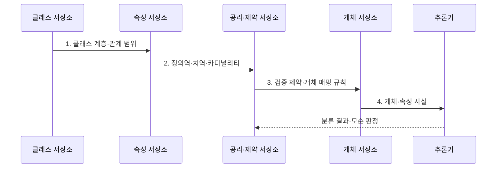

---
sidebar:
  order: 80
  label: "080. Ontology 온톨로지 (Ontology)"
  badge:
    text: "기출 · 50%"
    variant: note
title: "Ontology 온톨로지 (Ontology)"
date: "2026-07-31T12:04:02+09:00"
tags:
  - "notes-latest_tech"
weight: 80
extra:
  question_no: "080"
  source_status: "기출"
  source_history: "138회"
  priority: 50
  priority_note: "개념·관계 명세가 지식그래프 기반"
---

## 미리 알고가기

- **온톨로지 (Ontology)**: 도메인 개념·관계·제약을 명세함
- **개념 계층 (Concept Hierarchy)**: 상위·하위 개념 관계를 정의함
- **공리 (Axiom)**: 추론 및 모순 판정에 사용하는 논리 규칙임
- **일관성 검사 (Consistency Check)**: 규칙 간 모순을 탐지함
- **웹 온톨로지 언어(Web Ontology Language, OWL)**: 클래스·속성·공리를 표현하는 W3C 표준
- **OWL과 온톨로지의 관계**: OWL은 개념·속성·관계·제약을 기계가 해석하도록 표현하는 온톨로지 표준 언어

## Ⅰ. 개요

- 정의/개념: 도메인의 개념·관계·제약·공리를 명시한 **공유 의미 모형**
- 배경/필요성: 시스템별 **용어·관계 해석 차이**로 지식 통합·공유 곤란

### 쉽게 이해하기 (학습용)

- 여러 시스템이 용어와 관계의 뜻을 동일하게 해석하도록 만든 공용 설계도입니다.

## Ⅱ. 특징

- 클래스의 상하위·상속 관계를 정하는 **개념 계층**
- 속성의 정의역·치역·카디널리티를 밝히는 **의미 제약**
- 공리로 암묵 지식·모순을 판정하는 **논리 추론**

### 쉽게 이해하기 (학습용)

- 자세한 규칙은 숨은 분류와 모순을 찾지만 잘못된 사실도 추론에 전파됩니다.

## Ⅲ. 구조 및 구성요소

```mermaid
block-beta
  columns 3
  class["클래스 저장소"]
  individual["개체 저장소"]
  object["객체 속성 저장소"]
  data["데이터 속성 저장소"]
  axiom["공리·제약 저장소"]
  class --- individual
  class --- object
  individual --- object
  individual --- data
  axiom --- class
  axiom --- object
```

| 구성요소 | 책임 |
|:---|:---|
| **클래스 저장소** | 도메인 개념과 상하위 계층 정의 |
| **개체 저장소** | 클래스에 속하는 실제 대상·식별자 관리 |
| **객체 속성 저장소** | 개체와 개체 사이의 관계 정의 |
| **데이터 속성 저장소** | 개체와 리터럴 값의 관계 정의 |
| **공리·제약 저장소** | 분류 추론과 모순 판정 규칙 관리 |

### 쉽게 이해하기 (학습용)

- 개념·계층·관계·제약·공리가 공유 의미 체계를 구성합니다.

## Ⅳ. 흐름도



**동작 원리**

1. **클래스 계층·관계 범위**: 합의한 개념의 상하위 구조와 관계 대상 정의
2. **정의역·치역·카디널리티**: 속성에 허용할 클래스와 개수 제한 명시
3. **검증 제약·개체 매핑 규칙**: 원천 데이터를 온톨로지 개념에 연결
4. **개체·속성 사실**: 추론기가 판정할 명시적 사실 제공

### 쉽게 이해하기 (학습용)

- 용어·관계·공리를 명세하고 추론 결과와 논리적 모순을 검사합니다.

## Ⅴ. 종류 및 비교

| 비교 기준 | 분류체계 | 온톨로지 | 지식그래프 |
|:---|:---|:---|:---|
| **적용 기준** | **분류 계층** 필요 | 공유 의미·**추론** 필요 | **경로 탐색** 중심 |
| **핵심 특징** | 용어·**상하위 관계** | **개념·제약·공리** | **개체·관계·사실** |
| **한계** | 관계·**추론 표현 제한** | 합의·**추론 비용** | 개체 연결·**정합성 비용** |

### 쉽게 이해하기 (학습용)

- 분류체계·온톨로지·지식그래프는 표현 깊이와 활용 목적이 다릅니다.

## Ⅵ. 실무 고려사항 및 대책

| 고려사항 | 대책 | 효과 |
|:---|:---|:---|
| 동음이의어와 **분류 기준 충돌** | 용어집·상하위 관계의 **공동 검토** | 공유 개념의 **해석 일관성** 확보 |
| 규칙의 **공리 복잡도 증가** | **OWL 프로파일** 선택과 규칙 복잡도 제한 | **결정 가능성·응답 시간** 확보 |
| 변경으로 **하위 호환성 훼손** | 식별자·버전·폐기 매핑과 **일관성 회귀 검사** | 기존 개체·질의의 **호환성** 보존 |

### 쉽게 이해하기 (학습용)

- 공통 개념과 관계를 합의하고 공리 변경이 기존 개체·질의에 미치는 영향을 검사합니다.

## Ⅶ. 결론

- 용어 계층만 필요하면 **분류체계**, 의미 제약·추론이 필요하면 **온톨로지** 선택

### 쉽게 이해하기 (학습용)

- 과도한 규칙과 잘못된 사실은 유지보수 비용과 추론 오류를 함께 키웁니다.
