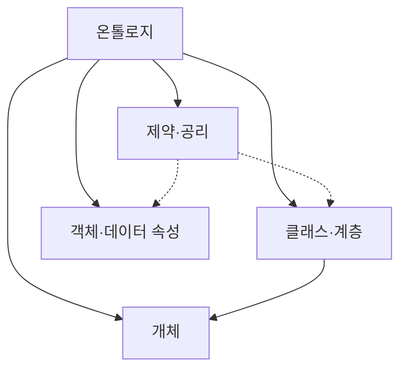

---
sidebar:
  order: 80
  label: "080. Ontology 온톨로지 (Ontology)"
  badge:
    text: "기출 · 50%"
    variant: note
title: "Ontology 온톨로지 (Ontology)"
date: "2026-07-27T23:59:59+09:00"
tags:
  - "notes-latest_tech"
weight: 80
extra:
  question_no: "080"
  source_status: "기출"
  source_history: "138회"
  priority: 50
  priority_note: "개념·관계 명세가 지식그래프 기반"
---

## 미리 알고가기

- **온톨로지 (Ontology)**: 도메인 개념·관계·제약을 명세함
- **개념 계층 (Concept Hierarchy)**: 상위·하위 개념 관계를 정의함
- **공리 (Axiom)**: 추론 및 모순 판정에 사용하는 논리 규칙임
- **일관성 검사 (Consistency Check)**: 규칙 간 모순을 탐지함
- **웹 온톨로지 언어(Web Ontology Language, OWL)**: 클래스·속성·공리를 표현하는 W3C 표준
- **OWL과 온톨로지의 관계**: OWL은 개념·속성·관계·제약을 기계가 해석하도록 표현하는 온톨로지 표준 언어

## Ⅰ. 개요

- 정의/개념: 도메인의 개념·관계·제약·공리를 명시한 의미 모형
- 기존 한계: 시스템별 용어·관계 해석 차이로 지식 공유가 어려움

### 쉽게 이해하기 (학습용)

- 여러 시스템이 용어와 관계의 뜻을 동일하게 해석하도록 만든 공용 설계도입니다.

## Ⅱ. 특징

- **개념 계층**: 클래스의 상하위·상속 관계를 정의한다
- **의미 제약**: 속성의 정의역·치역·카디널리티를 명시한다
- **논리 추론**: 공리로 암묵 지식·모순을 판정한다

### 쉽게 이해하기 (학습용)

- 자세한 규칙은 숨은 분류와 모순을 찾지만 잘못된 사실도 추론에 전파됩니다.

## Ⅲ. 구성요소 및 구조

| 설계 요소 | 핵심 키워드 | 직관적 설명 |
|:---|:---|:---|
| 클래스 | 개념 범주 | 도메인의 대상 유형 정의 |
| 개체 | 클래스 인스턴스 | 실제 대상·식별자 표현 |
| 객체 속성 | 개체 관계 | 개체 간 관계 정의 |
| 데이터 속성 | 값 관계 | 개체와 리터럴 값 연결 |
| 공리·제약 | 추론 규칙 | 분류·모순 판정 기준 |

### 쉽게 이해하기 (학습용)

- 개념·계층·관계·제약·공리가 공유 의미 체계를 구성합니다.

## Ⅳ. 원리 및 절차 흐름도

| 절차 | 설명 |
|:---|:---|
| 범위·용어합의 | 도메인·용어·역할 확정 |
| 클래스·속성설계 | 계층·관계·값 구조 정의 |
| 공리·제약명세 | 정의역·치역·제약 작성 |
| 개체매핑 | 원천 데이터를 개념에 연결 |
| 추론·일관성검사 | 분류 결과·모순 확인 |
| 버전배포·관리 | 변경 영향 검토·버전 공개 |

### 쉽게 이해하기 (학습용)

- 용어·관계·공리를 명세하고 추론 결과와 논리적 모순을 검사합니다.

## Ⅴ. 분류체계·온톨로지·지식그래프 비교

| 비교 기준 | 분류체계 | 온톨로지 | 지식그래프 |
|:---|:---|:---|:---|
| 적용 기준 | 분류 계층 필요 | 공유 의미·추론 | 경로 탐색 중심 |
| 핵심 특징 | 용어·상하위 관계 | 개념·제약·공리 | 개체·관계·사실 |
| 한계 | 관계·추론 표현 제한 | 합의·추론 비용 | 개체 연결·정합성 비용 |

> 요약: 모델별 표현 중심과 적용 범위의 차이임

### 쉽게 이해하기 (학습용)

- 분류체계·온톨로지·지식그래프는 표현 깊이와 활용 목적이 다릅니다.

## Ⅵ. 실무 사례

1. 자산 관리: **공통 클래스·속성**으로 용어 통일

### 쉽게 이해하기 (학습용)

- 공통 개념과 관계로 자산 의미를 통일하고 자동 추론은 원문 규정과 대조합니다.

## Ⅶ. 결론

- 의미 일관성을 위해 개념·제약을 검토하여 **온톨로지** 활용

### 쉽게 이해하기 (학습용)

- 과도한 규칙과 잘못된 사실은 유지보수 비용과 추론 오류를 함께 키웁니다.
