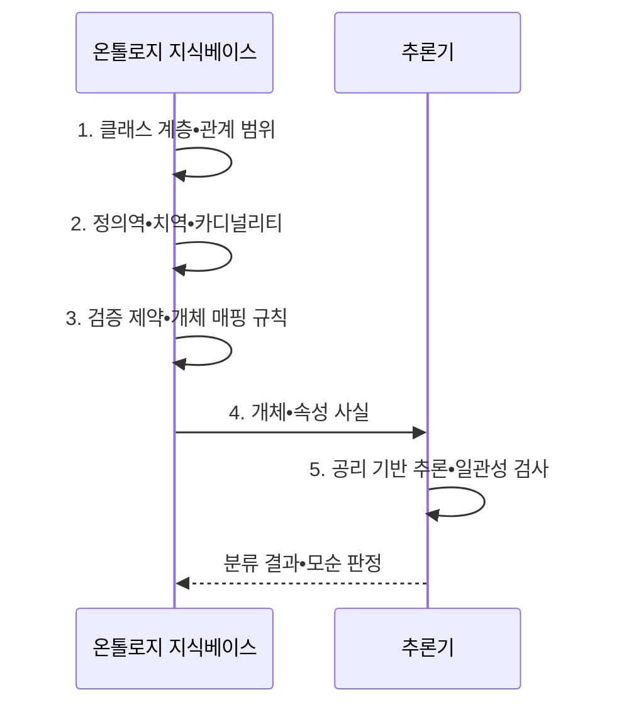

---
sidebar:
  order: 80
  label: "080. 온톨로지 (Ontology)"
  badge:
    text: "기출 • 50%"
    variant: note
title: "온톨로지 (Ontology)"
date: "2026-08-05T00:00:00+09:00"
tags:
  - "notes-latest_tech"
weight: 80
extra:
  question_no: "080"
  source_status: "기출"
  source_history: "138회"
  priority: 50
  priority_note: "개념•관계 명세가 지식그래프 기반"
---

## Ⅰ. 개요

<details>
<summary>핵심 용어</summary>

- **온톨로지(Ontology)**: 도메인의 개념•관계•제약•공리를 명시해 여러 시스템이 공유하는 의미 모형이다.

</details>

- 정의/개념: **온톨로지(Ontology)** 는 도메인의 개념•관계•제약•공리를 명시한 공유 의미 모형
- 배경/필요성: 시스템별 **용어•관계 해석 차이** 로 지식 통합•공유 곤란

#### 한줄 요약

- 여러 시스템이 용어와 관계의 뜻을 동일하게 해석하도록 만든 공용 설계도입니다.

## Ⅱ. 특징

<details>
<summary>핵심 용어</summary>

- **개념 계층**: 상위•하위 개념과 상속 관계를 정의한다.
- **공리(Axiom)**: 암묵 지식을 추론하고 모순을 판정하는 논리 규칙이다.

</details>

- 클래스의 상하위•상속 관계를 정하는 **개념 계층**
- 속성의 정의역•치역•카디널리티를 밝히는 **의미 제약**
- 공리로 암묵 지식•모순을 판정하는 **논리 추론**

#### 한줄 요약

- 자세한 규칙은 숨은 분류와 모순을 찾지만 잘못된 사실도 추론에 전파됩니다.

## Ⅲ. 구조 및 구성요소

<details>
<summary>핵심 용어</summary>

- **객체 속성**: 개체와 개체의 관계를 정의한다.
- **데이터 속성**: 개체와 리터럴 값의 관계를 정의한다.
- **클래스(Class)**: 공통 성질과 제약을 공유하는 도메인 개념의 집합을 정의한다.
- **개체(Individual)**: 특정 클래스에 속하는 실제 대상이나 사례를 표현한다.
- **공리 적용**: 클래스•속성 사이의 포함•동치•배타•제약 선언
- **정의역•치역•카디널리티**: 속성을 적용할 클래스, 결과 클래스, 허용 개수를 제한한다.

</details>

```text
                         [공리•제약 저장소]
                       /          |          \
          [클래스 저장소] ----- [개체 저장소] ----- [데이터 속성 저장소]
                    \              /
                    [객체 속성 저장소]
```

선의 의미: 공리•제약 저장소는 클래스•개체•데이터 속성의 의미 제약을 포괄하고, 클래스와 개체는 객체 속성 저장소를 통해 개체 간 관계를 공유하는 정적 온톨로지 계층을 뜻한다.

| 구성요소 | 책임 |
|:---|:---|
| **클래스 저장소** | 도메인 개념과 상하위 계층 정의 |
| **개체 저장소** | 클래스에 속하는 실제 대상•식별자 관리 |
| **객체 속성 저장소** | 개체와 개체 사이의 관계 정의 |
| **데이터 속성 저장소** | 개체와 리터럴 값의 관계 정의 |
| **공리•제약 저장소** | 분류 추론과 모순 판정 규칙 관리 |

#### 한줄 요약

- 개념•계층•관계•제약•공리가 공유 의미 체계를 구성합니다.

## Ⅳ. 흐름도

<details>
<summary>핵심 용어</summary>

- **추론기**: 명시적 사실과 공리를 결합해 분류•파생 사실•모순 여부를 계산한다.
- **일관성 검사**: 개념•관계•규칙 사이의 논리적 모순을 탐지한다.

</details>



**동작 원리**

1. **클래스 계층•관계 범위**: 합의한 개념의 상하위 구조와 관계 대상 정의
2. **정의역•치역•카디널리티**: 속성에 허용할 클래스와 개수 제한 명시
3. **검증 제약•개체 매핑 규칙**: 원천 데이터를 온톨로지 개념에 연결
4. **개체•속성 사실**: 추론기가 판정할 명시적 사실 제공
5. **공리 기반 추론•일관성 검사**: 파생 분류와 논리적 모순 판정

#### 한줄 요약

- 용어•관계•공리를 명세하고 추론 결과와 논리적 모순을 검사합니다.

## Ⅴ. 종류 및 비교

<details>
<summary>핵심 용어</summary>

- **분류체계•온톨로지•지식그래프**: 각각 용어 계층, 의미 제약•추론, 개체•관계 사실과 경로 탐색에 중점을 둔다.

</details>

| 비교 기준 | 분류체계 | 온톨로지 | 지식그래프 |
|:---|:---|:---|:---|
| **적용 기준** | **분류 계층** 필요 | 공유 의미•**추론** 필요 | **경로 탐색** 중심 |
| **핵심 특징** | 용어•**상하위 관계** | **개념•제약•공리** | **개체•관계•사실** |
| **한계** | 관계•**추론 표현 제한** | 합의•**추론 비용** | 개체 연결•**정합성 비용** |

#### 한줄 요약

- 분류체계•온톨로지•지식그래프는 표현 깊이와 활용 목적이 다릅니다.

## Ⅵ. 실무 고려사항 및 대책

<details>
<summary>핵심 용어</summary>

- **웹 온톨로지 언어(Web Ontology Language, OWL)**: 클래스•속성•공리를 기계가 해석할 수 있게 표현하는 월드 와이드 웹 컨소시엄(World Wide Web Consortium, W3C) 표준 언어다.
- **웹 온톨로지 언어 프로파일**: 필요한 표현력과 추론 비용에 맞춰 사용할 언어 기능의 범위를 제한한다.

</details>

| 문제 | 대책 | 효과 |
|:---|:---|:---|
| 동음이의어와 **분류 기준 충돌** | 용어집•상하위 관계의 **공동 검토** | 공유 개념의 **해석 일관성** 확보 |
| 규칙의 **공리 복잡도 증가** | **OWL 프로파일** 선택•규칙 복잡도 제한 | **결정 가능성•응답 시간** 확보 |
| 변경으로 **하위 호환성 훼손** | 식별자•버전•폐기 매핑과 **일관성 회귀 검사** | 기존 개체•질의의 **호환성** 보존 |

#### 한줄 요약

- 공통 개념과 관계를 합의하고 공리 변경이 기존 개체•질의에 미치는 영향을 검사합니다.

## Ⅶ. 결론

<details>
<summary>핵심 용어</summary>

- **하위 호환성**: 온톨로지 변경 후에도 기존 개체•질의•연동 시스템이 의도한 의미로 계속 동작하는 성질이다.

</details>

- 용어 계층만 필요하면 **분류체계**, 의미 제약•추론이 필요하면 **온톨로지** 선택

#### 한줄 요약

- 과도한 규칙과 잘못된 사실은 유지보수 비용과 추론 오류를 함께 키웁니다.
