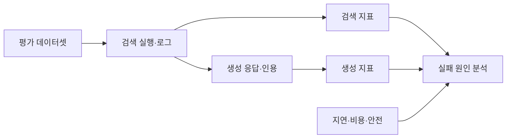
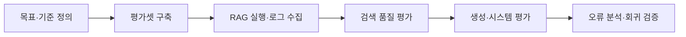

---
sidebar:
  order: 81
  label: "081. RAG Evaluation RAG 평가 (RAG Evaluation)"
  badge:
    text: "기출 · 70%"
    variant: note
title: "RAG Evaluation RAG 평가 (RAG Evaluation)"
date: "2026-07-27T23:59:59+09:00"
tags:
  - "notes-latest_tech"
weight: 81
extra:
  question_no: "081"
  source_status: "기출"
  source_history: "138회"
  priority: 70
  priority_note: "검색·생성 분리 평가가 운영 핵심"
---

## 미리 알고가기

- **검색 증강 생성(Retrieval-Augmented Generation, RAG)**: 검색 근거로 생성 답변을 보강하는 구조
- **문맥 재현율 (Context Recall)**: 필요한 근거가 검색 문맥에 포함된 정도
- **문맥 정밀도 (Context Precision)**: 검색 문맥 중 유용한 근거의 비율과 순위
- **충실성 (Faithfulness)**: 답변 주장이 제공된 문맥으로 뒷받침되는 정도
- **답변 관련성 (Answer Relevance)**: 답변이 질의 요구에 직접 대응하는 정도
- **평균 역순위(Mean Reciprocal Rank, MRR)**: 첫 관련 문서 순위의 역수를 평균한 검색 지표
- **상위 k 재현율(Recall@k)**: 상위 k개 결과가 관련 문서를 회수한 비율
- **검색 평가 범위**: Recall@k는 상위 k개 검색 결과에 정답 근거가 포함됐는지, MRR은 첫 정답 근거의 순위가 얼마나 높은지 측정함

## Ⅰ. 개요

- 정의/개념: RAG의 검색·생성·시스템 성능을 단계별 측정
- 기존 한계: 최종 답변 점수만으로 검색·생성 실패 분리 불가

### 쉽게 이해하기 (학습용)

- 답이 틀린 원인이 검색 누락인지 생성 오류인지 단계별로 검사합니다.

## Ⅱ. 특징

- **검색 평가**: 재현율·정밀도·순위로 근거 회수를 측정한다
- **생성 평가**: 충실성·관련성·정확성으로 답변을 측정한다
- **시스템 평가**: 지연·비용·안전·업무 성과를 함께 측정한다

### 쉽게 이해하기 (학습용)

- 필요한 자료의 확보와 잡음 배제 및 답변의 근거성을 따로 평가합니다.

## Ⅲ. 구성요소 및 구조

| 설계 요소 | 설명 |
|:---|:---|
| 평가 데이터셋 | 질의·기준 문서·답 보관 |
| 실행기록 | 검색 후보·문맥·답을 연결함 |
| 검색 지표 | 회수·순위·문맥 품질 측정 |
| 생성 지표 | 충실성·관련성·정확성 측정 |
| 운영 지표 | 지연·비용·안전·업무 성과 측정 |

### 쉽게 이해하기 (학습용)

- 평가 자료·실행 기록·지표·평가자 설정을 함께 보존합니다.

## Ⅳ. 원리 및 절차 흐름도

| 절차 | 설명 |
|:---|:---|
| 목표·기준정의 | 품질 목표·임계값·평가자 정의 |
| 평가셋구축 | 질의·근거·기준 답 구축 |
| RAG실행·로그수집 | 후보·문맥·응답·인용 저장 |
| 검색품질평가 | 회수율·정밀도·순위 측정 |
| 생성·시스템평가 | 충실성·정확성·지연 측정 |
| 오류분석·회귀검증 | 실패 단계 식별·변경 전후 비교 |

### 쉽게 이해하기 (학습용)

- 검색과 생성을 따로 평가해 실패 원인과 개선 대상을 구분합니다.

## Ⅴ. RAG 평가 방식 비교

| 비교 기준 | 정답셋 평가 | 인간 평가 | 모델 평가자 |
|:---|:---|:---|:---|
| 적용 기준 | 회귀 테스트 | 고위험·개방형 | 대량 사전 평가 |
| 핵심 특징 | 기준 근거·답과 자동 비교 | 전문가 지침으로 직접 판정 | LLM·루브릭으로 의미 판정 |
| 한계 | 기준셋 구축·갱신 비용 | 시간·비용·평가자 편차 | 모델·프롬프트 편향 |

> 요약: 판정 근거와 환경에 따라 정답셋·인간·모델로 구분함

### 쉽게 이해하기 (학습용)

- 정답셋·사람·모델 평가자는 판정 근거와 적용 환경이 다릅니다.

## Ⅵ. 실무 사례

1. 청킹 변경: **Recall@k·MRR**로 검색 회귀 검증

### 쉽게 이해하기 (학습용)

- 청킹이나 자동 평가자를 바꾸면 고정 표본으로 검색과 생성 품질을 다시 검증합니다.

## Ⅶ. 결론

- RAG 품질 진단을 위해 검색·충실성을 검토하여 **RAG 평가** 활용

### 쉽게 이해하기 (학습용)

- 실패 단계와 평가자 간 일치도를 확인해 개선 대상을 선택해야 합니다.
