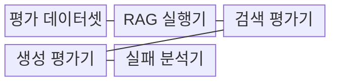
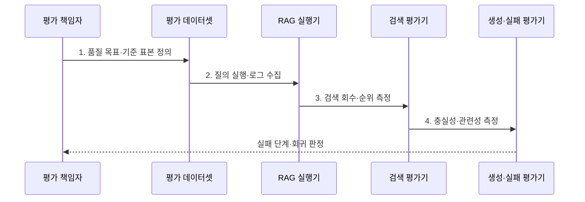

---
sidebar:
  order: 81
  label: "081. RAG 평가 (RAG Evaluation)"
  badge:
    text: "기출 · 70%"
    variant: note
title: "RAG 평가 (RAG Evaluation)"
date: "2026-08-02T11:12:00+09:00"
tags:
  - "notes-latest_tech"
weight: 81
extra:
  question_no: "081"
  source_status: "기출"
  source_history: "138회"
  priority: 70
  priority_note: "검색·생성 분리 평가가 운영 핵심"
---

## Ⅰ. 개요

핵심 용어

- **RAG 평가**는 답변 오류를 검색 누락과 생성 오류로 분리하도록 검색·생성·운영 단계를 각각 측정하는 평가 체계다.

- 정의/개념: **RAG 평가**는 검색·생성·운영 품질을 분리 측정하여 실패 원인을 진단하는 평가 체계
- 배경/필요성: 최종 답변 점수만으로는 **검색 누락·생성 오류**의 구분 곤란

### 쉽게 이해하기 (학습용)
- 답이 틀렸을 때 자료를 못 찾았는지, 찾은 자료를 잘못 읽었는지, 답을 잘못 썼는지 따로 검사함

## Ⅱ. 특징

핵심 용어

- **문맥 재현율**은 필요한 근거가 검색 문맥에 포함된 정도이고, **문맥 정밀도**는 검색 문맥 중 관련 근거의 비율과 순위 품질이다.
- **충실성**은 답변 주장이 검색 문맥으로 뒷받침되는 정도이고, **답변 관련성**은 질의 요구에 직접 대응하는 정도다.

- **문맥 재현율·정밀도**와 **Recall@k·MRR** 기반 검색 품질 평가
- 충실성·관련성 기반 **문맥 지지·질의 대응 평가**
- 검색·생성·운영 지표의 **단계별 실패 귀속**

### 쉽게 이해하기 (학습용)
- 필요한 자료를 찾은 정도와 그 자료만으로 답한 정도를 다른 채점표로 측정함

## Ⅲ. 구조 및 구성요소

핵심 용어

- **기준 정답(Ground Truth)**은 검색·생성 결과의 정오를 비교하기 위해 미리 검증한 근거 문서와 답변이다.
- **실행 식별자**는 검색 후보·문맥·응답·인용과 평가 결과를 같은 실행으로 연결한다.

| 구성요소 | 책임 |
|:---|:---|
| 평가 데이터셋 | 질의·근거·**기준 정답**의 평가 표본 보관 |
| RAG 실행기 | 검색 후보·문맥·응답·인용의 **실행 기록 생성** |
| 검색 평가기 | Recall@k·MRR·문맥 정밀도의 **회수 품질 계산** |
| 생성 평가기 | 충실성·관련성·정확성의 **답변 품질 계산** |
| 실패 분석기 | 지표·로그를 연결한 **오류 단계 귀속** |

### 쉽게 이해하기 (학습용)
- 같은 시험 문제로 RAG를 실행하고 검색 채점기와 답변 채점기의 결과를 한곳에서 비교함

## Ⅳ. 흐름도

핵심 용어

- **Recall@k**는 상위 k개 결과에 정답 근거가 포함된 질의 비율이고, **MRR**은 첫 관련 문서 순위의 역수를 질의별로 평균한 값이다.
- **실패 귀속**은 낮은 최종 점수의 원인을 검색·생성·운영 단계 중 하나로 분리해 연결하는 분석이다.

**동작 원리**

1. **품질 목표·기준 표본 정의**: 질의별 기준 근거·답과 **합격 임계값** 설정
2. **질의 실행·로그 수집**: 검색 후보·문맥·응답·인용을 **동일 실행 식별자**로 연결
3. **검색 회수·순위 측정**: 기준 근거 포함 여부와 첫 관련 문서의 **검색 품질** 계산
4. **충실성·관련성 측정**: 답변 주장의 문맥 지지와 질의 대응의 **생성 품질** 계산

### 쉽게 이해하기 (학습용)
- 기준 자료와 답을 정해 실행 기록을 모으고 검색 점수와 생성 점수 중 떨어진 단계를 찾음

## Ⅴ. 종류 및 비교

핵심 용어

- **정답셋·인간·모델 평가**는 각각 반복 가능한 자동 비교, 전문가 직접 판정, 대량 의미 판정에 적합하다.

| 비교 기준 | 정답셋 평가 | 인간 평가 | 모델 평가자 |
|:---|:---|:---|:---|
| 적용 기준 | 반복 회귀 시험 | 고위험·개방형 판정 | 대량 의미 평가 |
| 핵심 특징 | 기준 근거·답과 **자동 비교** | 전문가 지침의 **직접 판정** | 평가 모델·규칙의 **의미 판정** |
| 한계 | 정답셋 구축·갱신 비용 | 시간·비용·평가자 편차 | 모델·프롬프트 편향 |

### 쉽게 이해하기 (학습용)
- 고정 답안지, 전문가, 다른 모델 중 누가 채점하는지에 따라 비용과 신뢰도가 달라짐

## Ⅵ. 실무 고려사항 및 대책

핵심 용어

- **평가자 일치도**는 모델 평가자의 판정이 인간 합의 표본과 얼마나 일치하는지 나타낸다.
- **신뢰 구간**은 표본과 평가 변동을 고려해 실제 품질이 존재할 것으로 추정하는 범위다.

| 문제 | 대책 | 효과 |
|:---|:---|:---|
| 기준 근거 누락의 **Recall@k 왜곡** | 질의별 복수 정답 근거·판정 규칙 검수 | 검색 재현율의 **타당성 확보** |
| 검색 실패가 섞인 **충실성 오판** | 검색 성공·실패 표본을 분리해 생성 평가 | 생성 오류의 **독립 진단** |
| 모델 평가자의 **판정 편향** | 인간 합의 표본과 일치도·불일치 유형 측정 | 자동 평가의 **신뢰 구간 확인** |

### 쉽게 이해하기 (학습용)
- 시험 답안과 채점기부터 맞는지 확인하고 검색 실패와 답변 실패를 섞어 채점하지 않음

## Ⅶ. 결론

핵심 용어

- **개선 우선순위**는 검색 회수·생성 충실성·운영 지연 중 품질 목표를 가장 크게 저해하는 단계부터 정한다.

- 검색 회수·문맥 충실성·평가자 신뢰도를 기준으로 **RAG 실패 단계와 개선 우선순위** 결정

### 쉽게 이해하기 (학습용)
- 검색과 생성 중 어느 단계가 실제로 점수를 떨어뜨렸는지 확인해 먼저 고칠 곳을 정함
