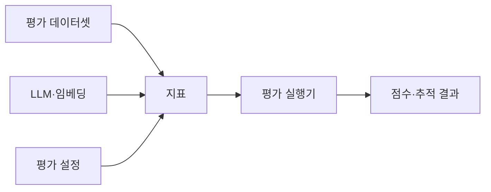
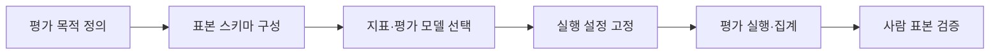

---
sidebar:
  order: 82
  label: "082. RAGAS (RAGAS)"
  badge:
    text: "기출 · 50%"
    variant: note
title: "RAGAS (RAGAS)"
date: "2026-07-27T23:59:59+09:00"
tags:
  - "notes-latest_tech"
weight: 82
extra:
  question_no: "082"
  source_status: "기출"
  source_history: "138회"
  priority: 50
  priority_note: "RAG 평가지표 묶음의 대표 도구"
---

## 미리 알고가기

- **RAGAS (Retrieval-Augmented Generation Assessment)**: RAG 품질을 지표별로 평가하는 프레임워크
- **충실성 (Faithfulness)**: 응답 주장이 검색 문맥에 근거한 정도
- **문맥 정밀도 (Context Precision)**: 검색 문맥의 관련성과 순위 품질
- **평가 모델 (Evaluator Model)**: 자연어 의미를 기준으로 표본을 판정하는 모델
- **대규모 언어 모델(Large Language Model, LLM)**: 의미 기반 RAGAS 지표의 판정에 사용하는 모델
- **명칭 읽기·표기**: RAGAS는 ‘라가스’로 읽고 RAG와 Assessment를 결합한 이름이며, LLM은 ‘엘엘엠’으로 읽고 평가 모델 역할을 뜻함

## Ⅰ. 개요

- 정의/개념: 데이터셋·지표로 AI 앱을 평가하는 프레임워크
- 기존 한계: 수작업 평가는 반복 실험의 비용·판정 편차가 큼

### 쉽게 이해하기 (학습용)

- 검색과 생성의 성공 여부를 서로 다른 채점표로 검사합니다.

## Ⅱ. 특징

- **평가 표본**: 질의·응답·문맥·기준 정보를 구조화한다
- **지표 조합**: RAG·에이전트 목적별 지표를 선택한다
- **평가 재현성**: 모델·프롬프트·반복 조건을 기록한다

### 쉽게 이해하기 (학습용)

- 채점자와 채점표가 바뀌면 점수도 달라지므로 평가 조건을 기록합니다.

## Ⅲ. 구성요소 및 구조

| 설계 요소 | 설명 |
|:---|:---|
| 평가 데이터셋 | 단일·다중 턴 표본 묶음 |
| 지표 | 평가 대상·입력·점수 규칙 정의 |
| 평가 모델 | LLM·임베딩 기반 의미 판정 |
| 실행 설정 | 프롬프트·재시도·동시성 관리 |
| 평가 결과 | 표본별 점수·비용·추적 기록 |

### 쉽게 이해하기 (학습용)

- 표본·지표·평가 모델·설정이 재현 가능한 평가 체계를 구성합니다.

## Ⅳ. 원리 및 절차 흐름도

| 절차 | 설명 |
|:---|:---|
| 평가목적정의 | 시스템·구성요소 목표 결정 |
| 표본스키마구성 | 필수 입력·기준 정보 준비 |
| 지표·모델선택 | 목적별 지표·판정 모델 지정 |
| 실행설정고정 | 프롬프트·재시도·버전 기록 |
| 평가실행·집계 | 표본별 점수 계산·요약 |
| 사람표본검증 | 자동 점수와 전문가 판단 대조 |

### 쉽게 이해하기 (학습용)

- 같은 설정으로 자동 평가하고 일부 표본을 사람의 판단과 대조합니다.

## Ⅴ. RAGAS 평가 방식 비교

| 비교 기준 | LLM 기반 | 비LLM 기반 | 사람 평가 |
|:---|:---|:---|:---|
| 적용 기준 | 의미·맥락 판정 시 | 일치·유사도 자동 판정 시 | 고위험 최종 판정 시 |
| 핵심 특징 | LLM 프롬프트로 의미 평가 | 문자열·통계 기반 결정 평가 | 전문가 지침 기반 평가 |
| 한계 | 비결정성·모델 편향 | 의미 판정 한계 | 시간·비용·평가자 편차 |

> 요약: 판정 방식에 따라 자동·사람·문자열로 구분함

### 쉽게 이해하기 (학습용)

- RAGAS·사람·문자열 평가는 판정 근거와 비용이 다릅니다.

## Ⅵ. 실무 사례

1. 검색 변경: **고정 데이터셋**으로 지표 회귀 탐지

### 쉽게 이해하기 (학습용)

- 변경 전후를 같은 표본으로 평가하고 낮은 점수의 원인은 사람이 확인합니다.

## Ⅶ. 결론

- 반복 평가를 위해 자동 지표·위험도를 검토하여 **RAGAS** 활용

### 쉽게 이해하기 (학습용)

- 자동 점수는 개선 신호이므로 중요한 판단은 사람 평가와 교차 검증해야 합니다.
