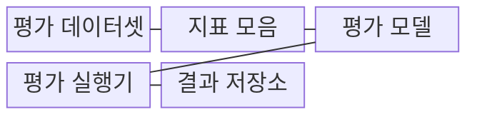
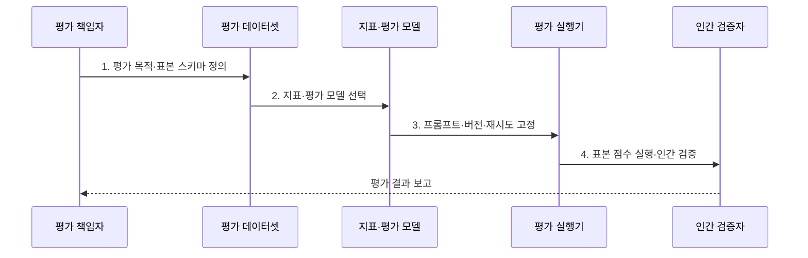

---
sidebar:
  order: 82
  label: "082. RAGAS"
  badge:
    text: "기출 · 50%"
    variant: note
title: "RAGAS"
date: "2026-08-02T11:14:00+09:00"
tags:
  - "notes-latest_tech"
weight: 82
extra:
  question_no: "082"
  source_status: "기출"
  source_history: "138회"
  priority: 50
  priority_note: "RAG 평가지표 묶음의 대표 도구"
---

## Ⅰ. 개요

핵심 용어

- **RAGAS**는 질의·검색 문맥·응답·기준 정보를 묶어 RAG 품질을 여러 지표로 자동 평가하는 프레임워크다.
- **RAG**는 질의와 관련된 외부 문서를 검색하여 생성 답변의 근거로 제공하는 방식이다.

- 정의/개념: **RAGAS**는 구조화 표본과 자동 지표로 RAG 검색·생성 품질을 반복 평가하는 프레임워크
- 배경/필요성: 수작업 RAG 평가는 반복 실험의 **비용·판정 편차** 증가

#### 한줄 요약
- 같은 답안지와 채점 조건으로 검색 자료와 생성 답변을 반복 채점하는 자동 평가 도구임

## Ⅱ. 특징

핵심 용어

- **충실성**은 응답 주장이 검색 문맥으로 뒷받침되는 정도다.
- **문맥 정밀도·재현율**은 관련 근거의 앞순위 배치와 필요한 근거의 포함 정도를 각각 측정한다.

- 질의·응답·문맥·기준 정보의 **평가 스키마 구조화**
- **충실성**과 **문맥 정밀도·재현율**의 목적별 지표 조합
- 평가 모델·프롬프트·반복 조건의 **재현 가능한 실행 기록**

#### 한줄 요약
- 표본 형식과 채점 모델·채점 문장을 함께 고정해야 변경 전후 점수를 비교할 수 있음

## Ⅲ. 구조 및 구성요소

핵심 용어

- **평가 모델**은 자연어 의미와 지표 규칙으로 표본을 판정하고, **임베딩 모델**은 문장을 벡터로 바꿔 의미 유사도를 계산한다.
- **평가 스키마**는 지표 계산에 필요한 질의·응답·문맥·기준 답 필드의 구조다.

| 구성요소 | 책임 |
|:---|:---|
| 평가 데이터셋 | 단일 질의·대화 표본의 **평가 스키마 보관** |
| 지표 모음 | 평가 대상·필수 입력·**점수 규칙 정의** |
| 평가 모델 | **평가 모델·임베딩 모델** 기반 의미 판정 |
| 평가 실행기 | 프롬프트·재시도·동시성의 **실행 조건 통제** |
| 결과 저장소 | 표본별 점수·비용·추적의 **평가 결과 보존** |

#### 한줄 요약
- 표본과 채점표를 평가 모델에 넣고 실행 조건과 결과를 같은 기록에 남김

## Ⅳ. 흐름도

핵심 용어

- **실행 조건 고정**은 평가 모델·프롬프트·버전·재시도 설정을 기록해 변경 전후 비교를 가능하게 한다.

**동작 원리**

1. **평가 목적·표본 스키마 정의**: 검색·생성 목표와 지표별 **필수 필드** 구성
2. **지표·평가 모델 선택**: 평가 질문에 맞는 점수 규칙과 **판정 모델** 지정
3. **프롬프트·버전·재시도 고정**: 변경 전후 비교가 가능한 **실행 조건** 저장
4. **표본 점수 실행·인간 검증**: 지표 결과와 대표 표본의 **판정 일치도** 대조

#### 한줄 요약
- 채점 목적과 표본 형식을 정하고 같은 채점기로 점수를 낸 뒤 일부 답을 사람이 다시 확인함

## Ⅴ. 종류 및 비교

핵심 용어

- **LLM 기반·비LLM 기반·인간 평가**는 각각 의미 판정, 결정론적 계산, 고위험 최종 판단에 강점이 있다.

| 비교 기준 | LLM 기반 지표 | 비LLM 기반 지표 | 인간 평가 |
|:---|:---|:---|:---|
| 적용 기준 | 의미·문맥 판정 | 문자열·통계 판정 | 고위험 최종 판정 |
| 핵심 특징 | 프롬프트 기반 **의미 평가** | 일치·유사도 기반 **결정론적 평가** | 전문가 지침 기반 **직접 평가** |
| 한계 | 비결정성·모델 편향 | 의미 관계 판정 한계 | 시간·비용·평가자 편차 |

#### 한줄 요약
- 다른 모델, 계산 규칙, 사람이 채점할 때 각각 이해 범위와 비용이 달라짐

## Ⅵ. 실무 고려사항 및 대책

핵심 용어

- **점수 기준 이동**은 평가 모델이나 프롬프트 변경으로 같은 표본의 점수 의미가 달라지는 현상이다.
- **반복 실행 분포**는 비결정 평가를 여러 번 수행해 점수의 평균·분산·범위를 확인한 결과다.

| 문제 | 대책 | 효과 |
|:---|:---|:---|
| 지표별 **필수 스키마 누락** | 지표 입력 계약에 맞춘 필드 사전 검증 | 계산 실패·무효 점수 **방지** |
| 평가 모델 변경의 **점수 기준 이동** | 모델·프롬프트 버전 고정과 병렬 재평가 | 지표 시계열의 **비교 가능성 확보** |
| 비결정 평가의 **점수 변동** | 반복 실행 분포·인간 일치도 측정 | 자동 점수의 **불확실성 확인** |

#### 한줄 요약
- 채점표에 필요한 칸과 채점기 버전을 고정하고 같은 답을 여러 번 채점해 흔들림을 확인함

## Ⅶ. 결론

핵심 용어

- **지표 선택 기준**은 평가 목적, 필수 스키마 완전성, 판정 모델의 인간 일치도와 반복 안정성이다.

- 평가 목적·스키마 완전성·판정 일치도를 기준으로 **RAGAS 지표와 평가 모델** 선택

#### 한줄 요약
- 필요한 정보를 갖춘 지표와 사람이 납득할 만큼 일관된 채점 모델을 선택함
