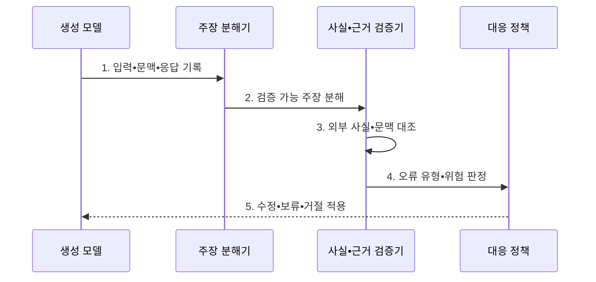

---
sidebar:
  order: 83
  label: "083. AI 환각 (AI Hallucination)"
  badge:
    text: "기출 • 80%"
    variant: note
title: "AI 환각 (AI Hallucination)"
date: "2026-08-05T02:12:45+09:00"
tags:
  - "notes-latest_tech"
weight: 83
extra:
  question_no: "083"
  source_status: "기출"
  source_history: "137회"
  priority: 80
  priority_note: "생성 오류 원인•대응이 반복 출제축"
---

## Ⅰ. 개요

핵심 용어

- **인공지능 환각(Artificial Intelligence Hallucination, AI 환각)**: 언어 모델이 입력•근거•검증 가능한 사실과 맞지 않는 내용을 사실처럼 자연스럽게 생성하는 현상이다.

- 정의/개념: 모델이 입력•근거•검증 사실과 불일치하는 내용을 생성하는 **AI 환각 현상**
- 배경/필요성: 다음 토큰 확률 기반 생성의 **사실성•충실성 보장 불가**

#### 한줄 요약
- 그럴듯한 답도 실제 사실과 근거에 맞는지 별도로 확인해야 한다.

## Ⅱ. 특징

핵심 용어

- **사실성(Factuality)**: 출력 주장이 외부의 검증 가능한 사실과 일치하는 정도다.
- **충실성(Faithfulness)**: 출력 주장이 제공된 문맥으로 뒷받침되는 정도다.
- **근거 귀속(Attribution)**: 각 주장과 지지 출처를 연결하는 과정이다.

- 외부 검증 사실과 충돌하는 **사실성 오류**
- 제공 문맥에 없는 주장을 추가하는 **충실성 오류**
- 주장과 인용 출처가 어긋나는 **근거 귀속 오류**

#### 한줄 요약
- 사실•제공 문맥•출처 중 어디에서 오류가 발생했는지 구분한다.

## Ⅲ. 구조 및 구성요소

핵심 용어

- **원자 주장(Atomic Claim)**: 하나의 사실 관계만 담아 독립적으로 참•거짓을 검증할 수 있게 나눈 문장 단위다.
- **주장 분해기**: 생성 답변을 독립 검증할 수 있는 원자 주장으로 나누는 구성요소다.
- **사실 검증기(Fact Verifier)**: 각 주장을 신뢰 가능한 근거와 대조해 지지•반박•판단 불가로 판정한다.
- **근거 귀속기(Attribution Mapper)**: 검증된 주장과 이를 뒷받침하는 출처•인용 구간을 연결한다.
- **대응 정책(Response Policy)**: 검증 오류와 업무 위험에 따라 출력을 수정•보류•거절한다.

| 구성요소 | 책임 |
|:---|:---|
| 생성 모델 | 질의•검색 문맥 기반 **후보 답변 생성** |
| 주장 분해기 | 답변을 검증 가능한 **원자 주장** 단위로 분리 |
| 사실 검증기 | 신뢰 출처와 주장의 **외부 사실 대조** |
| 근거 귀속기 | 문맥•인용과 주장의 **지지 관계 판정** |
| 대응 정책 | 오류 위험별 **수정•보류•거절 결정** |

#### 한줄 요약
- 답변을 원자 주장으로 나눠 사실•문맥•출처와 대조한다.

## Ⅳ. 흐름도

핵심 용어

- **생성 조건(Generation Condition)**: 입력•검색 문맥•모델•프롬프트•응답을 함께 기록해 오류 원인을 재현하게 한다.
- **주장 지지 여부(Claim Support)**: 외부 사실과 제공 문맥이 원자 주장을 실제로 뒷받침하는지 판정한 결과다.

1. **입력•문맥•응답 기록**: 환각 원인 추적을 위한 **생성 조건** 보존
2. **검증 가능 주장 분해**: **복합 답변의 원자 주장 변환**
3. **외부 사실•문맥 대조**: 신뢰 사실과 제공 근거의 **주장 지지 여부** 확인
4. **오류 유형•위험 판정**: 사실성•충실성•귀속 오류와 **업무 영향** 분류
5. **수정•보류•거절 적용**: 검증 결과와 위험 수준에 맞는 **출력 통제** 실행

#### 한줄 요약
- 원자 주장을 근거와 대조하고 위험한 오류는 수정•보류•거절한다.

## Ⅴ. 종류 및 비교

핵심 용어

- **사실성 오류(Factuality Error)**: 출력 주장이 외부 사실과 충돌하는 오류다.
- **충실성 오류(Faithfulness Error)**: 출력 주장이 제공 문맥의 지지를 받지 못하는 오류다.
- **귀속 오류(Attribution Error)**: 인용과 주장 사이의 지지 연결이 잘못된 오류다.

| 비교 기준 | 사실성 오류 | 충실성 오류 | 귀속 오류 |
|:---|:---|:---|:---|
| 적용 기준 | 외부 사실 응답 | 제공 문맥 기반 응답 | 출처 인용 응답 |
| 핵심 특징 | 검증 사실과 **주장 충돌** | 문맥의 **주장 지지 부재** | 인용과 **주장 연결 오류** |
| 한계 | 신뢰 기준 사실 필요 | 충분한 기준 문맥 필요 | 출처 단위 추적 필요 |

#### 한줄 요약
- 사실성•충실성•귀속 오류는 검증 기준이 서로 다르다.

## Ⅵ. 실무 고려사항 및 대책

핵심 용어

- **검색 증강 생성(Retrieval-Augmented Generation, RAG)**: 관련 외부 문서를 검색해 생성 답변의 근거로 제공하는 방식이다.
- **출처 장식형 답변(Citation Decoration)**: 인용이 존재하지만 실제로는 해당 주장을 지지하지 않는 답변이다.

| 문제 | 대책 | 효과 |
|:---|:---|:---|
| 복합 문장의 **오류 주장 은폐** | 원자 주장 분해 후 주장별 사실 검증 | 부분 환각의 **탐지율 향상** |
| 검색 증강 생성(Retrieval-Augmented Generation, RAG)의 **검색 문맥 부족•충실성 오판** | 근거 없음 상태와 생성 오류를 분리 판정 | 검색•생성 실패의 **정확한 귀속** |
| 인용 존재만 확인한 **귀속 오류** | 주장별 인용 구간•지지 관계 검증 | 출처 장식형 답변 **차단** |

#### 한줄 요약
- 각 주장이 인용한 자료의 어느 부분에서 지지되는지 확인한다.

## Ⅶ. 결론

핵심 용어

- **출력 통제 수준(Output-control Level)**: 오류 유형과 업무 영향에 따라 수정•보류•거절 중 적절한 조치를 선택한 결과다.

- 사실•문맥•출처의 불일치 유형과 위험도를 기준으로 **환각 탐지와 출력 통제 수준** 결정

#### 한줄 요약
- 오류 위치와 업무 위험에 따라 수정•보류•거절을 결정한다.
