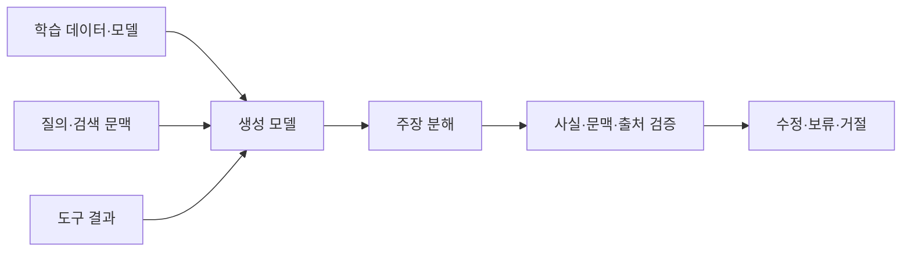
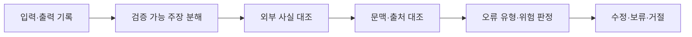

---
sidebar:
  order: 83
  label: "083. Hallucination 환각 (AI Hallucination)"
  badge:
    text: "기출 · 80%"
    variant: note
title: "Hallucination 환각 (AI Hallucination)"
date: "2026-07-27T23:59:59+09:00"
tags:
  - "notes-latest_tech"
weight: 83
extra:
  question_no: "083"
  source_status: "기출"
  source_history: "137회"
  priority: 80
  priority_note: "생성 오류 원인·대응이 반복 출제축"
---

## 미리 알고가기

- **환각 (Hallucination)**: 사실과 다르거나 근거가 없는 모델 출력
- **사실성 (Factuality)**: 출력이 외부의 검증 가능한 사실과 일치하는 정도
- **충실성 (Faithfulness)**: 출력 주장이 제공된 문맥으로 뒷받침되는 정도
- **근거 귀속 (Attribution)**: 주장과 이를 지지하는 출처를 연결하는 과정
- **대규모 언어 모델(Large Language Model, LLM)**: 다음 토큰 확률로 출력을 생성하는 언어 모델
- **명칭 읽기·표기**: Hallucination은 ‘할루시네이션’으로 읽고 실제 근거 없이 그럴듯한 내용을 만든다는 비유이며, LLM은 ‘엘엘엠’으로 읽음

## Ⅰ. 개요

- 정의/개념: 모델이 사실과 다르거나 근거 없는 내용을 생성
- 기존 한계: 확률적 생성은 사실·근거 검증을 보장하지 않음

### 쉽게 이해하기 (학습용)

- 근거 없는 내용을 사실처럼 자연스럽게 말해 사용자의 오해를 유발합니다.

## Ⅱ. 특징

- **사실성 오류**: 출력 주장이 외부 검증 사실과 충돌한다
- **충실성 오류**: 제공 문맥에 없는 주장을 답변에 추가한다
- **검증 필요**: 주장·근거·출처를 대조해 대응을 결정한다

### 쉽게 이해하기 (학습용)

- 자신 있는 말투만으로는 판별할 수 없어 주장과 근거를 대조해야 합니다.

## Ⅲ. 구성요소 및 구조

| 설계 요소 | 설명 |
|:---|:---|
| 지식 경계 | 학습 시점·데이터 오류 확인 |
| 문맥 경계 | 검색 근거·답변 범위 확인 |
| 생성 경계 | 모델·프롬프트·디코딩 기록 |
| 검증 계층 | 주장별 사실·근거·출처 대조 |
| 대응 정책 | 수정·보류·거절 조건 적용 |

### 쉽게 이해하기 (학습용)

- 학습·질의·생성·도구·대응 경계별로 오류 원인을 구분합니다.

## Ⅳ. 원리 및 절차 흐름도

| 절차 | 설명 |
|:---|:---|
| 입력·출력기록 | 질의·문맥·도구·응답 저장 |
| 검증가능주장분해 | 응답을 원자 주장으로 분리 |
| 외부사실대조 | 신뢰 출처와 사실 일치 확인 |
| 문맥·출처대조 | 근거 지지·인용 연결 확인 |
| 오류유형·위험판정 | 사실성·충실성·영향 분류 |
| 수정·보류·거절 | 위험 수준별 대응 적용 |

### 쉽게 이해하기 (학습용)

- 응답을 검증 가능한 주장으로 나눠 근거와 대조하고 원인을 추적합니다.

## Ⅴ. 생성 답변 오류 비교

| 비교 기준 | 사실성 오류 | 충실성 오류 | 귀속 오류 |
|:---|:---|:---|:---|
| 적용 기준 | 외부 사실을 답할 때 | 제공 문맥으로 답할 때 | 출처를 인용할 때 |
| 핵심 특징 | 검증 사실과 주장 충돌 | 문맥이 주장을 지지하지 않음 | 인용과 주장 연결이 틀림 |
| 한계 | 신뢰 기준 사실 필요 | 충분한 기준 문맥 필요 | 출처 단위 추적 필요 |

> 요약: 사실·근거·도구 오류를 각각 대조하여 진단함

### 쉽게 이해하기 (학습용)

- 외부 사실·제공 문맥·도구 결과를 서로 다른 기준으로 대조합니다.

## Ⅵ. 실무 사례

1. 의료 답변: **근거 미확인 주장**은 생성 보류

### 쉽게 이해하기 (학습용)

- 확인할 수 없는 고위험 답은 추정하지 않고 보류하거나 거절합니다.

## Ⅶ. 결론

- 허위 생성 억제를 위해 근거·위험도를 검토하여 **환각 통제** 활용

### 쉽게 이해하기 (학습용)

- 오류 원인을 추적하고 위험도에 맞춰 수정·보류·거절을 적용합니다.
