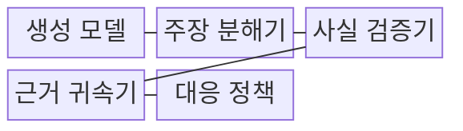
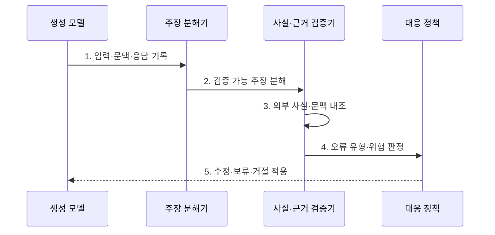

---
sidebar:
  order: 83
  label: "083. AI 환각 (AI Hallucination)"
  badge:
    text: "기출 · 80%"
    variant: note
title: "AI 환각 (AI Hallucination)"
date: "2026-08-02T11:16:00+09:00"
tags:
  - "notes-latest_tech"
weight: 83
extra:
  question_no: "083"
  source_status: "기출"
  source_history: "137회"
  priority: 80
  priority_note: "생성 오류 원인·대응이 반복 출제축"
---

## Ⅰ. 개요

핵심 용어

- **AI 환각(AI Hallucination)**은 언어 모델이 입력·근거·검증 가능한 사실과 맞지 않는 내용을 사실처럼 자연스럽게 생성하는 현상이다.

- 정의/개념: **AI 환각**은 모델이 입력·근거·검증 사실과 불일치하는 내용을 사실처럼 생성하는 현상
- 배경/필요성: 다음 토큰 확률 기반 생성은 **사실성·충실성**을 보장하지 않음

#### 한줄 요약
- 모델이 빈칸을 그럴듯한 말로 채워도 실제 자료와 맞는지는 별도로 확인해야 함

## Ⅱ. 특징

핵심 용어

- **사실성**은 출력 주장이 외부의 검증 가능한 사실과 일치하는 정도다.
- **충실성**은 출력 주장이 제공된 문맥으로 뒷받침되는 정도이고, **근거 귀속**은 각 주장과 지지 출처를 연결하는 과정이다.

- 외부 검증 사실과 충돌하는 **사실성 오류**
- 제공 문맥에 없는 주장을 추가하는 **충실성 오류**
- 주장과 인용 출처가 어긋나는 **근거 귀속 오류**

#### 한줄 요약
- 답이 틀린 이유를 세상 사실, 제공 자료, 붙인 출처 중 어디와 어긋났는지 나누어 찾음

## Ⅲ. 구조 및 구성요소

핵심 용어

- **원자 주장(Atomic Claim)**은 하나의 사실 관계만 담아 독립적으로 참·거짓을 검증할 수 있게 나눈 문장 단위다.
- **대응 정책**은 검증 오류와 업무 위험에 따라 출력을 수정·보류·거절한다.

| 구성요소 | 책임 |
|:---|:---|
| 생성 모델 | 질의·검색 문맥 기반 **후보 답변 생성** |
| 주장 분해기 | 답변을 검증 가능한 **원자 주장** 단위로 분리 |
| 사실 검증기 | 신뢰 출처와 주장의 **외부 사실 대조** |
| 근거 귀속기 | 문맥·인용과 주장의 **지지 관계 판정** |
| 대응 정책 | 오류 위험별 **수정·보류·거절 결정** |

#### 한줄 요약
- 긴 답을 작은 주장으로 나누고 각 주장이 사실과 자료와 출처에 모두 맞는지 검사함

## Ⅳ. 흐름도

핵심 용어

- **생성 조건**은 입력·검색 문맥·모델·프롬프트·응답을 함께 기록해 오류 원인을 재현하게 한다.
- **주장 지지 여부**는 외부 사실과 제공 문맥이 원자 주장을 실제로 뒷받침하는지 판정한 결과다.

1. **입력·문맥·응답 기록**: 환각 원인 추적을 위한 **생성 조건** 보존
2. **검증 가능 주장 분해**: 복합 답변을 독립 판정 가능한 **원자 주장**으로 변환
3. **외부 사실·문맥 대조**: 신뢰 사실과 제공 근거의 **주장 지지 여부** 확인
4. **오류 유형·위험 판정**: 사실성·충실성·귀속 오류와 **업무 영향** 분류
5. **수정·보류·거절 적용**: 검증 결과와 위험 수준에 맞는 **출력 통제** 실행

#### 한줄 요약
- 답을 낱개 사실로 쪼개 자료와 맞춰 보고 위험한 오류는 고치거나 내보내지 않음

## Ⅴ. 종류 및 비교

핵심 용어

- **사실성·충실성·귀속 오류**는 각각 외부 사실과의 충돌, 문맥 지지 부재, 인용과 주장 연결 실패를 뜻한다.

| 비교 기준 | 사실성 오류 | 충실성 오류 | 귀속 오류 |
|:---|:---|:---|:---|
| 적용 기준 | 외부 사실 응답 | 제공 문맥 기반 응답 | 출처 인용 응답 |
| 핵심 특징 | 검증 사실과 **주장 충돌** | 문맥의 **주장 지지 부재** | 인용과 **주장 연결 오류** |
| 한계 | 신뢰 기준 사실 필요 | 충분한 기준 문맥 필요 | 출처 단위 추적 필요 |

#### 한줄 요약
- 세상 사실이 틀린 답, 자료에 없는 답, 출처를 잘못 붙인 답은 검증 기준이 서로 다름

## Ⅵ. 실무 고려사항 및 대책

핵심 용어

- **RAG**는 관련 외부 문서를 검색해 생성 답변의 근거로 제공하지만 검색 근거 부족과 생성 오류를 분리해 판정해야 한다.
- **출처 장식형 답변**은 인용이 존재하지만 실제로는 해당 주장을 지지하지 않는 답변이다.

| 문제 | 대책 | 효과 |
|:---|:---|:---|
| 복합 문장의 **오류 주장 은폐** | 원자 주장 분해 후 주장별 사실 검증 | 부분 환각의 **탐지율 향상** |
| **RAG** 검색 문맥 부족의 충실성 오판 | 근거 없음 상태와 생성 오류를 분리 판정 | 검색·생성 실패의 **정확한 귀속** |
| 인용 존재만 확인한 **귀속 오류** | 주장별 인용 구간·지지 관계 검증 | 출처 장식형 답변 **차단** |

#### 한줄 요약
- 출처가 붙었다는 이유만 믿지 않고 어떤 문장이 어느 자료의 어느 부분으로 증명되는지 확인함

## Ⅶ. 결론

핵심 용어

- **출력 통제 수준**은 오류 유형과 업무 영향에 따라 수정·보류·거절 중 적절한 조치를 선택한 결과다.

- 사실·문맥·출처의 불일치 유형과 위험도를 기준으로 **환각 탐지와 출력 통제 수준** 결정

#### 한줄 요약
- 틀린 위치와 업무 위험을 확인해 답을 수정할지 보류할지 거절할지 정함
