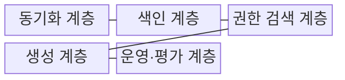
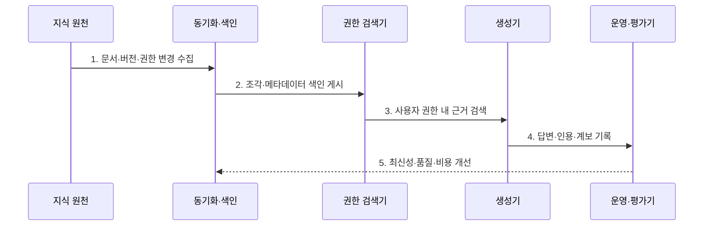

---
sidebar:
  order: 84
  label: "084. 기업 RAG (Enterprise RAG)"
  badge:
    text: "미출 · 70%"
    variant: note
title: "기업 RAG (Enterprise RAG)"
date: "2026-08-02T11:18:00+09:00"
tags:
  - "notes-latest_tech"
weight: 84
extra:
  question_no: "084"
  source_status: "미출"
  source_history: ""
  priority: 70
  priority_note: "권한·운영·평가를 묶는 실무 설계 주제"
---

## Ⅰ. 개요

핵심 용어

- **기업 RAG**는 여러 사내 지식 원천의 버전·권한·감사를 수집부터 답변까지 일관되게 관리하는 RAG 체계다.

- 정의/개념: **기업 RAG**는 사내 지식의 버전·권한·계보를 수집·검색·생성 전 과정에 통합한 RAG 체계
- 배경/필요성: 일반 RAG는 다중 원천의 **최신성·접근권한**과 감사 책임 관리 곤란

#### 한줄 요약
- 여러 부서의 문서를 모아도 최신 버전과 열람 권한, 답에 사용된 경로가 끝까지 이어져야 함

## Ⅱ. 특징

핵심 용어

- **데이터 계보**는 답변 근거가 어떤 원천·버전·처리 단계를 거쳤는지 추적하는 기록이다.
- **허용 문맥**은 현재 사용자가 열람할 권한이 있는 검색 근거만 생성 모델에 전달한 입력이다.

- 원천 변경 이벤트와 색인을 잇는 **문서 생명주기 동기화**
- 원천·색인·답변을 연결하는 **버전·데이터 계보 추적**
- 검색 단계의 사용자 권한 적용과 **허용 문맥 생성**

#### 한줄 요약
- 문서가 바뀌거나 권한이 달라지면 검색 자료와 답변 근거도 같은 상태로 함께 바뀌어야 함

## Ⅲ. 구조 및 구성요소

핵심 용어

- **데이터 커넥터**는 문서 저장소·업무 시스템의 내용과 변경 이벤트를 수집 계층에 전달한다.
- **색인**은 문서 조각과 메타데이터를 검색 가능한 형태로 변환해 저장한 구조다.

| 구성요소 | 책임 |
|:---|:---|
| 동기화 계층 | **데이터 커넥터**를 통한 원천 변경 수집 |
| 색인 계층 | 문서 조각·메타데이터의 **검색 구조 게시** |
| 권한 검색 계층 | 사용자 권한 범위의 **허용 근거 검색** |
| 생성 계층 | 허용 문맥 기반 **답변·인용 생성** |
| 운영·평가 계층 | 계보·감사·품질·비용의 **운영 상태 추적** |

#### 한줄 요약
- 원천 문서가 수집·색인·검색·답변을 지날 때 같은 버전과 권한표를 들고 이동함

## Ⅳ. 흐름도

핵심 용어

- **메타데이터**는 문서 내용과 함께 관리하는 버전·소유자·권한·유효기간 등의 속성 정보다.
- **생명주기 동기화**는 원천의 문서·버전·권한 변경을 색인과 답변 근거에 일관되게 반영한다.

**동작 원리**

1. **문서·버전·권한 변경 수집**: 원천 이벤트를 통해 **현재 지식 상태** 확보
2. **조각·메타데이터 색인 게시**: 내용과 버전·권한을 결합한 **검색 단위** 생성
3. **사용자 권한 내 근거 검색**: 허용 공간에서만 관련 문서를 찾아 **검색 후보** 제한
4. **답변·인용·계보 기록**: 생성 결과와 사용 근거의 **원천 추적 정보** 저장
5. **최신성·품질·비용 개선**: 운영 지표와 실패 단계로 **동기화·검색·생성 설정** 조정

#### 한줄 요약
- 원천 변경을 색인에 반영하고 권한 내 자료로 답한 경로를 기록해 뒤처진 단계를 고침

## Ⅴ. 종류 및 비교

핵심 용어

- **데모형·기업·폐쇄망 RAG**는 각각 기능 검증, 조직 지식 통합 운영, 외부 연결이 금지된 격리 환경에 적합하다.
- **폐쇄망 RAG**는 외부 네트워크와 분리된 환경에서 모델·색인·문서를 독립 운영한다.

| 비교 기준 | 데모형 RAG | 기업 RAG | 폐쇄망 RAG |
|:---|:---|:---|:---|
| 적용 기준 | 기능 가치 검증 | 조직 지식 통합 운영 | 외부 연결 금지 환경 |
| 핵심 특징 | 단일 흐름의 **기능 구현** | 권한·계보의 **생명주기 통합** | 격리 환경의 **독립 운영** |
| 한계 | 최신성·권한 누락 | 통합 복잡성·운영 비용 | 모델·지식 갱신 제약 |

#### 한줄 요약
- 기능만 시험하는 환경, 조직 전체를 잇는 환경, 외부와 끊긴 환경은 관리 범위가 다름

## Ⅵ. 실무 고려사항 및 대책

핵심 용어

- **색인 버전 지연**은 원천 문서 변경이 검색 색인에 아직 반영되지 않아 오래된 근거가 반환되는 상태다.
- **권한 메타데이터 불일치**는 원천과 색인의 접근 권한 상태가 달라 비인가 문서가 검색될 수 있는 문제다.

| 문제 | 대책 | 효과 |
|:---|:---|:---|
| 원천 변경 후 **색인 버전 지연** | 이벤트별 원천·색인 버전 대조와 재색인 | 오래된 답변 **방지** |
| 원천·색인의 **권한 메타데이터 불일치** | 권한 변경 동기화·검색 전 허용 범위 검사 | 비인가 근거 검색 **차단** |
| 답변 근거의 **데이터 계보 단절** | 문서 ID·버전·조각·인용의 실행 기록 연결 | 감사·오류 추적 **가능** |

#### 한줄 요약
- 원본과 검색 사본의 버전·권한이 같은지 확인하고 답에 사용된 문서 경로를 남김

## Ⅶ. 결론

핵심 용어

- **운영 경계**는 지식 최신성·권한 일치·데이터 계보를 어느 계층과 책임자가 보장할지 정한 범위다.

- 지식 최신성·권한 일치·데이터 계보를 기준으로 **기업 RAG 동기화·검색·감사 경계** 결정

#### 한줄 요약
- 최신 문서만 권한 안에서 검색되고 답의 출처를 끝까지 추적할 수 있게 경계를 정함
