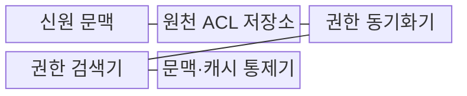
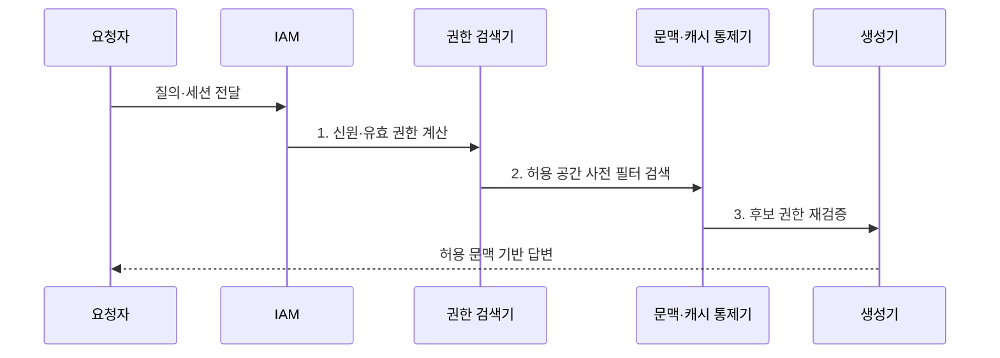

---
sidebar:
  order: 85
  label: "085. 권한 인지 RAG (Permission-Aware RAG)"
  badge:
    text: "미출 · 60%"
    variant: note
title: "권한 인지 RAG (Permission-Aware RAG)"
date: "2026-07-31T08:47:08+09:00"
tags:
  - "notes-latest_tech"
weight: 85
extra:
  question_no: "085"
  source_status: "미출"
  source_history: ""
  priority: 60
  priority_note: "사용자 권한 기반 검색 통제가 보안 핵심"
---

## Ⅰ. 개요

핵심 용어

- **권한 인지 RAG**: 요청자의 현재 권한으로 검색 공간을 제한하고 허용된 근거만 답변에 사용하는 RAG 방식이다.
- **접근 제어 목록(ACL)**: 문서마다 허용하거나 거부할 사용자·그룹과 권한을 기록한 목록이다.

- 정의/개념: **권한 인지 RAG**는 사용자 권한을 색인·검색·문맥·캐시에 일관되게 적용하는 RAG 방식
- 배경/필요성: 일반 RAG는 원천 ACL을 검색·인용·캐시에 보존하지 못해 **민감정보 노출** 가능

### 쉽게 이해하기 (학습용)
- 사용자의 출입증으로 검색 서가를 먼저 제한하고 허용된 문서만 답변 책상에 올림

## Ⅱ. 특징

핵심 용어

- **신원·접근 관리(IAM)**: 사용자와 서비스의 신원을 확인하고 자원별 유효 권한을 계산하는 체계이다.
- **권한 버전**: 원천 문서의 권한 변경 상태를 색인·캐시와 대조하기 위한 식별값이다.

- 사용자·그룹·정책을 결합한 **IAM** 기반 유효 권한 계산
- 원천 ACL·색인·캐시의 **권한 버전 동기화**
- **사전·사후 필터링**과 반환 전 재검증의 이중 권한 통제

### 쉽게 이해하기 (학습용)
- 검색 전에 출입 범위를 정하고 답변에 넣기 직전에도 문서 권한이 바뀌지 않았는지 다시 확인함

## Ⅲ. 구조 및 구성요소

핵심 용어

- **신원 문맥**: 요청자의 인증 상태와 사용자·서비스·그룹 정보를 결합한 권한 판단 입력이다.
- **권한 검색기**: 계산된 유효 권한 범위 안에서만 관련 문서를 검색하는 구성요소이다.
- **권한별 캐시 격리**: 서로 다른 권한의 사용자가 같은 캐시 결과를 공유하지 않도록 저장 영역이나 키를 분리하는 통제이다.

| 구성요소 | 책임 |
|:---|:---|
| 신원 문맥 | 사용자·서비스·그룹의 **요청 주체 식별** |
| 원천 ACL 저장소 | 문서별 허용·거부 주체와 **권한 버전 보관** |
| 권한 동기화기 | 원천 ACL 변경의 **색인·캐시 반영** |
| 권한 검색기 | 유효 권한 범위의 **사전 필터 검색** |
| 문맥·캐시 통제기 | 반환 전 재검증과 **권한별 캐시 격리** |

### 쉽게 이해하기 (학습용)
- 사용자 출입증과 문서 권한표를 맞춰 검색하고 캐시도 권한별로 다른 서랍에 보관함

## Ⅳ. 흐름도

핵심 용어

- **사전 필터링**: 유사도 검색 전에 권한 조건으로 검색 가능한 문서 공간을 제한하는 방식이다.
- **반환 전 재검증**: 검색 이후 문맥 전달 직전에 최신 원천 권한을 다시 확인하는 통제이다.

**동작 원리**

1. **신원·유효 권한 계산**: 인증 상태와 그룹·정책으로 **현재 허용 범위** 산출
2. **허용 공간 사전 필터 검색**: 권한 조건을 먼저 적용한 뒤 **관련 근거** 검색
3. **후보 권한 재검증**: 원천과 색인의 권한 버전을 대조해 **변경 후보 차단**

### 쉽게 이해하기 (학습용)
- 로그인 상태를 확인하고 허용 서가에서 검색한 뒤 답변 직전에 출입 권한을 다시 검사함

## Ⅴ. 종류 및 비교

핵심 용어

- **보안 색인 분리**: 보안 등급이나 권한 영역별로 독립된 검색 색인을 운영하는 방식이다.
- **사후 필터링**: 관련 문서를 검색한 뒤 문맥 전달 전에 권한 없는 후보를 제거하는 방식이다.

| 비교 기준 | 보안 색인 분리 | 사전 권한 필터 | 사후 권한 필터 |
|:---|:---|:---|:---|
| 적용 기준 | 보안 등급별 물리·논리 격리 | 권한 메타데이터 검색 지원 | 검색 엔진의 사전 필터 미지원 |
| 핵심 특징 | 권한 영역별 **독립 색인** | 검색 전 **허용 공간 제한** | 검색 후 **비인가 후보 제거** |
| 한계 | 색인 중복·운영 비용 | 필터 조건의 회수율 영향 | 로그·캐시 선노출 위험 |

### 쉽게 이해하기 (학습용)
- 서가를 아예 나누거나 검색 전에 출입증을 보거나 검색 뒤 금지 문서를 버리는 방식의 차이임

## Ⅵ. 실무 고려사항 및 대책

핵심 용어

- **권한 반영 지연**: 원천 ACL 변경이 색인이나 캐시에 늦게 적용되어 폐기된 권한이 남는 문제이다.
- **선노출**: 권한 검증 전에 비인가 문서의 내용이나 식별자가 로그·캐시에 기록되는 문제이다.
- **정책 결정 충돌**: 그룹 상속과 명시적 허용·거부 규칙이 서로 다른 접근 결과를 만드는 문제이다.

| 문제 | 대책 | 효과 |
|:---|:---|:---|
| 원천 ACL 변경의 **색인 반영 지연** | 권한 버전 비교·불일치 문서 즉시 차단 | 폐기 권한의 **잔존 노출 방지** |
| 사후 필터의 **로그·캐시 선노출** | 사전 필터 우선·권한별 캐시 키 분리 | 비인가 후보의 **처리 경로 차단** |
| 그룹 상속·거부 규칙의 **권한 계산 충돌** | 명시적 거부 우선순위·정책 결정 시험 | 유효 권한의 **결정성 확보** |

### 쉽게 이해하기 (학습용)
- 권한이 바뀐 문서는 즉시 막고 금지 문서가 검색 로그나 공용 캐시에 들어가기 전부터 걸러냄

## Ⅶ. 결론

핵심 용어

- **권한 경계**: 원천 문서부터 색인·검색·캐시·답변까지 동일한 접근 정책을 적용하는 통제 범위이다.
- **정책 결정성**: 같은 신원과 자원 조건에 대해 권한 평가가 항상 같은 결과를 내는 성질이다.

- ACL 최신성·사전 차단·정책 결정성을 기준으로 **색인·검색·캐시의 권한 경계** 결정

### 쉽게 이해하기 (학습용)
- 같은 권한표가 원본부터 검색·캐시·답변까지 이어지는 경계를 선택함
