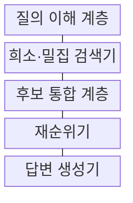
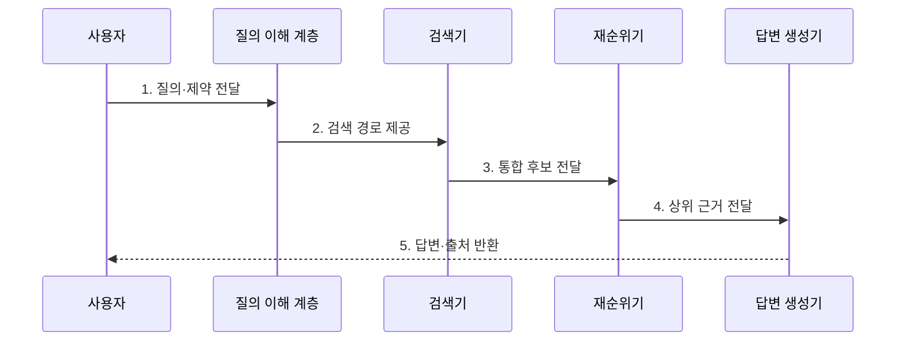

---
sidebar:
  order: 86
  label: "086. AI Search (AI 검색)"
  badge:
    text: "미출제 · 70%"
    variant: note
title: "AI Search (AI 검색)"
date: "2026-07-25T23:35:00+09:00"
tags:
  - "notes-latest_tech"
weight: 86
extra:
  question_no: "086"
  source_status: "미출제"
  source_history: ""
  priority: 70
  priority_note: "검색·생성 통합 경험이 최신 서비스축"
---

## 미리 알고가기

- **AI 검색(AI Search)**: 질의를 해석해 복수 검색 결과를 재순위하고 근거 문서나 답변을 제공하는 검색 방식
- **하이브리드 검색(Hybrid Retrieval)**: 어휘 일치 기반 희소 검색과 의미 기반 밀집 검색의 후보를 결합하는 기법
- **재순위기(Reranker)**: 1차 검색 후보의 질의 관련성을 더 정밀하게 계산해 순서를 다시 정하는 모델
- **검색 증강 생성(Retrieval-Augmented Generation, RAG)**: 검색한 문서를 모델 문맥에 넣어 근거 답변을 생성하는 기법

## Ⅰ. 개요

- 정의/개념: **질의 해석·복수 검색·재순위**로 근거 답변을 제공하는 검색 방식
- 배경/필요성: 키워드 검색의 **표현 불일치·복합 근거 결합** 한계 보완 필요

### 쉽게 이해하기 (학습용)

- 뜻이 맞는 자료를 찾아 재순위하고 필요하면 그 근거로 답변을 작성합니다.

## Ⅱ. 특징

- **질의 의도·개체·제약** 기반 검색 경로 결정
- **희소·밀집 후보 융합**을 통한 어휘·의미 신호 보완
- **재순위·근거 생성** 분리를 통한 관련성·충실성 검증

### 쉽게 이해하기 (학습용)

- 어휘·의미 검색 결과를 재순위한 뒤 요청에 따라 상위 문서로 답변합니다.

## Ⅲ. 구조 및 구성요소

| 구성요소 | 책임 |
|:---|:---|
| 질의 이해 계층 | 질의 의도와 검색 경로 결정 |
| 희소·밀집 검색기 | 어휘·의미 기반 후보 문서 검색 |
| 후보 통합 계층 | 복수 검색 결과의 점수·순위 융합 |
| 재순위기 | 통합 후보 질의 관련성 판정 |
| 답변 생성기 | 상위 근거 활용 답변과 출처 생성 |

### 쉽게 이해하기 (학습용)

- 질의 해석·희소 검색·밀집 검색·재순위·답변 생성이 책임을 나눕니다.

## Ⅳ. 흐름도

### 동작 원리

- **1. 질의·제약 전달**: 의도·개체·기간·권한 조건 식별
- **2. 검색 경로 제공**: 희소·밀집 검색의 조합과 필터 결정
- **3. 통합 후보 전달**: 복수 검색 결과의 중복 제거·순위 융합
- **4. 상위 근거 전달**: 질의 관련성 재평가 기반 문서 선별
- **5. 답변·출처 반환**: 선택 근거에 충실한 답변과 원문 연결

### 쉽게 이해하기 (학습용)

- 질문을 분석해 후보를 모으고 재순위한 뒤 문서나 근거 답변을 반환합니다.

## Ⅴ. 종류 및 비교

| 검색 방식 | AI 검색 | 전통 검색 | 의미 검색 |
|:---|:---|:---|:---|
| **적용 기준** | 복합 질의·근거 답변 | 정확한 용어 검색 | 자연어 의미 검색 |
| **핵심 특징** | 복수 검색·재순위·답변 생성 | 어휘 일치 기반 문서 순위 | 임베딩 근접성 기반 순위 |
| **한계** | 생성 충실성·추가 지연 | 표현 불일치 | 정확한 고유명사 누락 |

> 요약: 검색과 생성을 통합한 지능형 검색 서비스임

### 쉽게 이해하기 (학습용)

- 전통·의미·AI 검색은 사용하는 신호와 결과 형태가 다릅니다.

## Ⅵ. 실무 고려사항 및 대책

| 고려사항 | 대책 | 효과 |
|:---|:---|:---|
| 희소·밀집 융합 실패로 **검색 누락** | 검색기별 회수율과 **재순위 성능** 분리 평가 | 복합 질의 **근거 회수율** 향상 |
| 검색 밖 생성으로 **근거 불충실** | 인용 검증·근거 없음 응답 정책 | 답변의 **출처 충실성** 확보 |

### 쉽게 이해하기 (학습용)

- 정확한 규정명과 일상어 질문을 모두 찾고 답변에는 확인할 원문을 붙입니다.

## Ⅶ. 결론

- **검색 회수율·답변 충실성**을 분리 평가해 AI 검색의 재순위·생성을 통제하는 설계

### 쉽게 이해하기 (학습용)

- 좋은 자료를 찾았는지 먼저 확인하고 답변의 근거성과 추가 지연을 따로 평가해야 합니다.
