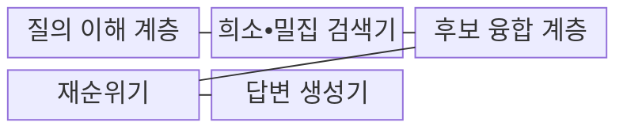
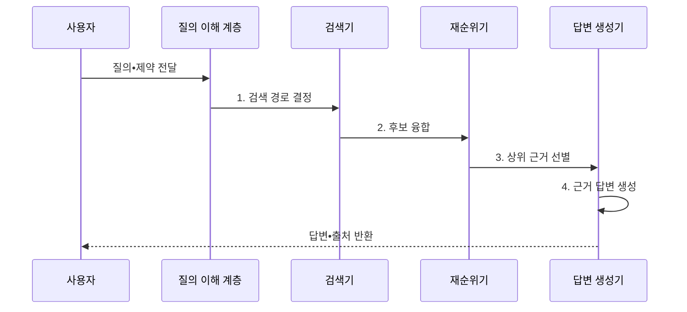

---
sidebar:
  order: 86
  label: "086. AI Search (AI 검색)"
  badge:
    text: "미출 • 70%"
    variant: note
title: "AI Search (AI 검색)"
date: "2026-08-04T15:36:00+09:00"
tags:
  - "notes-latest_tech"
weight: 86
extra:
  question_no: "086"
  source_status: "미출"
  source_history: ""
  priority: 70
  priority_note: "검색•생성 통합 경험이 최신 서비스축"
---

## Ⅰ. 개요

핵심 용어

- **인공지능 검색(Artificial Intelligence Search, AI 검색)**: 질의를 해석하고 복수 검색 결과를 재순위해 근거 문서나 답변을 제공하는 검색 방식이다.

- 정의/개념: 질의 해석•복수 검색•재순위로 근거 답변을 제공하는 **AI 검색 방식**
- 배경/필요성: 키워드 일치만으로는 표현 변형과 복합 근거의 **통합 검색 곤란**

#### 한줄 요약

- 뜻이 맞는 자료를 찾아 재순위하고 필요하면 그 근거로 답변을 작성합니다.

## Ⅱ. 특징

핵심 용어

- **하이브리드 검색**: 어휘 기반 희소 검색과 의미 기반 밀집 검색의 후보를 결합하는 기법이다.
- **재순위**: 1차 검색 후보의 질의 관련성을 정밀하게 다시 계산해 순서를 조정하는 과정이다.

- **질의 의도•제약** 기반 검색 경로 결정
- 어휘•의미 신호 보완 방식: **하이브리드 검색**
- **재순위•근거 생성** 분리를 통한 관련성•충실성 검증

#### 한줄 요약

- 어휘•의미 검색 결과를 재순위한 뒤 요청에 따라 상위 문서로 답변합니다.

## Ⅲ. 구조 및 구성요소

핵심 용어

- **질의 이해**: 사용자의 의도와 제약을 식별해 검색 경로와 필터를 결정하는 과정이다.
- **후보 융합**: 여러 검색기가 반환한 결과의 중복을 제거하고 점수나 순위를 결합하는 과정이다.
- **검색 증강 생성(Retrieval-Augmented Generation, RAG)**: 검색한 문서를 모델 문맥에 넣어 근거가 있는 답변을 생성하는 기법이다.

| 구성요소 | 책임 |
|:---|:---|
| 질의 이해 계층 | 질의 **의도•제약 기반 검색 경로 결정** |
| 희소•밀집 검색기 | 어휘•**임베딩** 기반 후보 문서 검색 |
| 후보 융합 계층 | 복수 검색 결과의 **점수•순위 융합** |
| 재순위기 | 통합 후보의 **질의 관련성** 판정 |
| 답변 생성기 | **검색 증강 생성(Retrieval-Augmented Generation, RAG) 기반 답변•출처 생성** |

#### 한줄 요약

- 질의 해석•희소 검색•밀집 검색•재순위•답변 생성이 책임을 나눕니다.

## Ⅳ. 흐름도

핵심 용어

- **검색 경로**: 질의의 의도와 제약에 따라 선택한 검색기•필터•융합 절차의 조합이다.
- **출처 인용**: 생성 답변을 뒷받침하는 원문 위치와 문서를 함께 제시하는 기능이다.

**동작 원리**

1. **검색 경로 결정**: 질의 의도•제약에 맞는 검색 조합과 필터 선택
2. **후보 융합**: 희소•밀집 결과의 중복 제거와 **순위 융합**
3. **상위 근거 선별**: 재순위기의 **질의 관련성** 평가로 문서 선별
4. **근거 답변 생성**: 선택 근거에 충실한 답변과 **출처 인용** 생성

#### 한줄 요약

- 질문을 분석해 후보를 모으고 재순위한 뒤 문서나 근거 답변을 반환합니다.

## Ⅴ. 종류 및 비교

핵심 용어

- **전통 검색**: 어휘 일치와 빈도 신호를 중심으로 문서 순위를 계산하는 방식이다.
- **의미 검색**: 질의와 문서 임베딩의 의미 유사도를 기준으로 문서를 찾는 방식이다.

인공지능(Artificial Intelligence, AI) 검색은 복수 검색과 재순위 및 답변 생성을 통합하고, 전통 검색과 의미 검색은 각각 어휘와 임베딩 신호에 집중한다.

| 검색 방식 | AI 검색 | 전통 검색 | 의미 검색 |
|:---|:---|:---|:---|
| 적용 기준 | 복합 질의•근거 답변 | 정확한 용어 검색 | 자연어 의미 검색 |
| 핵심 특징 | **복수 검색•재순위와 답변 생성** | **어휘 일치 기반 문서 순위** | **임베딩 근접성 기반 순위** |
| 한계 | **생성 충실성•추가 지연** | **표현 불일치** | 정확한 **고유명사 누락** |

> 요약: 검색과 생성을 통합한 **인공지능 검색 기반 지능형 서비스**

#### 한줄 요약

- 전통•의미•AI 검색은 사용하는 신호와 결과 형태가 다릅니다.

## Ⅵ. 실무 고려사항 및 대책

핵심 용어

- **검색 누락**: 관련 근거가 희소•밀집 검색 후보나 융합 결과에 포함되지 않는 문제이다.
- **근거 불충실**: 생성 답변이 검색된 원문의 내용이나 범위를 벗어나는 문제이다.

| 문제 | 대책 | 효과 |
|:---|:---|:---|
| 희소•밀집 융합 실패로 **검색 누락** | 검색기별 회수율과 **재순위 성능** 분리 평가 | 복합 질의 **근거 회수율** 향상 |
| 검색 밖 생성으로 **근거 불충실** | 인용 검증•근거 없음 응답 정책 | 답변의 **출처 충실성** 확보 |

#### 한줄 요약

- 정확한 규정명과 일상어 질문을 모두 찾고 답변에는 확인할 원문을 붙입니다.

## Ⅶ. 결론

핵심 용어

- **검색 회수율**: 실제 관련 문서 가운데 검색 후보에 포함된 문서의 비율이다.
- **답변 충실성**: 생성한 답변의 주장이 제공된 검색 근거와 일치하는 정도이다.

- 분리 평가 지표: **검색 회수율•답변 충실성**, 통제 대상: **인공지능(Artificial Intelligence, AI) 검색의 재순위•생성**

#### 한줄 요약

- 좋은 자료를 찾았는지 먼저 확인하고 답변의 근거성과 추가 지연을 따로 평가해야 합니다.
