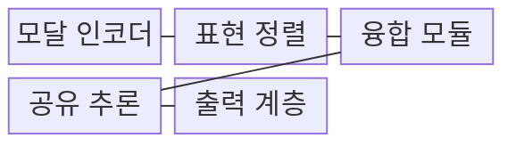
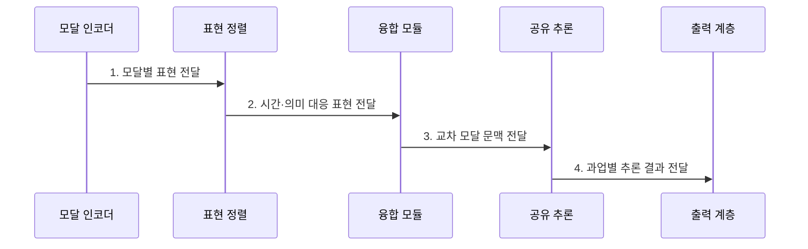

---
sidebar:
  order: 87
  label: "087. Multimodal AI (멀티모달 AI)"
  badge:
    text: "기출 · 80%"
    variant: note
title: "Multimodal AI (멀티모달 AI)"
date: "2026-07-31T11:57:02+09:00"
tags:
  - "notes-latest_tech"
weight: 87
extra:
  question_no: "087"
  source_status: "기출"
  source_history: "134회, 137회"
  priority: 80
  priority_note: "다중 모달 융합 구조가 반복 출제축"
---

## 미리 알고가기

- **멀티모달 인공지능(Multimodal Artificial Intelligence, Multimodal AI)**: 텍스트·이미지·음성 등 여러 신호를 정렬·융합해 공동 추론하는 AI
- **모달리티(Modality)**: 텍스트·시각·음성처럼 정보를 표현하는 신호 유형
- **교차 모달 정렬(Cross-modal Alignment)**: 서로 다른 신호에서 같은 대상·시점·의미의 표현을 대응시키는 처리

> **키워드:** Multimodal AI (멀티모달 AI)

## Ⅰ. 개요

- 정의/개념: **멀티모달 AI**는 여러 모달리티를 정렬·융합해 공동 추론·생성하는 AI
- 배경/필요성: 단일 모달은 신호 누락·잡음 시 **보완 문맥 활용 불가**

### 쉽게 이해하기 (학습용)

- 글·사진·음성을 같은 상황의 단서로 연결해 이해하고 여러 형태로 결과를 만드는 시스템입니다.

## Ⅱ. 특징

- 전용 인코더 기반 **모달별 특징 표현**
- 같은 대상·시점·의미의 **교차 모달 정렬**
- 신호 상호작용·누락을 반영한 **융합 추론**

### 쉽게 이해하기 (학습용)

- 자막은 선명하고 영상은 흐리면 한 모달에만 의존하기 쉬우므로 입력별 품질과 누락을 함께 확인해야 합니다.

## Ⅲ. 구조 및 구성요소

| 구성요소 | 책임 |
|:---|:---|
| 모달 인코더 | 개별 모달을 **특징 표현**으로 변환 |
| 표현 정렬 | 대상·시점의 **교차 모달 정렬** |
| 융합 모듈 | 모달 표현의 **상호작용 결합** |
| 공유 추론 | 모달 간 **관계 추론** |
| 출력 계층 | 과업별 **모달 결과** 생성 |

### 쉽게 이해하기 (학습용)

- 모달 인코더·정렬·융합·추론·출력이 순서대로 연결됩니다.

## Ⅳ. 흐름도

**동작 원리**

1. **모달별 표현 전달**: 텍스트·시각·음성을 **특징·토큰**으로 변환
2. **시간·의미 대응 표현 전달**: 동일 시점·대상의 **신호 관계** 정렬
3. **교차 모달 문맥 전달**: 신호별 품질·누락을 반영한 **표현 융합**
4. **과업별 추론 결과 전달**: 공동 문맥 기반 **분류·생성 결과** 산출

### 쉽게 이해하기 (학습용)

- 사용할 수 있는 모달을 정렬하고 누락을 처리한 뒤 결과를 융합합니다.

## Ⅴ. 종류 및 비교

| 융합 방식 | 초기 융합 | 중간 융합 | 후기 융합 |
|:---|:---|:---|:---|
| 적용 기준 | 저수준 **상관관계** 중요 시 | 세밀한 **교차 추론** 시 | **모듈 독립성** 중요 시 |
| 핵심 특징 | 입력·**저수준 특징 결합** | 중간 표현 간 **상호작용** | 독립 **예측·점수 결합** |
| 한계 | **정렬·누락**에 취약 | **연산·학습 복잡도** | 세밀한 **상호작용 제한** |

> 요약: **멀티모달 AI**는 여러 모달을 정렬·융합하는 **공동 추론 모델**

### 쉽게 이해하기 (학습용)

- 초기·중간·후기 융합은 모달 정보를 결합하는 시점과 상호작용이 다릅니다.

## Ⅵ. 실무 고려사항 및 대책

| 고려사항 | 대책 | 효과 |
|:---|:---|:---|
| 시점·대상 불일치로 **모달 정렬 오류** | 타임스탬프·객체 기반 정렬 검증 | 교차 모달 **의미 대응** 향상 |
| 신호 누락·잡음으로 **단일 모달 편향** | 모달 드롭아웃·품질 가중 융합 | 누락 입력의 **추론 강건성** 확보 |

### 쉽게 이해하기 (학습용)

- 보고서의 글과 그림, 상담 음성과 전사문을 함께 보되 일부 자료가 없을 때도 처리하도록 설계합니다.

## Ⅶ. 결론

- **모달 상호작용·누락 가능성**으로 초기·중간·후기 융합 시점을 결정

### 쉽게 이해하기 (학습용)

- 여러 감각을 무조건 섞지 않고 상호작용 수준과 누락 가능성을 보고 융합 시점을 정해야 합니다.
