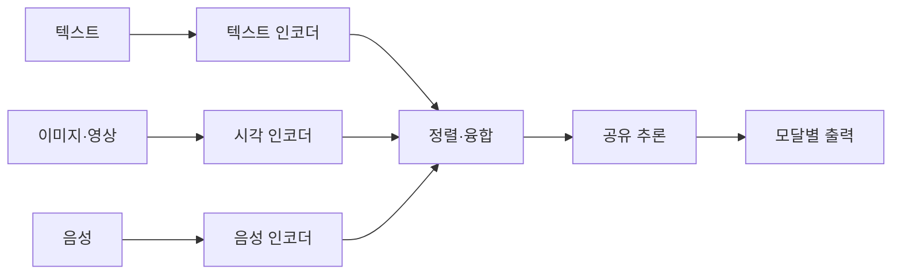
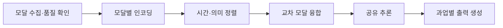

---
sidebar:
  order: 87
  label: "087. Multimodal AI 멀티모달 AI (Multimodal AI)"
  badge:
    text: "기출 · 80%"
    variant: note
title: "Multimodal AI 멀티모달 AI (Multimodal AI)"
date: "2026-07-27T23:59:59+09:00"
tags:
  - "notes-latest_tech"
weight: 87
extra:
  question_no: "087"
  source_status: "기출"
  source_history: "134회, 137회"
  priority: 80
  priority_note: "다중 모달 융합 구조가 반복 출제축"
---

## 미리 알고가기

- **멀티모달 인공지능 (Multimodal Artificial Intelligence, Multimodal AI)**: 여러 모달을 함께 이해·생성함
- **시각언어모델 (Vision-Language Model, VLM)**: 이미지·텍스트 관계를 처리함
- **대조 언어-이미지 사전학습 (Contrastive Language-Image Pre-training, CLIP)**: 이미지·텍스트를 정렬함
- **음성-텍스트 변환(Speech-to-Text, STT)**: 음성을 문자 토큰으로 변환함
- **텍스트-음성 변환(Text-to-Speech, TTS)**: 텍스트를 음성 파형으로 변환함
- **모달리티(Modality)**: 텍스트·시각·음성처럼 정보를 표현하는 신호 유형
- **주요 구성요소**: VLM·CLIP은 시각과 언어 표현을 연결하고, STT·TTS는 음성과 텍스트를 상호 변환함

## Ⅰ. 개요

- 정의/개념: 여러 모달리티를 공동 이해·추론·생성하는 AI
- 기존 한계: 단일 모달은 다른 신호의 보완 문맥을 활용 못함

### 쉽게 이해하기 (학습용)

- 글·사진·음성을 같은 상황의 단서로 연결해 이해하고 여러 형태로 결과를 만드는 시스템입니다.

## Ⅱ. 특징

- **모달 표현**: 전용 인코더가 신호별 특징을 추출한다
- **교차 모달 정렬**: 같은 의미의 표현을 공동 공간에 맞춘다
- **융합·생성**: 상호작용과 누락을 처리해 결과를 만든다

### 쉽게 이해하기 (학습용)

- 자막은 선명하고 영상은 흐리면 한 모달에만 의존하기 쉬우므로 입력별 품질과 누락을 함께 확인해야 합니다.

## Ⅲ. 구성요소 및 구조

| 설계 요소 | 설명 |
|:---|:---|
| 모달 인코더 | 개별 모달을 표현으로 변환 |
| 표현 정렬 | 대상과 시점 의미 대응 |
| 융합 모듈 | 모달 표현과 예측 결합 |
| 공유 추론 | 모달 간 관계 판단 |
| 출력 계층 | 과업별 모달 결과 생성 |

### 쉽게 이해하기 (학습용)

- 모달 인코더·정렬·융합·추론·출력이 순서대로 연결됩니다.

## Ⅳ. 원리 및 절차 흐름도

| 절차 | 설명 |
|:---|:---|
| 모달수집·품질확인 | 입력 가용성·잡음·누락 확인 |
| 모달별인코딩 | 신호를 특징·토큰으로 변환 |
| 시간·의미정렬 | 동일 시점·대상의 표현 대응 |
| 교차모달융합 | 정렬 표현의 상호작용 계산 |
| 공유추론 | 모달 관계로 과업 판단 |
| 과업별출력생성 | 텍스트·음성·영상 결과 생성 |

### 쉽게 이해하기 (학습용)

- 사용할 수 있는 모달을 정렬하고 누락을 처리한 뒤 결과를 융합합니다.

## Ⅴ. 멀티모달 융합 방식 비교

| 비교 기준 | 초기 융합 | 중간 융합 | 후기 융합 |
|:---|:---|:---|:---|
| 적용 기준 | 저수준 상관 중요 시 | 세밀한 교차 추론 시 | 모듈 독립이 중요 시 |
| 핵심 특징 | 입력·저수준 특징 결합 | 중간 표현 간 상호작용 | 독립 예측·점수 결합 |
| 한계 | 정렬·누락에 취약 | 연산·학습 복잡 | 세밀한 상호작용 제한 |

> 요약: 다중 입출력 모달을 결합하는 AI 모델임

### 쉽게 이해하기 (학습용)

- 초기·중간·후기 융합은 모달 정보를 결합하는 시점과 상호작용이 다릅니다.

## Ⅵ. 실무 사례

1. 문서 QA: **본문·표·도표**를 중간 융합

### 쉽게 이해하기 (학습용)

- 보고서의 글과 그림, 상담 음성과 전사문을 함께 보되 일부 자료가 없을 때도 처리하도록 설계합니다.

## Ⅶ. 결론

- 다중 양식 결합을 위해 상호작용·독립성을 검토하여 **멀티모달 AI** 활용

### 쉽게 이해하기 (학습용)

- 여러 감각을 무조건 섞지 않고 상호작용 수준과 누락 가능성을 보고 융합 시점을 정해야 합니다.
