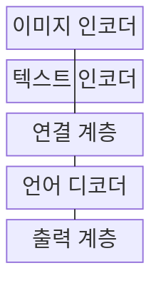
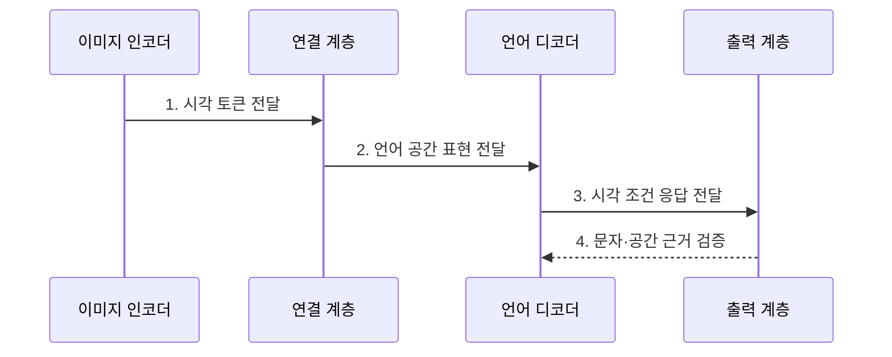

---
sidebar:
  order: 88
  label: "088. Vision-Language Model (시각언어모델)"
  badge:
    text: "기출 · 70%"
    variant: note
title: "Vision-Language Model (시각언어모델)"
date: "2026-07-27T23:59:59+09:00"
tags:
  - "notes-latest_tech"
weight: 88
extra:
  question_no: "088"
  source_status: "기출"
  source_history: "137회"
  priority: 70
  priority_note: "시각·언어 정렬이 멀티모달 핵심"
---

## 미리 알고가기

- **시각언어모델(Vision-Language Model, VLM)**: 이미지와 텍스트의 관계를 공동 학습해 판별·생성하는 멀티모달 모델
- **시각 인코더 (Vision Encoder)**: 이미지를 시각 표현으로 변환함
- **대규모 언어 모델 (Large Language Model, LLM)**: 시각 표현으로 언어 응답을 생성함
- **광학 문자 인식(Optical Character Recognition, OCR)**: 이미지 속 글자를 문자 데이터로 변환하는 기술

## Ⅰ. 개요

- 정의/개념: 이미지와 텍스트를 연결해 판별·생성하는 모델
- 배경/필요성: 단일 모달 모델의 **객체·공간 관계·언어 의미** 공동 처리 한계 극복

### 쉽게 이해하기 (학습용)

- 사진과 문장을 같은 의미 공간에 연결해 짝을 찾거나 사진 내용을 말로 설명하는 모델입니다.

## Ⅱ. 특징

- **시각 인코더** 기반 픽셀의 패치·영역 표현 변환
- **연결 계층** 기반 시각·언어 입력 공간 정렬
- 대조·매칭·생성 목적별 **출력 능력·오류 차이**

### 쉽게 이해하기 (학습용)

- 사진을 언어 모델이 읽는 표현으로 바꿔도 작은 글자나 공간 관계를 틀릴 수 있어 원본 확인이 필요합니다.

## Ⅲ. 구조 및 구성요소

| 구성요소 | 책임 |
|:---|:---|
| 이미지 인코더 | 이미지 패치 시각 표현 변환 |
| 텍스트 인코더 | 문장 언어 표현 변환 |
| 연결 계층 | 시각 표현 언어 공간 사상 |
| 언어 디코더 | 시각 텍스트 조건 토큰 생성 |
| 출력 계층 | 유사도 판별 결과 반환 |

### 쉽게 이해하기 (학습용)

- 시각 표현을 공동 의미 공간이나 언어 디코더의 입력에 연결합니다.

## Ⅳ. 흐름도

### 동작 원리

- **1. 시각 토큰 전달**: 이미지 패치·영역의 객체 특징 추출
- **2. 언어 공간 표현 전달**: 시각 표현을 LLM 입력 차원에 사상
- **3. 시각 조건 응답 전달**: 이미지 문맥 기반 언어 토큰 생성
- **4. 문자·공간 근거 검증**: OCR 문자·객체 위치와 응답 내용 대조

### 쉽게 이해하기 (학습용)

- 이미지와 텍스트를 정렬해 일치 점수나 자연어 응답을 생성합니다.

## Ⅴ. 종류 및 비교

| 학습 방식 | 대조 학습 | 이미지 매칭 | 생성형 튜닝 |
|:---|:---|:---|:---|
| 적용 기준 | 검색 전이 필요 시 | 대응 판별 필요 시 | 자연어 생성 필요 시 |
| 핵심 특징 | 이미지·텍스트 공동 임베딩 | 이미지·문장 일치 점수 | 시각 조건 토큰 생성 |
| 한계 | 세부 공간·문자 정보 손실 | 생성형 설명 불가 | 환각·공간 관계 오류 |

> 요약: 시각과 언어를 연결해 생성·판별하는 모델임

### 쉽게 이해하기 (학습용)

- 대조·매칭·생성 학습은 시각과 언어를 연결하는 목표가 다릅니다.

## Ⅵ. 실무 고려사항 및 대책

| 고려사항 | 대책 | 효과 |
|:---|:---|:---|
| 저해상도 문자로 **OCR 인식 오류** | 원본 영역 확대·OCR 결과 결합 | 문서 **문자 정확도** 향상 |
| 객체 관계 생성 시 **시각 환각** | 객체 위치·원본 근거 교차 검증 | **공간 관계 충실성** 확보 |

### 쉽게 이해하기 (학습용)

- 작은 글자는 OCR로 읽고 표 배치와 사진 의미는 모델이 설명한 뒤 원본 위치와 맞는지 확인합니다.

## Ⅶ. 결론

- **문자 정확도·공간 관계 충실성**으로 VLM의 판별·생성 방식을 선택

### 쉽게 이해하기 (학습용)

- 사진 설명에 능해도 작은 글자와 정확한 위치까지 보장하지 않으므로 목적에 맞는 도구를 함께 써야 합니다.
