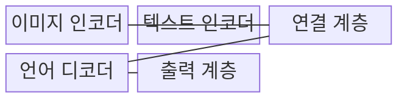
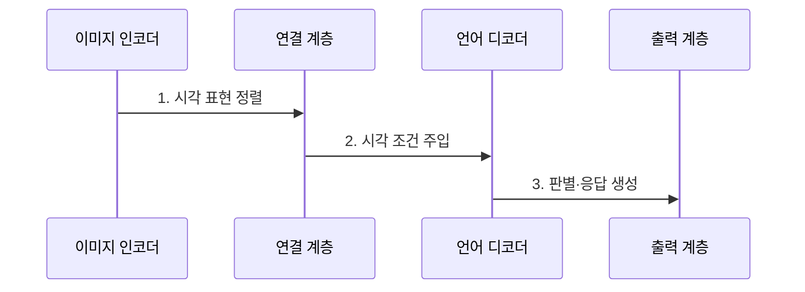

---
sidebar:
  order: 88
  label: "088. Vision-Language Model (시각언어모델)"
  badge:
    text: "기출 · 70%"
    variant: note
title: "Vision-Language Model (시각언어모델)"
date: "2026-07-31T11:57:46+09:00"
tags:
  - "notes-latest_tech"
weight: 88
extra:
  question_no: "088"
  source_status: "기출"
  source_history: "137회"
  priority: 70
  priority_note: "시각·언어 정렬이 멀티모달 핵심"
---

## Ⅰ. 개요

핵심 용어

- **시각언어모델(Vision-Language Model, VLM)**: 이미지와 텍스트의 관계를 공동 학습해 시각 정보를 판별하거나 언어로 생성하는 멀티모달 모델이다.

- 정의/개념: 이미지와 텍스트를 정렬해 판별·생성하는 **시각언어모델(Vision-Language Model, VLM)**
- 배경/필요성: 단일 모달은 이미지의 객체·공간과 언어 의미를 **공동 해석 불가**

#### 한줄 요약

- 사진과 문장을 같은 의미 공간에 연결해 짝을 찾거나 사진 내용을 말로 설명하는 모델입니다.

## Ⅱ. 특징

핵심 용어

- **시각 인코더**: 이미지의 픽셀을 패치나 영역 단위의 시각 표현으로 변환하는 모델이다.
- **연결 계층**: 시각 표현을 언어 모델이 처리할 수 있는 입력 공간으로 사상하는 구성요소이다.

- **시각 인코더** 기반 픽셀의 패치·영역 표현 변환
- **연결 계층** 기반 시각·언어 입력 공간 정렬
- 대조·매칭·생성 목적별 **출력 능력·오류 차이**

#### 한줄 요약

- 사진을 언어 모델이 읽는 표현으로 바꿔도 작은 글자나 공간 관계를 틀릴 수 있어 원본 확인이 필요합니다.

## Ⅲ. 구조 및 구성요소

핵심 용어

- **텍스트 인코더**: 입력 문장을 의미 특징이 담긴 언어 표현으로 변환한다.
- **언어 디코더**: 시각 조건을 문맥으로 받아 다음 언어 토큰을 생성한다.
- **공동 의미 공간**: 의미가 대응하는 이미지와 텍스트 표현이 가깝게 배치되는 표현 공간이다.

| 구성요소 | 책임 |
|:---|:---|
| 이미지 인코더 | 이미지 패치의 **시각 표현 변환** |
| 텍스트 인코더 | 문장의 **언어 표현 변환** |
| 연결 계층 | 시각 표현의 **언어 공간 사상** |
| 언어 디코더 | **거대 언어 모델(Large Language Model, LLM) 기반 시각 조건 토큰 생성** |
| 출력 계층 | **유사도·생성 결과** 산출 |

#### 한줄 요약

- 시각 표현을 공동 의미 공간이나 언어 디코더의 입력에 연결합니다.

## Ⅳ. 흐름도

핵심 용어

- **시각 조건 주입**: 정렬된 이미지 표현을 언어 디코더의 입력 문맥에 전달하는 과정이다.
- **언어 토큰**: 언어 디코더가 순차적으로 예측해 자연어 응답을 구성하는 출력 단위이다.

**동작 원리**

1. **시각 표현 정렬**: 이미지 패치·영역의 **공동 의미 공간 사상**
2. **시각 조건 주입**: 정렬된 표현의 **언어 디코더 입력 문맥 변환**
3. **판별·응답 생성**: 이미지 문맥으로 **유사도·언어 토큰** 산출

#### 한줄 요약

- 이미지와 텍스트를 정렬해 일치 점수나 자연어 응답을 생성합니다.

## Ⅴ. 종류 및 비교

핵심 용어

- **대조 학습**: 일치하는 이미지·텍스트 표현은 가깝게, 불일치하는 표현은 멀게 학습하는 방식이다.
- **이미지 매칭**: 이미지와 문장이 실제로 대응하는지를 점수로 판별하는 방식이다.
- **생성형 튜닝**: 시각 조건에 맞는 자연어 응답을 생성하도록 모델을 조정하는 방식이다.

| 학습 방식 | 대조 학습 | 이미지 매칭 | 생성형 튜닝 |
|:---|:---|:---|:---|
| 적용 기준 | **검색·전이** 필요 시 | **대응 판별** 필요 시 | **자연어 생성** 필요 시 |
| 핵심 특징 | 이미지·텍스트 **공동 임베딩** | 이미지·문장 **일치 점수** | **시각 조건 토큰** 생성 |
| 한계 | 세부 **공간·문자 정보 손실** | **생성형 설명 불가** | **환각·공간 관계 오류** |

> 요약: 시각과 언어를 정렬해 판별·생성하는 **시각언어모델(Vision-Language Model, VLM)**

#### 한줄 요약

- 대조·매칭·생성 학습은 시각과 언어를 연결하는 목표가 다릅니다.

## Ⅵ. 실무 고려사항 및 대책

핵심 용어

- **광학 문자 인식(Optical Character Recognition, OCR)**: 이미지 속 글자 영역을 탐지하고 문자 데이터로 변환하는 기술이다.
- **시각 환각**: 이미지에 없거나 위치가 다른 객체와 관계를 모델이 사실처럼 생성하는 문제이다.

| 문제 | 대책 | 효과 |
|:---|:---|:---|
| 저해상도 문자로 **광학 문자 인식(Optical Character Recognition, OCR) 오류** | 원본 영역 확대·OCR 결과 결합 | 문서 **문자 정확도** 향상 |
| 객체 관계 생성 시 **시각 환각** | 객체 위치·원본 근거 교차 검증 | **공간 관계 충실성** 확보 |

#### 한줄 요약

- 작은 글자는 OCR로 읽고 표 배치와 사진 의미는 모델이 설명한 뒤 원본 위치와 맞는지 확인합니다.

## Ⅶ. 결론

핵심 용어

- **문자 정확도**: 이미지의 글자를 원문과 일치하게 인식하거나 생성한 정도이다.
- **공간 관계 충실성**: 생성한 객체의 위치와 관계가 실제 이미지 배치와 일치하는 정도이다.

- 선택 기준: **문자 정확도·공간 관계 충실성**, 적용 모델: **시각언어모델(Vision-Language Model, VLM)의 판별·생성 방식**

#### 한줄 요약

- 사진 설명에 능해도 작은 글자와 정확한 위치까지 보장하지 않으므로 목적에 맞는 도구를 함께 써야 합니다.
