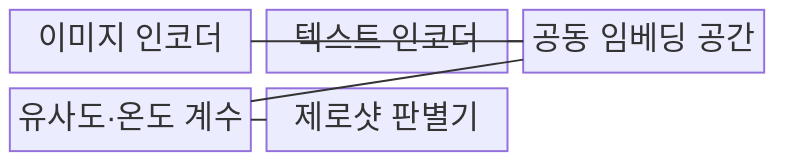
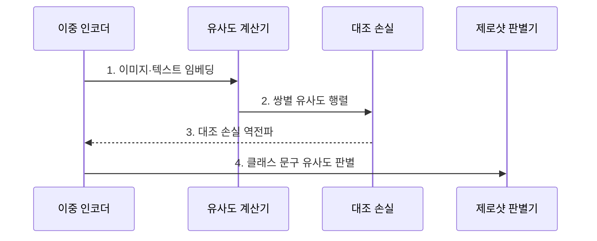

---
sidebar:
  order: 89
  label: "089. CLIP (대조 언어-이미지 사전학습)"
  badge:
    text: "기출 · 50%"
    variant: note
title: "CLIP (대조 언어-이미지 사전학습)"
date: "2026-07-31T11:58:33+09:00"
tags:
  - "notes-latest_tech"
weight: 89
extra:
  question_no: "089"
  source_status: "기출"
  source_history: "137회"
  priority: 50
  priority_note: "대조학습은 시각·언어 정렬의 기반"
---

## Ⅰ. 개요

핵심 용어

- **대조 언어-이미지 사전학습(Contrastive Language-Image Pre-training, CLIP)**: 이미지와 텍스트 쌍을 공동 임베딩 공간에 정렬하는 이중 인코더 모델이다.

- 정의/개념: 이미지·텍스트 쌍을 공동 임베딩에 정렬하는 **대조 언어-이미지 사전학습(Contrastive Language-Image Pre-training, CLIP) 이중 인코더 모델**
- 배경/필요성: 고정 라벨 분류기는 새 시각 개념마다 **라벨 데이터 재학습 필요**

#### 한줄 요약

- 그림과 설명에 같은 의미 좌표를 부여해 서로 가까운 짝을 찾는 방식입니다.

## Ⅱ. 특징

핵심 용어

- **대조학습**: 정답 이미지·텍스트 쌍은 가깝게, 오답 쌍은 멀게 표현을 학습하는 방식이다.
- **제로샷 분류**: 해당 클래스의 학습 표본 없이 자연어 클래스 설명과의 유사도로 분류하는 방식이다.
- **교차 모달 검색**: 이미지로 텍스트를 찾거나 텍스트로 이미지를 찾는 검색 방식이다.

- 정답 쌍은 가깝게 하고 오답 쌍은 멀게 하는 **대조학습**
- **이중 인코더** 기반 이미지·텍스트 임베딩 독립 계산
- 클래스 문구 유사도 기반 **제로샷 분류·교차 모달 검색**

#### 한줄 요약

- 맞는 그림과 설명은 가깝게, 틀린 짝은 멀게 배워 새로운 설명도 이미지와 비교할 수 있습니다.

## Ⅲ. 구조 및 구성요소

핵심 용어

- **이중 인코더**: 이미지와 텍스트를 각각 독립된 인코더로 변환해 검색 시 표현을 재사용하는 구조이다.
- **온도 계수**: 유사도 점수의 분포 간격을 조절해 대조 손실의 구분 강도를 제어하는 값이다.

| 구성요소 | 책임 |
|:---|:---|
| 이미지 인코더 | 이미지의 **시각 임베딩** 변환 |
| 텍스트 인코더 | 클래스 문구의 **텍스트 임베딩** 변환 |
| 공동 임베딩 공간 | 이미지·텍스트의 **정렬 공간** |
| 유사도·온도 계수 | **코사인 유사도·온도** 기반 점수 조정 |
| 제로샷 판별기 | 클래스 문구와의 **유사도 판별** |

#### 한줄 요약

- 이미지·문장 인코더와 공동 공간, 점수 간격 조절기, 프롬프트 결합부로 구성됩니다.

## Ⅳ. 흐름도

핵심 용어

- **유사도 행렬**: 한 배치의 모든 이미지와 텍스트 표현 사이 점수를 배열한 행렬이다.
- **대조 손실**: 정답 쌍의 유사도는 높이고 오답 쌍의 유사도는 낮추도록 모델을 갱신하는 손실 함수이다.

**동작 원리**

1. **이미지·텍스트 임베딩**: 이중 인코더로 정규화된 **공동 좌표** 생성
2. **쌍별 유사도 행렬**: 온도 계수를 적용해 배치의 **모든 쌍 비교**
3. **대조 손실 역전파**: 정답 쌍은 가깝게, 오답 쌍은 멀게 **표현 갱신**
4. **클래스 문구 유사도 판별**: 자연어 클래스와 이미지의 **제로샷 예측**

#### 한줄 요약

- 정답 쌍을 정렬한 뒤 클래스 설명과 이미지의 유사도를 비교합니다.

## Ⅴ. 종류 및 비교

핵심 용어

- **지도 분류기**: 미리 정의한 클래스의 라벨 데이터로 학습해 클래스 확률을 출력하는 모델이다.
- **생성 모델**: 시각 조건을 입력받아 이미지에 대한 자연어 설명을 생성하는 모델이다.

| 시각 모델 | CLIP | 지도 분류기 | 생성 모델 |
|:---|:---|:---|:---|
| 적용 기준 | **검색·제로샷 분류** | **고정 라벨 분류** | **자연어 설명 생성** |
| 핵심 특징 | 이미지·텍스트 **유사도** | 학습 클래스 **확률** | 시각 조건 **언어 생성** |
| 한계 | **프롬프트·도메인 민감도** | 새 클래스 **재학습** | **생성 비용·환각** |

> 요약: 이미지와 텍스트를 공동 임베딩 공간에 정렬하는 **대조 언어-이미지 사전학습(Contrastive Language-Image Pre-training, CLIP) 모델**

#### 한줄 요약

- 고정 분류기·CLIP·생성 모델은 클래스 확장 방식과 출력이 다릅니다.

## Ⅵ. 실무 고려사항 및 대책

핵심 용어

- **프롬프트 민감도**: 같은 클래스도 설명 문구에 따라 제로샷 예측 점수가 달라지는 성질이다.
- **도메인 전이**: 학습 분포와 다른 업무 분야에서도 학습한 표현을 적용하는 능력이다.

| 문제 | 대책 | 효과 |
|:---|:---|:---|
| 클래스 문구에 따른 **프롬프트 민감도** | 복수 프롬프트 임베딩 앙상블 | **문구 민감도 완화** |
| 학습 분포 밖 **도메인 전이 오류** | 도메인 검증셋·선형 프로브 평가 | **전이 가능 범위 식별** |

#### 한줄 요약

- 상품 사진의 표현을 미리 색인하면 자연어와 가까운 상품을 찾고 새 분류 문구로 후보를 나눌 수 있습니다.

## Ⅶ. 결론

핵심 용어

- **프롬프트 앙상블**: 같은 클래스를 여러 문구로 표현한 임베딩을 결합해 예측 편차를 줄이는 방법이다.
- **전이 가능 범위**: 별도 재학습 없이 목표 도메인에서 허용 성능을 유지하는 적용 영역이다.

- 적용 대책: **프롬프트 앙상블**, 판단 기준: **전이 가능 범위**, 적용 모델: **대조 언어-이미지 사전학습(Contrastive Language-Image Pre-training, CLIP)**

#### 한줄 요약

- 이미지와 문장의 거리를 재는 데 알맞지만 새로운 분야와 문구에서는 결과를 다시 확인해야 합니다.
